# 📘 Credit Union System Documentation

## 📑 Table of Contents

1. **Overview**
2. **Branch, User, Role & Permission Management**
3. **Customer & Relationship Management**
4. **Products (Deposit, Loan, Insurance)**
5. **Account Management (Savings, Term, Recurring, Share, Loan, Insurance)**
6. **Loan Application Lifecycle**
7. **General Ledger & Journals**
8. **Cash Flow Management (Drawers, Vaults, ATMs, Reconciliation)**
9. **Payments, Schedules, Interest, Charges**
10. **Cheques Handling**
11. **Audit Logs & Compliance**

---

## 1️⃣ Overview

A modular credit union system designed to manage **member accounts, deposits, loans, and cash operations**. It ensures regulatory compliance, robust permissions, and detailed financial tracking.

---

## 2️⃣ Branch, User, Role & Permission Management

**Purpose:** Manage branches, user access, and operational permissions.

- **Branches**: Represents physical locations.
- **Roles**: Predefined roles like TELLER, LOAN_OFFICER.
- **Permissions**: Fine-grained actions like `VIEW_ACCOUNTS`.
- **Users**: Staff members tied to branches.
- **User Roles**: Many-to-many relationship assigning roles to users.

✅ **ER Diagram**


---

## 3️⃣ Customer & Relationship Management

## 👤 Customer Flow

### 1️⃣ Customer Onboarding

- **Initiation:** A prospective member visits a branch or applies online.
- **Captured Data:**
    - Personal details (Name, DOB, Contact)
    - Identification documents (NID, Passport, etc.)
    - Proof of address
    - Nominee and introducer details
    - Digital signature capture

### 2️⃣ Verification & KYC Compliance

- **Steps:**
    - Validate identification and address proofs.
    - Perform risk and blacklist checks (AML/CFT).
    - Approve or reject the application.

### 3️⃣ Customer Creation in System

- System generates a **Customer ID**.
- Assigns default branch, account officer, and membership status.
- Links:
    - **Addresses** (Current & Permanent)
    - **Family Relations** (Guarantors, Relatives)
    - **Signatures** for future verification

### 4️⃣ Product Enrollment

- Customer opens one or more products:
    - Savings, Recurring, or Term Deposits
    - Loan Applications
    - Insurance Policies
- System creates corresponding **Account Records** linked to the customer.

### 5️⃣ Digital Access Setup \*(if applicable)

- Creates **Online User** credentials for mobile/web banking.
- Sets permissions, transaction limits, and security preferences.

### 6️⃣ Ongoing Customer Relationship Management

- **Updates:** Address changes, nominee updates, or signature renewals.
- **Monitoring:** Transaction activity, loan performance, and compliance checks.
- **Support:** Handling queries, disputes, or account closures.

### 7️⃣ Dormancy, Closure, or Exit

- If inactive: Status changed to `DORMANT`.
- For account closure:
    - All balances settled and accounts closed.
    - Membership revoked, and audit logs updated.

### 🔁 High-Level Customer Flow Diagram


---

## 4️⃣ Products (Deposit, Loan, Insurance)

**Purpose:** Define financial products and link them to GL accounts.

- **Deposit Products**: Savings, RD, FD with interest methods.
- **Loan Products**: Principal, interest, fees, collateral rules.
- **Insurance Products**: Premium cycles, coverage types.

✅ **ER Diagram**


---

## 5️⃣ Account Management

---

## 🏦 Account Flow

### 1️⃣ Account Opening

- **Trigger:** Customer requests to open a deposit or loan account.
- **Steps:**
    - Collect required documents and initial deposit.
    - Verify KYC details (linked to Customer Flow).
    - Assign account number and link to Customer ID.
    - Configure account type, product, interest rules, and branch.

### 2️⃣ Account Activation

- Account status set to `ACTIVE` after approval.
- Digital access and transaction channels enabled.

### 3️⃣ Transactions Handling

- **Credits:** Deposits, loan disbursements, fund transfers, interest credits.
- **Debits:** Withdrawals, loan repayments, fees, penalties.
- Update balances in **General Ledger** and **Subsidiary Ledgers**.

### 4️⃣ Account Maintenance

- Handle updates like:
    - Change of nominee or signatory.
    - Product upgrades (e.g., convert savings to fixed deposit).
    - Temporary blocks (e.g., fraud alerts).

### 5️⃣ Interest & Charges Processing

- Apply interest accruals as per product rules.
- Deduct service charges, penalties, or taxes automatically.

### 6️⃣ Statements & Reporting

- Generate periodic account statements.
- Provide downloadable reports via digital channels.

### 7️⃣ Account Dormancy and Closure

- Mark as `DORMANT` if inactive for a specified period.
- For closure:
    - Verify identity and settle balances.
    - Update status to `CLOSED`.
    - Archive for audit compliance.

### 🔁 High-Level Account Flow Diagram


✅ **ER Diagram**


---

## 6️⃣ Loan Application Lifecycle

**Flow:**

1. **Application** → Loan request, guarantors, collaterals, and documents stored.
2. **Approval** → Credit officer reviews and approves.
3. **Account Creation** → Loan account opened and linked.
4. **Disbursement** → Funds transferred and balances updated.
5. **Repayment Schedule** → System generates due dates and amounts.
6. **Repayment** → Payments logged, balances reduced.
7. **Closure / Write-off** → Status updated, variances recorded.

✅ **ER Diagram**


✅ **Life Cycle Flow**


---

## 7️⃣ General Ledger & Journals

**Purpose:** Record all financial transactions.

- **GL Accounts**: Chart of accounts hierarchy.
- **Journal Entries & Lines**: Capture debits and credits with references.

✅ **ER Diagram**


---

## 8️⃣ Cash Flow Management

**Core Concepts:**

- **Cash Accounts**: Logical balances for CASH_ON_HAND, BANK.
- **Vaults / ATMs**: Track denominations and movements.
- **Cash Drawers & Tellers**: Manage shifts and reconcile balances.
- **Reconciliation**: Validate counted cash vs system balances.

✅ **Cash Flow**


✅ **Movement Flow**


✅ **ER Diagram**


---

## 9️⃣ Payments, Schedules, Interest, Charges

---

## 💸 Account Transactions, Schedules, Loan Repayment, Fees & Interest Flow

### 1️⃣ Account Transactions Flow

- **Credits** (funds into account): Deposits, loan disbursements, fund transfers, interest credits.
- **Debits** (funds out of account): Withdrawals, loan repayments, service fees, penalties.
- **Process:**
    - Teller or digital channel initiates transaction.
    - Validate account status, sufficient balance, and authorization.
    - Post to **General Ledger** and **Subsidiary Ledger**.
    - Update running balances and generate journal entries.
    - Notify customer via SMS/email.

---

### 2️⃣ Loan Repayment Flow

- **Trigger:** Customer repays loan via cash, transfer, or auto-debit.
- **Steps:**
    - Retrieve repayment schedule.
    - Allocate payment:
        - First to **penalties/fees**,
        - Then **interest due**,
        - Finally **principal due**.
    - Update loan account balance and repayment history.
    - Generate receipt and send confirmation.
    - Mark schedule line as `PAID`.

---

### 3️⃣ Repayment Schedules Flow

- **Creation:**
    - Generated during loan disbursement.
    - Each line stores: due date, principal due, interest due, fee due, and status (`PENDING`, `PAID`, `OVERDUE`).
- **Maintenance:**
    - System checks schedules daily for overdue amounts.
    - Overdue items trigger penalties or collection workflows.

---

### 4️⃣ Fees Flow

- **Types:** Service charges, penalties for bounced cheques, late payment fees, or account maintenance charges.
- **Posting:**
    - Automatically applied based on triggers (e.g., late repayment).
    - Debit customer account, credit **Fees Income** ledger.
    - Notify customer and include in statement.

---

### 5️⃣ Interest Flow

- **Accrual:**
    - Calculated daily, monthly, or quarterly based on product rules.
    - Accrued interest posted periodically to customer accounts or income ledgers.
- **For Loans:**
    - Interest due is part of the repayment schedule.
    - Accrual continues on overdue amounts (compounded if applicable).
- **For Deposits:**
    - Interest credited to savings or fixed deposit accounts as per rules.

---

### 🔁 High-Level Flow Diagram

```mermaid
flowchart TD
    A[Transaction Initiation] --> B[Validation & Authorization]
    B --> C[Post to Ledger & Update Balances]
    C --> D{Transaction Type?}
    D -->|Loan Repayment| E[Allocate: Fees → Interest → Principal]
    D -->|Deposit/Withdrawal| F[Update Account Balances]
    E --> G[Update Repayment Schedule]
    G --> H[Overdue Check & Penalties]
    F --> I[Interest Accrual/Fees Processing]
    H --> J[Notify Customer & Generate Statements]
    I --> J
```



---

## 🔟 Cheques Handling

## 🧾 Cheque Flow

### 1️⃣ Cheque Issuance

- **Process:**
    - Teller or authorized staff issues a cheque book to a member.
    - System logs:
        - Cheque book number and series
        - Member’s account ID and branch
        - Status: `ISSUED`

### 2️⃣ Cheque Writing by Member

- Member writes a cheque for withdrawal or payment.
- Cheque details captured at deposit or clearing time:
    - Cheque number, payee, date, amount, and signature.

### 3️⃣ Cheque Deposit / Collection

- **Scenarios:**
    - **In-house cheque** (same credit union): Processed internally.
    - **Third-party bank cheque:** Sent for clearing via interbank network.
- Teller enters cheque details into **Cheque Transactions** table.

### 4️⃣ Verification

- **Steps:**
    - Signature verification against stored digital signatures.
    - Check for stop-payment orders or post-dated cheques.
    - Validate sufficient funds in the member’s account.

### 5️⃣ Clearing & Settlement

- **In-house:** Funds transferred instantly between accounts.
- **External Bank:**
    - Sent to clearing house.
    - Await confirmation before crediting recipient account.

### 6️⃣ Posting & Journal Entry

- **Debit:** Member’s account or suspense account (for external cheques).
- **Credit:** Recipient account or clearing suspense.
- Status updated to `CLEARED` once confirmed.

### 7️⃣ Cheque Return / Bounce \*(if applicable)

- **Causes:** Insufficient funds, invalid signature, or stop-payment.
- **Actions:**
    - Status updated to `BOUNCED`.
    - Penalty or fee posted to member’s account.
    - Notifications sent to member and possibly guarantors.

### 8️⃣ Archiving & Audit

- Cleared cheques stored digitally or physically for record-keeping.
- Audit logs updated for traceability and compliance.

### 🔁 High-Level Cheque Flow Diagram


---

## 1️⃣1️⃣ Audit Logs & Compliance

---

## 📝 Audit Logs Flow

### 1️⃣ Purpose

- Track **all system activities** for accountability, troubleshooting, and regulatory compliance.
- Provide a **tamper-proof trail** of user actions, system events, and automated processes.

---

### 2️⃣ Key Entities Logged

- **Users:** Login, logout, password changes, profile updates.
- **Transactions:** Deposits, withdrawals, fund transfers, loan repayments, fees, interest postings.
- **Configuration Changes:** Product updates, interest rate changes, fee adjustments.
- **System Events:** Scheduled jobs, failed operations, errors, security alerts.

---

### 3️⃣ Logging Flow

1. **Action Initiated:** User or system triggers an action.
2. **Validation:** System validates the action.
3. **Log Creation:** Capture:
    - `Timestamp`
    - `User ID` or `System Process`
    - `Action Type`
    - `Entity Affected` (Account, Loan, Customer, etc.)
    - `Before & After State` (if applicable)
    - `IP Address` / `Device Info`
4. **Store Log:**
    - Write to **Audit Logs Table** in the database or a dedicated logging service.
    - Ensure **read-only access** for regular users.
5. **Notification (Optional):** Alerts for suspicious or critical actions.
6. **Review & Reporting:** Admins can query logs, generate reports, or export for audits.

---

### 4️⃣ Audit Logs Table Structure (Example)

| Column Name | Type        | Description                                            |
| ----------- | ----------- | ------------------------------------------------------ |
| id          | BIGINT      | Primary key                                            |
| timestamp   | DATETIME    | When action occurred                                   |
| user_id     | BIGINT      | Who performed the action                               |
| action_type | VARCHAR(50) | Type of action (CREATE, UPDATE, DELETE, LOGIN, LOGOUT) |
| entity      | VARCHAR(50) | Target entity (Account, Loan, Customer)                |
| entity_id   | BIGINT      | ID of the affected entity                              |
| old_value   | JSON        | Previous state (if applicable)                         |
| new_value   | JSON        | New state (if applicable)                              |
| ip_address  | VARCHAR(50) | IP of the user/system                                  |
| remarks     | TEXT        | Optional notes                                         |

---

### 5️⃣ High-Level Flow Diagram


# Credit Union System Audit Log Plan

Audit logging is critical for security, compliance, and traceability. This document outlines the recommended events to log in a Credit Union system.

---

## 1. User Activities

Track all user actions, including staff and members.

| Event                  | Description                     | Important Fields                                          |
| ---------------------- | ------------------------------- | --------------------------------------------------------- |
| Login                  | Successful login attempt        | user_id, role, timestamp, IP                              |
| Failed Login           | Failed login attempt            | user_id, role, timestamp, IP, reason                      |
| Logout                 | User logs out                   | user_id, timestamp, IP                                    |
| Password Change        | Password updated                | user_id, timestamp                                        |
| Profile Update         | Changes to member/staff profile | user_id, fields_changed, old_value, new_value, timestamp  |
| Role/Permission Change | Admin modifies user roles       | admin_id, target_user_id, old_roles, new_roles, timestamp |

---

## 2. Accounts

Log creation, closure, and modifications.

| Event                         | Description               | Important Fields                                    |
| ----------------------------- | ------------------------- | --------------------------------------------------- |
| Account Creation              | New account opened        | account_id, customer_id, type, branch_id, timestamp |
| Account Closure               | Account closed            | account_id, customer_id, timestamp, reason          |
| Account Suspension/Activation | Account status change     | account_id, status, timestamp                       |
| Account Type Change           | Change in account type    | account_id, old_type, new_type, timestamp           |
| Signature Update              | Account signature updated | account_id, timestamp                               |

---

## 3. Transactions

Track all financial movements.

| Event                     | Description                        | Important Fields                                            |
| ------------------------- | ---------------------------------- | ----------------------------------------------------------- |
| Deposit                   | Deposit into account               | transaction_id, account_id, amount, timestamp, teller_id    |
| Withdrawal                | Withdrawal from account            | transaction_id, account_id, amount, timestamp, teller_id    |
| Transfer                  | Funds transferred between accounts | transaction_id, from_account, to_account, amount, timestamp |
| Cheque Issuance           | Cheque issued                      | cheque_no, account_id, amount, timestamp                    |
| Cheque Clearance/Dishonor | Cheque cleared or bounced          | cheque_no, account_id, status, timestamp                    |
| Fee Deduction             | Fees deducted                      | account_id, fee_type, amount, timestamp                     |
| Interest Posting          | Interest credited/debited          | account_id, amount, interest_type, timestamp                |

---

## 4. Loan Management

Capture all loan-related events.

| Event                      | Description                | Important Fields                                      |
| -------------------------- | -------------------------- | ----------------------------------------------------- |
| Loan Application           | New loan application       | loan_id, customer_id, amount, type, status, timestamp |
| Loan Approval/Rejection    | Admin decision             | loan_id, approver_id, status, timestamp               |
| Loan Disbursement          | Funds released             | loan_id, amount, timestamp                            |
| Loan Repayment             | Payment received           | loan_id, amount, remaining_balance, timestamp         |
| Schedule Change            | Repayment schedule updated | loan_id, old_schedule, new_schedule, timestamp        |
| Loan Write-off/Restructure | Changes to loan terms      | loan_id, old_terms, new_terms, timestamp              |

---

## 5. System / Configuration Changes

Critical system modifications.

| Event                     | Description                   | Important Fields                                |
| ------------------------- | ----------------------------- | ----------------------------------------------- |
| Product Definition Change | Change in interest rate, fees | product_id, old_values, new_values, timestamp   |
| Branch Setup              | Branch created/updated        | branch_id, timestamp                            |
| Policy Adjustment         | Change in rules or limits     | policy_id, old_values, new_values, timestamp    |
| System Parameter Change   | Config changes                | parameter_name, old_value, new_value, timestamp |

---

## 6. Security & Compliance

Monitor unauthorized and sensitive actions.

| Event                | Description                           | Important Fields                           |
| -------------------- | ------------------------------------- | ------------------------------------------ |
| Unauthorized Access  | Attempt to access restricted resource | user_id, resource, timestamp, IP           |
| Data Export          | Sensitive data exported               | user_id, data_type, timestamp              |
| Exception / Error    | System error                          | module, error_code, stack_trace, timestamp |
| Permission Violation | Role-based action blocked             | user_id, action, resource, timestamp       |
| Suspicious Activity  | Fraudulent or abnormal action         | user_id, action, details, timestamp        |

---

## 7. Logging Design Guidelines

- **Immutable:** Logs should be read-only for most users.
- **Structured:** Include timestamp, user, action, entity affected, old/new values, IP/device.
- **Granularity:** Balance between detail and noise.
- **Retention:** Follow regulatory requirements for archiving.

---

## 8. Example Log Entry (JSON)

```json
{
    "timestamp": "2025-09-11T14:35:22Z",
    "user_id": 102,
    "role": "Teller",
    "action_type": "LOAN_REPAYMENT",
    "entity": "Loan",
    "entity_id": 4501,
    "old_value": { "balance_due": 5000.0 },
    "new_value": { "balance_due": 4500.0 },
    "ip_address": "192.168.1.10",
    "remarks": "Partial repayment of principal"
}
```
