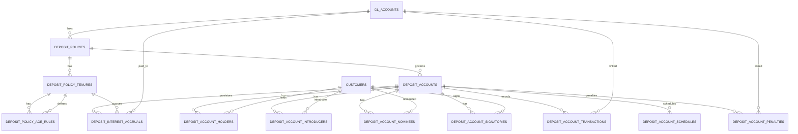
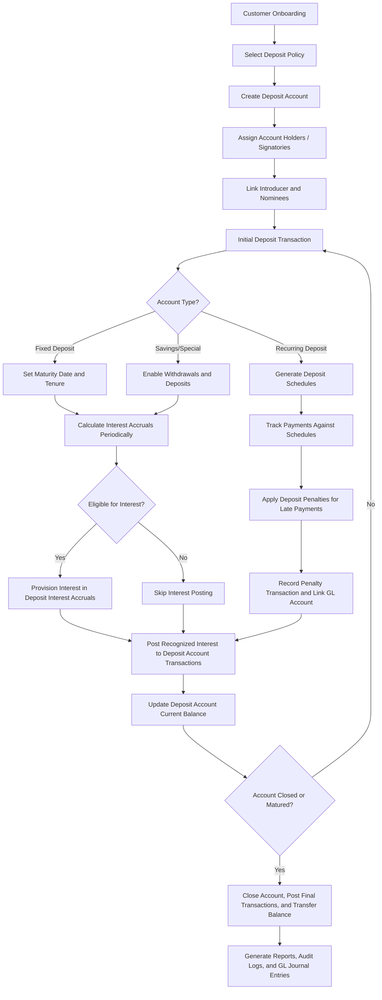

## Deposit Sub-Ledger Database Schema

```sql
CREATE TABLE deposit_policies (
    id BIGINT UNSIGNED AUTO_INCREMENT PRIMARY KEY,
    type ENUM('SAVINGS','FIXED','RECURRING','SPECIAL') NOT NULL,
    code VARCHAR(50) UNIQUE NOT NULL,             -- e.g., "SAV_STD", "FD_12M"
    name VARCHAR(150) NOT NULL,                   -- Product name
    description TEXT,

    -- opening policy
    requires_kyc BOOLEAN DEFAULT TRUE,            -- KYC needed at opening?
    initial_fee DECIMAL(18,2) DEFAULT 0.00,       -- Any initial fee
    min_opening_balance DECIMAL(18,2) DEFAULT 0.00,
    min_balance DECIMAL(18,2) DEFAULT 0.00,       -- Minimum balance for interest eligibility

    -- fine/late policy
    late_payment_fee DECIMAL(18,2) DEFAULT 0.00,  -- Flat late fee
    fine_rate DECIMAL(5,2) DEFAULT 0.00,          -- % fine on overdue amounts

    -- installment/deposit policy
    min_age INT NOT NULL,
    max_age INT NOT NULL,
    min_installment DECIMAL(18,2) NOT NULL,       -- Minimum recurring amount
    max_installment DECIMAL(18,2) DEFAULT NULL,   -- Optional cap
    lock_in_period INT DEFAULT NULL,              -- Months for FD/RD

    -- withdrawal policy
    withdrawal_limit INT DEFAULT NULL,            -- Allowed withdrawals per period
    early_withdrawal_penalty DECIMAL(5,2) DEFAULT 0.00, -- % penalty for early FD/RD breakage

    -- transfer policy
    allow_transfers BOOLEAN DEFAULT TRUE,         -- Can transfer to other accounts?

    -- closing policy (matured/without matured)
    auto_renew BOOLEAN DEFAULT FALSE,             -- Auto-renew on maturity?
    closure_fee DECIMAL(18,2) DEFAULT 0.00,
    premature_closure_fee DECIMAL(18,2) DEFAULT 0.00,

    -- interest policy
    interest_method ENUM('DAILY','MONTHLY','QUARTERLY','HALF_YEARLY','ANNUAL','MATURITY') DEFAULT 'HALF_YEARLY',
    interest_rate DECIMAL(5,2) DEFAULT 0.00,      -- Default annual interest
    interest_eligibility_check BOOLEAN DEFAULT TRUE, -- Flag to enforce eligibility rules

    -- GL accounts
    gl_control_ledger_id BIGINT UNSIGNED DEFAULT NULL,      -- Deposit control account
    gl_interest_payable_id BIGINT UNSIGNED DEFAULT NULL,    -- Liability for accrued interest
    gl_interest_expense_id BIGINT UNSIGNED DEFAULT NULL,    -- P&L account for interest expense
    gl_fee_id BIGINT UNSIGNED DEFAULT NULL,                -- P&L account for fees/fines

    status ENUM('ACTIVE','INACTIVE') DEFAULT 'ACTIVE',
    created_at TIMESTAMP DEFAULT CURRENT_TIMESTAMP,

    -- Foreign keys for GL accounts
    FOREIGN KEY (gl_control_ledger_id) REFERENCES gl_accounts(id),
    FOREIGN KEY (gl_interest_payable_id) REFERENCES gl_accounts(id),
    FOREIGN KEY (gl_interest_expense_id) REFERENCES gl_accounts(id),
    FOREIGN KEY (gl_fee_id) REFERENCES gl_accounts(id)
);

CREATE TABLE deposit_policy_tenures (
    id BIGINT UNSIGNED AUTO_INCREMENT PRIMARY KEY,
    deposit_policy_id BIGINT UNSIGNED NOT NULL,
    tenure_months INT NOT NULL,                    -- e.g., 6, 12, 24
    min_installment DECIMAL(18,2) NOT NULL,        -- Minimum recurring amount
    max_installment DECIMAL(18,2) DEFAULT NULL,    -- Optional cap
    interest_rate DECIMAL(5,2) NOT NULL,           -- Annual rate for this tenure
    notes VARCHAR(255),
    FOREIGN KEY (deposit_policy_id) REFERENCES deposit_policies(id),
    UNIQUE KEY uq_policy_tenure (deposit_policy_id, tenure_months)
);

CREATE TABLE deposit_policy_age_rules (
    id BIGINT UNSIGNED AUTO_INCREMENT PRIMARY KEY,
    tenure_id BIGINT UNSIGNED NOT NULL,
    min_age INT NOT NULL,
    max_age INT NOT NULL,
    adjusted_interest_rate DECIMAL(5,2) DEFAULT NULL,
    adjusted_installment DECIMAL(18,2) DEFAULT NULL,
    notes VARCHAR(255),
    FOREIGN KEY (tenure_id) REFERENCES deposit_policy_tenures(id),
    UNIQUE KEY uq_tenure_age (tenure_id, min_age, max_age)
);

CREATE TABLE deposit_accounts (
    id BIGINT UNSIGNED AUTO_INCREMENT PRIMARY KEY,
    account_no VARCHAR(50) UNIQUE NOT NULL,       -- Unique deposit account number
    account_name VARCHAR(100) UNIQUE NOT NULL,
    policy_id BIGINT UNSIGNED NOT NULL,           -- FK to deposit_policies
    opened_date DATE NOT NULL,
    maturity_date DATE DEFAULT NULL,              -- For FD or RD
    tenure_months INT DEFAULT NULL,               -- Useful for RD
    installment_amount DECIMAL(18,2) DEFAULT NULL,-- RD monthly installment
    status ENUM('OPEN','FROZEN','CLOSED') DEFAULT 'OPEN',
    current_balance DECIMAL(18,2) DEFAULT 0.00,
    last_interest_posted DATE,
    created_at TIMESTAMP DEFAULT CURRENT_TIMESTAMP,
    FOREIGN KEY (policy_id) REFERENCES deposit_policies(id)
);

CREATE TABLE deposit_account_holders (
    id BIGINT UNSIGNED AUTO_INCREMENT PRIMARY KEY,
    deposit_account_id BIGINT UNSIGNED NOT NULL,
    holder_customer_id BIGINT UNSIGNED NOT NULL,
    role ENUM('PRIMARY_HOLDER','JOINT_HOLDER','AUTHORIZED_SIGNATORY') NOT NULL,
    created_at TIMESTAMP DEFAULT CURRENT_TIMESTAMP,
    updated_at TIMESTAMP DEFAULT CURRENT_TIMESTAMP ON UPDATE CURRENT_TIMESTAMP,
    FOREIGN KEY (deposit_account_id) REFERENCES deposit_accounts(id),
    FOREIGN KEY (holder_customer_id) REFERENCES customers(id) ON DELETE CASCADE
);

CREATE TABLE deposit_account_introducers (
    id BIGINT UNSIGNED AUTO_INCREMENT PRIMARY KEY,
    deposit_account_id BIGINT UNSIGNED NOT NULL,
    introducer_customer_id BIGINT UNSIGNED NOT NULL,
    created_at TIMESTAMP DEFAULT CURRENT_TIMESTAMP,
    FOREIGN KEY (deposit_account_id) REFERENCES deposit_accounts(id),
    FOREIGN KEY (introducer_customer_id) REFERENCES customers(id) ON DELETE CASCADE
);

CREATE TABLE deposit_account_nominees (
    id BIGINT UNSIGNED AUTO_INCREMENT PRIMARY KEY,
    deposit_account_id BIGINT UNSIGNED NOT NULL,
    nominee_customer_id BIGINT UNSIGNED DEFAULT NULL,
    name VARCHAR(100) NOT NULL,
    relation VARCHAR(100) NOT NULL,
    share_percentage DECIMAL(5,2) DEFAULT 0,
    FOREIGN KEY (deposit_account_id) REFERENCES deposit_accounts(id),
    FOREIGN KEY (nominee_customer_id) REFERENCES customers(id)
);

CREATE TABLE deposit_account_signatories (
    id BIGINT UNSIGNED AUTO_INCREMENT PRIMARY KEY,
    deposit_account_id BIGINT UNSIGNED NOT NULL,
    signatory_customer_id BIGINT UNSIGNED NOT NULL,
    signing_rule ENUM('PRIMARY','JOINT','DIRECTOR','PARTNER','AUTHORIZED') NOT NULL DEFAULT 'PRIMARY',
    created_at TIMESTAMP DEFAULT CURRENT_TIMESTAMP,
    updated_at TIMESTAMP DEFAULT CURRENT_TIMESTAMP ON UPDATE CURRENT_TIMESTAMP,
    FOREIGN KEY (deposit_account_id) REFERENCES deposit_accounts(id),
    FOREIGN KEY (signatory_customer_id) REFERENCES customers(id) ON DELETE CASCADE,
    UNIQUE KEY uq_account_signatory (deposit_account_id, signatory_customer_id)
);

CREATE TABLE deposit_account_transactions (
    id BIGINT UNSIGNED AUTO_INCREMENT PRIMARY KEY,
    deposit_account_id BIGINT UNSIGNED NOT NULL,
    txn_date DATE NOT NULL,
    description VARCHAR(255),
    debit DECIMAL(18,2) DEFAULT 0.00,
    credit DECIMAL(18,2) DEFAULT 0.00,
    balance DECIMAL(18,2) DEFAULT 0.00,
    reference_no VARCHAR(50),

    -- New fields
    deposit_policy_id BIGINT UNSIGNED DEFAULT NULL,
    interest_accrual_id BIGINT UNSIGNED DEFAULT NULL,
    fee_id BIGINT UNSIGNED DEFAULT NULL,
    gl_control_account_id BIGINT UNSIGNED DEFAULT NULL,

    created_at TIMESTAMP DEFAULT CURRENT_TIMESTAMP,

    FOREIGN KEY (deposit_account_id) REFERENCES deposit_accounts(id),
    FOREIGN KEY (deposit_policy_id) REFERENCES deposit_policies(id),
    FOREIGN KEY (interest_accrual_id) REFERENCES deposit_interest_accruals(id),
    FOREIGN KEY (fee_id) REFERENCES deposit_account_penalties(id),            -- Optional table for fee records
    FOREIGN KEY (gl_control_account_id) REFERENCES gl_accounts(id)
);

CREATE TABLE deposit_account_schedules (
    id BIGINT UNSIGNED AUTO_INCREMENT PRIMARY KEY,
    deposit_account_id BIGINT UNSIGNED NOT NULL,  -- FK to deposit_accounts
    sequence_no INT NOT NULL,                     -- Installment number
    due_date DATE NOT NULL,
    amount_due DECIMAL(18,2) NOT NULL,
    status ENUM('PENDING','PAID','LATE') DEFAULT 'PENDING',
    paid_date DATE DEFAULT NULL,
    created_at TIMESTAMP DEFAULT CURRENT_TIMESTAMP,
    FOREIGN KEY (deposit_account_id) REFERENCES deposit_accounts(id)
);

CREATE TABLE deposit_account_penalties (
    id BIGINT UNSIGNED AUTO_INCREMENT PRIMARY KEY,

    deposit_account_id BIGINT UNSIGNED NOT NULL,     -- FK to deposit_accounts
    related_schedule_id BIGINT UNSIGNED DEFAULT NULL, -- Link to deposit_schedules if applicable
    deposit_policy_id BIGINT UNSIGNED DEFAULT NULL,   -- Optional link to policy
    txn_date DATE NOT NULL,
    description VARCHAR(255),

    penalty_amount DECIMAL(18,2) NOT NULL,
    settled BOOLEAN DEFAULT FALSE,                   -- True when paid / posted
    interest_accrual_id BIGINT UNSIGNED DEFAULT NULL, -- Optional link if penalty adjusts interest
    gl_fee_id BIGINT UNSIGNED DEFAULT NULL,          -- GL account for penalty / fine

    created_at TIMESTAMP DEFAULT CURRENT_TIMESTAMP,

    -- Foreign keys
    FOREIGN KEY (deposit_account_id) REFERENCES deposit_accounts(id),
    FOREIGN KEY (related_schedule_id) REFERENCES deposit_account_schedules(id),
    FOREIGN KEY (deposit_policy_id) REFERENCES deposit_policies(id),
    FOREIGN KEY (interest_accrual_id) REFERENCES deposit_interest_accruals(id),
    FOREIGN KEY (gl_fee_id) REFERENCES gl_accounts(id)
);

CREATE TABLE deposit_interest_accruals (
    id BIGINT UNSIGNED AUTO_INCREMENT PRIMARY KEY,

    deposit_account_id BIGINT UNSIGNED NOT NULL,  -- FK to deposit_accounts
    deposit_policy_id BIGINT UNSIGNED NOT NULL,   -- FK to deposit_policies
    tenure_id BIGINT UNSIGNED DEFAULT NULL,       -- FK to deposit_policy_tenures, if applicable

    provision_date DATE NOT NULL,                 -- Date for which interest is calculated
    provision_amount DECIMAL(18,2) NOT NULL,     -- Calculated interest amount
    eligible BOOLEAN DEFAULT TRUE,               -- True if account qualifies for interest
    recognized BOOLEAN DEFAULT FALSE,            -- True once posted to ledger

    gl_interest_payable_id BIGINT UNSIGNED DEFAULT NULL, -- GL account for liability
    gl_interest_expense_id BIGINT UNSIGNED DEFAULT NULL, -- GL account for expense

    notes VARCHAR(255),                          -- Optional explanation (e.g., "balance below minimum")
    created_at TIMESTAMP DEFAULT CURRENT_TIMESTAMP,

    FOREIGN KEY (deposit_account_id) REFERENCES deposit_accounts(id),
    FOREIGN KEY (deposit_policy_id) REFERENCES deposit_policies(id),
    FOREIGN KEY (tenure_id) REFERENCES deposit_policy_tenures(id),
    FOREIGN KEY (gl_interest_payable_id) REFERENCES gl_accounts(id),
    FOREIGN KEY (gl_interest_expense_id) REFERENCES gl_accounts(id)
);

```

## ER Diagram



## Deposit Account Flow


