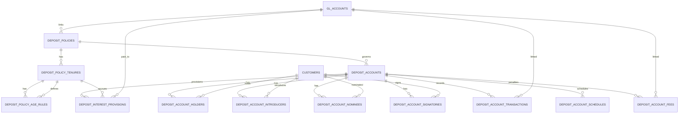
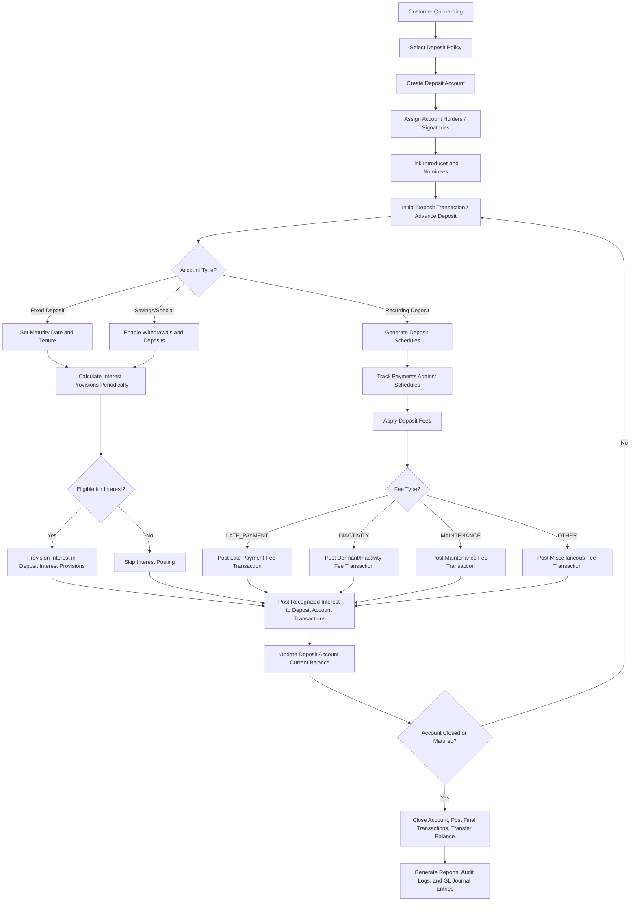

## Deposit Sub-Ledger Database Schema

```sql
-- ===========================
--  DEPOSIT POLICIES & RULES
-- ===========================
CREATE TABLE deposit_policies (
    id BIGINT UNSIGNED AUTO_INCREMENT PRIMARY KEY,
    type ENUM('SAVINGS','FIXED','RECURRING','SPECIAL') NOT NULL,
    code VARCHAR(50) UNIQUE NOT NULL,
    name VARCHAR(150) NOT NULL,
    description TEXT,

    -- Opening policy
    requires_kyc BOOLEAN DEFAULT TRUE,
    initial_fee DECIMAL(18,2) DEFAULT 0.00,
    min_opening_balance DECIMAL(18,2) DEFAULT 0.00,
    min_balance DECIMAL(18,2) DEFAULT 0.00,

    -- Fine / late payment policy
    calculation_method ENUM('FIXED','PERCENTAGE') NOT NULL,
    fine_rate DECIMAL(5,2) DEFAULT 0.00,
    fine_period_unit ENUM('DAY','MONTH') DEFAULT 'DAY',
    max_cap DECIMAL(18,2) DEFAULT NULL,
    apply_on ENUM('PRINCIPAL','INSTALLMENT','TOTAL') DEFAULT 'TOTAL',

    -- Dormant account policy
    inactivity_period INT NOT NULL,
    dormant_period_unit ENUM('MONTH','DAY','YEAR') DEFAULT 'MONTH',
    dormant_action ENUM('MARK_DORMANT','CLOSE_ACCOUNT','BLOCK_TRANSACTIONS') DEFAULT 'MARK_DORMANT',
    notify_member BOOLEAN DEFAULT TRUE,

    -- Installment / deposit policy
    min_age INT NOT NULL,
    max_age INT NOT NULL,
    min_installment DECIMAL(18,2) NOT NULL,
    max_installment DECIMAL(18,2) DEFAULT NULL,
    lock_in_period INT DEFAULT NULL,

    -- Withdrawal policy
    withdrawal_limit INT DEFAULT NULL,
    early_withdrawal_penalty DECIMAL(5,2) DEFAULT 0.00,

    -- Transfer policy
    allow_transfers BOOLEAN DEFAULT TRUE,

    -- Closing policy
    auto_renew BOOLEAN DEFAULT FALSE,
    closure_fee DECIMAL(18,2) DEFAULT 0.00,
    premature_closure_fee DECIMAL(18,2) DEFAULT 0.00,

    -- Interest policy
    interest_method ENUM('DAILY','WEEKLY','MONTHLY','QUARTERLY','HALF_YEARLY','ANNUAL','MATURITY') DEFAULT 'HALF_YEARLY',
    interest_rate DECIMAL(5,2) DEFAULT 0.00,
    interest_eligibility_check BOOLEAN DEFAULT TRUE,

    -- GL accounts
    gl_deposit_payable_id BIGINT UNSIGNED DEFAULT NULL,
    gl_interest_payable_id BIGINT UNSIGNED DEFAULT NULL,
    gl_interest_expense_id BIGINT UNSIGNED DEFAULT NULL,
    gl_fee_id BIGINT UNSIGNED DEFAULT NULL,

    status ENUM('ACTIVE','INACTIVE') DEFAULT 'ACTIVE',
    created_at TIMESTAMP DEFAULT CURRENT_TIMESTAMP,
    updated_at TIMESTAMP DEFAULT CURRENT_TIMESTAMP ON UPDATE CURRENT_TIMESTAMP,

    FOREIGN KEY (gl_deposit_payable_id) REFERENCES gl_accounts(id),
    FOREIGN KEY (gl_interest_payable_id) REFERENCES gl_accounts(id),
    FOREIGN KEY (gl_interest_expense_id) REFERENCES gl_accounts(id),
    FOREIGN KEY (gl_fee_id) REFERENCES gl_accounts(id)
);

CREATE TABLE deposit_policy_tenures (
    id BIGINT UNSIGNED AUTO_INCREMENT PRIMARY KEY,
    deposit_policy_id BIGINT UNSIGNED NOT NULL,
    tenure_months INT NOT NULL,
    min_installment DECIMAL(18,2) NOT NULL,
    max_installment DECIMAL(18,2) DEFAULT NULL,
    interest_rate DECIMAL(5,2) NOT NULL,
    notes VARCHAR(255),
    created_at TIMESTAMP DEFAULT CURRENT_TIMESTAMP,
    updated_at TIMESTAMP DEFAULT CURRENT_TIMESTAMP ON UPDATE CURRENT_TIMESTAMP,
    FOREIGN KEY (deposit_policy_id) REFERENCES deposit_policies(id) ON DELETE CASCADE,
    UNIQUE KEY uq_policy_tenure (deposit_policy_id, tenure_months)
);

CREATE TABLE deposit_policy_age_rules (
    id BIGINT UNSIGNED AUTO_INCREMENT PRIMARY KEY,
    tenure_id BIGINT UNSIGNED NOT NULL,
    min_age INT NOT NULL,
    max_age INT NOT NULL,
    adjusted_interest_rate DECIMAL(5,2) DEFAULT NULL,
    adjusted_installment DECIMAL(18,2) DEFAULT NULL,
    notes VARCHAR(255),
    created_at TIMESTAMP DEFAULT CURRENT_TIMESTAMP,
    updated_at TIMESTAMP DEFAULT CURRENT_TIMESTAMP ON UPDATE CURRENT_TIMESTAMP,
    FOREIGN KEY (tenure_id) REFERENCES deposit_policy_tenures(id) ON DELETE CASCADE,
    UNIQUE KEY uq_tenure_age (tenure_id, min_age, max_age)
);

-- ===========================
--  DEPOSIT ACCOUNTS
-- ===========================
CREATE TABLE deposit_accounts (
    id BIGINT UNSIGNED AUTO_INCREMENT PRIMARY KEY,
    account_no VARCHAR(50) UNIQUE NOT NULL,
    account_name VARCHAR(100) UNIQUE NOT NULL,
    policy_id BIGINT UNSIGNED NOT NULL,
    opened_date DATE NOT NULL,
    maturity_date DATE DEFAULT NULL,
    tenure_months INT DEFAULT NULL,
    installment_amount DECIMAL(18,2) DEFAULT NULL,
    status ENUM('OPEN','FROZEN','DORMANT','CLOSED') DEFAULT 'OPEN',
    current_balance DECIMAL(18,2) DEFAULT 0.00,
    last_interest_posted DATE,
    created_at TIMESTAMP DEFAULT CURRENT_TIMESTAMP,
    updated_at TIMESTAMP DEFAULT CURRENT_TIMESTAMP ON UPDATE CURRENT_TIMESTAMP,
    FOREIGN KEY (policy_id) REFERENCES deposit_policies(id)
);

CREATE TABLE deposit_account_holders (
    id BIGINT UNSIGNED AUTO_INCREMENT PRIMARY KEY,
    deposit_account_id BIGINT UNSIGNED NOT NULL,
    holder_customer_id BIGINT UNSIGNED NOT NULL,
    role ENUM('PRIMARY_HOLDER','JOINT_HOLDER','AUTHORIZED_SIGNATORY') NOT NULL,
    created_at TIMESTAMP DEFAULT CURRENT_TIMESTAMP,
    updated_at TIMESTAMP DEFAULT CURRENT_TIMESTAMP ON UPDATE CURRENT_TIMESTAMP,
    FOREIGN KEY (deposit_account_id) REFERENCES deposit_accounts(id),
    FOREIGN KEY (holder_customer_id) REFERENCES customers(id) ON DELETE CASCADE
);

CREATE TABLE deposit_account_nominees (
    id BIGINT UNSIGNED AUTO_INCREMENT PRIMARY KEY,
    deposit_account_id BIGINT UNSIGNED NOT NULL,
    nominee_customer_id BIGINT UNSIGNED DEFAULT NULL,
    name VARCHAR(100) NOT NULL,
    relation VARCHAR(100) NOT NULL,
    share_percentage DECIMAL(5,2) DEFAULT 0,
    FOREIGN KEY (deposit_account_id) REFERENCES deposit_accounts(id),
    FOREIGN KEY (nominee_customer_id) REFERENCES customers(id)
);

CREATE TABLE deposit_account_transactions (
    id BIGINT UNSIGNED AUTO_INCREMENT PRIMARY KEY,
    deposit_account_id BIGINT UNSIGNED NOT NULL,
    txn_date DATE NOT NULL,
    description VARCHAR(255),
    debit DECIMAL(18,2) DEFAULT 0.00,
    credit DECIMAL(18,2) DEFAULT 0.00,
    balance DECIMAL(18,2) DEFAULT 0.00,
    reference_no VARCHAR(50),
    transaction_type ENUM(
        'DEPOSIT','WITHDRAWAL','INTEREST','INTEREST_REV','FEE',
        'PENALTY','TRANSFER_IN','TRANSFER_OUT'
    ) DEFAULT 'DEPOSIT',
    reversal_of_txn_id BIGINT UNSIGNED DEFAULT NULL, -- for reversals

    deposit_policy_id BIGINT UNSIGNED DEFAULT NULL,
    interest_accrual_id BIGINT UNSIGNED DEFAULT NULL,
    deposit_account_fee_id BIGINT UNSIGNED DEFAULT NULL,
    gl_control_account_id BIGINT UNSIGNED DEFAULT NULL,

    created_at TIMESTAMP DEFAULT CURRENT_TIMESTAMP,
    updated_at TIMESTAMP DEFAULT CURRENT_TIMESTAMP ON UPDATE CURRENT_TIMESTAMP,

    FOREIGN KEY (deposit_account_id) REFERENCES deposit_accounts(id),
    FOREIGN KEY (deposit_policy_id) REFERENCES deposit_policies(id),
    FOREIGN KEY (interest_accrual_id) REFERENCES deposit_interest_provisions(id),
    FOREIGN KEY (deposit_account_fee_id) REFERENCES deposit_account_fees(id),
    FOREIGN KEY (gl_control_account_id) REFERENCES gl_accounts(id),
    FOREIGN KEY (reversal_of_txn_id) REFERENCES deposit_account_transactions(id)
);

CREATE TABLE deposit_account_schedules (
    id BIGINT UNSIGNED AUTO_INCREMENT PRIMARY KEY,
    deposit_account_id BIGINT UNSIGNED NOT NULL,
    sequence_no INT NOT NULL,
    due_date DATE NOT NULL,
    amount_due DECIMAL(18,2) NOT NULL,
    status ENUM('PENDING','PAID','LATE') DEFAULT 'PENDING',
    paid_date DATE DEFAULT NULL,
    created_at TIMESTAMP DEFAULT CURRENT_TIMESTAMP,
    updated_at TIMESTAMP DEFAULT CURRENT_TIMESTAMP ON UPDATE CURRENT_TIMESTAMP,
    FOREIGN KEY (deposit_account_id) REFERENCES deposit_accounts(id)
);

CREATE TABLE deposit_account_fees (
    id BIGINT UNSIGNED AUTO_INCREMENT PRIMARY KEY,
    deposit_account_id BIGINT UNSIGNED NOT NULL,
    related_schedule_id BIGINT UNSIGNED DEFAULT NULL,
    deposit_policy_id BIGINT UNSIGNED DEFAULT NULL,
    txn_date DATE NOT NULL,
    description VARCHAR(255),
    fee_type ENUM(
        'LATE_PAYMENT',     -- Fee for late recurring deposit
        'INACTIVITY',       -- Fee for dormant/inactive account
        'MAINTENANCE',      -- annual account maintenance fee  ??? From Account
        -- 'CLOSURE',          -- Fee for premature or regular closure
        -- 'TRANSFER',         -- Fee for account-to-account transfer
        'OTHER'             -- Any miscellaneous fee
    ) DEFAULT 'LATE_PAYMENT',
    penalty_amount DECIMAL(18,2) NOT NULL,
    settled BOOLEAN DEFAULT FALSE,
    interest_accrual_id BIGINT UNSIGNED DEFAULT NULL,
    gl_fee_id BIGINT UNSIGNED DEFAULT NULL,
    created_at TIMESTAMP DEFAULT CURRENT_TIMESTAMP,
    updated_at TIMESTAMP DEFAULT CURRENT_TIMESTAMP ON UPDATE CURRENT_TIMESTAMP,
    FOREIGN KEY (deposit_account_id) REFERENCES deposit_accounts(id),
    FOREIGN KEY (related_schedule_id) REFERENCES deposit_account_schedules(id),
    FOREIGN KEY (deposit_policy_id) REFERENCES deposit_policies(id),
    FOREIGN KEY (interest_accrual_id) REFERENCES deposit_interest_provisions(id),
    FOREIGN KEY (gl_fee_id) REFERENCES gl_accounts(id)
);

CREATE TABLE deposit_interest_provisions (
    id BIGINT UNSIGNED AUTO_INCREMENT PRIMARY KEY,
    deposit_account_id BIGINT UNSIGNED NOT NULL,
    deposit_policy_id BIGINT UNSIGNED NOT NULL,
    tenure_id BIGINT UNSIGNED DEFAULT NULL,
    provision_date DATE NOT NULL,
    provision_amount DECIMAL(18,2) NOT NULL,
    eligible BOOLEAN DEFAULT TRUE,
    recognized BOOLEAN DEFAULT FALSE,
    gl_interest_payable_id BIGINT UNSIGNED DEFAULT NULL,
    gl_interest_expense_id BIGINT UNSIGNED DEFAULT NULL,
    notes VARCHAR(255),
    created_at TIMESTAMP DEFAULT CURRENT_TIMESTAMP,
    updated_at TIMESTAMP DEFAULT CURRENT_TIMESTAMP ON UPDATE CURRENT_TIMESTAMP,
    FOREIGN KEY (deposit_account_id) REFERENCES deposit_accounts(id),
    FOREIGN KEY (deposit_policy_id) REFERENCES deposit_policies(id),
    FOREIGN KEY (tenure_id) REFERENCES deposit_policy_tenures(id),
    FOREIGN KEY (gl_interest_payable_id) REFERENCES gl_accounts(id),
    FOREIGN KEY (gl_interest_expense_id) REFERENCES gl_accounts(id)
);
```

## ER Diagram



## Deposit Account Flow


