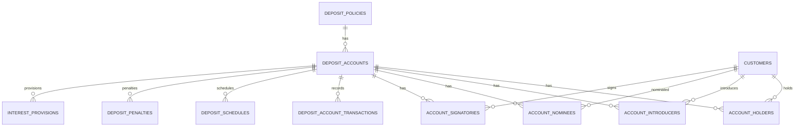
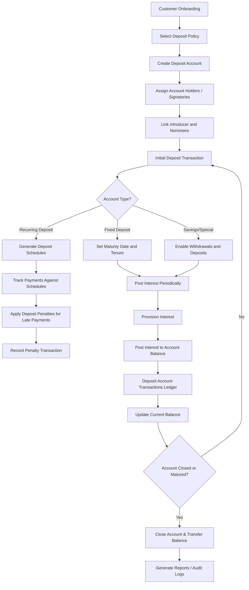

## Deposit Sub-Ledger Database Schema

```sql
CREATE TABLE deposit_policies (
    id BIGINT UNSIGNED AUTO_INCREMENT PRIMARY KEY,
    code VARCHAR(50) UNIQUE NOT NULL,             -- e.g., "SAV_STD", "FD_12M"
    name VARCHAR(150) NOT NULL,                   -- Product name
    description TEXT,
    type ENUM('SAVINGS','FIXED','RECURRING','SPECIAL') NOT NULL,
    interest_rate DECIMAL(5,2) DEFAULT 0.00,      -- Annual interest/dividend %
    interest_method ENUM('DAILY','MONTHLY','QUARTERLY','ANNUAL') DEFAULT 'MONTHLY',
    min_opening_balance DECIMAL(18,2) DEFAULT 0.00,
    min_balance DECIMAL(18,2) DEFAULT 0.00,
    lock_in_period INT DEFAULT NULL,              -- Months for FD/RD
    withdrawal_limit INT DEFAULT NULL,            -- Allowed withdrawals per period
    status ENUM('ACTIVE','INACTIVE') DEFAULT 'ACTIVE',
    created_at TIMESTAMP DEFAULT CURRENT_TIMESTAMP
);

CREATE TABLE deposit_accounts (
    id BIGINT UNSIGNED AUTO_INCREMENT PRIMARY KEY,
    account_no VARCHAR(50) UNIQUE NOT NULL,       -- Unique deposit account number
    account_name VARCHAR(100) UNIQUE NOT NULL,
    policy_id BIGINT UNSIGNED NOT NULL,           -- FK to deposit_policies
    opened_date DATE NOT NULL,
    maturity_date DATE DEFAULT NULL,              -- For FD or RD
    tenure_months INT DEFAULT NULL,               -- Useful for RD
    installment_amount DECIMAL(18,2) DEFAULT NULL,-- RD monthly installment
    status ENUM('OPEN','FROZEN','CLOSED') DEFAULT 'OPEN',
    current_balance DECIMAL(18,2) DEFAULT 0.00,
    last_interest_posted DATE,
    created_at TIMESTAMP DEFAULT CURRENT_TIMESTAMP,
    FOREIGN KEY (policy_id) REFERENCES deposit_policies(id)
);

CREATE TABLE account_holders (
    id BIGINT UNSIGNED AUTO_INCREMENT PRIMARY KEY,
    deposit_account_id BIGINT UNSIGNED NOT NULL,
    holder_customer_id BIGINT UNSIGNED NOT NULL,
    role ENUM('PRIMARY_HOLDER','JOINT_HOLDER','AUTHORIZED_SIGNATORY') NOT NULL,
    created_at TIMESTAMP DEFAULT CURRENT_TIMESTAMP,
    updated_at TIMESTAMP DEFAULT CURRENT_TIMESTAMP ON UPDATE CURRENT_TIMESTAMP,
    FOREIGN KEY (deposit_account_id) REFERENCES deposit_accounts(id),
    FOREIGN KEY (holder_customer_id) REFERENCES customers(id) ON DELETE CASCADE
);

CREATE TABLE account_introducers (
    id BIGINT UNSIGNED AUTO_INCREMENT PRIMARY KEY,
    deposit_account_id BIGINT UNSIGNED NOT NULL,
    introducer_customer_id BIGINT UNSIGNED NOT NULL,
    created_at TIMESTAMP DEFAULT CURRENT_TIMESTAMP,
    FOREIGN KEY (deposit_account_id) REFERENCES deposit_accounts(id),
    FOREIGN KEY (introducer_customer_id) REFERENCES customers(id) ON DELETE CASCADE
);

CREATE TABLE account_nominees (
    id BIGINT UNSIGNED AUTO_INCREMENT PRIMARY KEY,
    deposit_account_id BIGINT UNSIGNED NOT NULL,
    nominee_customer_id BIGINT UNSIGNED DEFAULT NULL,
    name VARCHAR(100) NOT NULL,
    relation VARCHAR(100) NOT NULL,
    share_percentage DECIMAL(5,2) DEFAULT 0,
    FOREIGN KEY (deposit_account_id) REFERENCES deposit_accounts(id),
    FOREIGN KEY (nominee_customer_id) REFERENCES customers(id)
);

CREATE TABLE account_signatories (
    id BIGINT UNSIGNED AUTO_INCREMENT PRIMARY KEY,
    deposit_account_id BIGINT UNSIGNED NOT NULL,
    signatory_customer_id BIGINT UNSIGNED NOT NULL,
    signing_rule ENUM('PRIMARY','JOINT','DIRECTOR','PARTNER','AUTHORIZED') NOT NULL DEFAULT 'PRIMARY',
    created_at TIMESTAMP DEFAULT CURRENT_TIMESTAMP,
    updated_at TIMESTAMP DEFAULT CURRENT_TIMESTAMP ON UPDATE CURRENT_TIMESTAMP,
    FOREIGN KEY (deposit_account_id) REFERENCES deposit_accounts(id),
    FOREIGN KEY (signatory_customer_id) REFERENCES customers(id) ON DELETE CASCADE,
    UNIQUE KEY uq_account_signatory (deposit_account_id, signatory_customer_id)
);

CREATE TABLE deposit_account_transactions (
    id BIGINT UNSIGNED AUTO_INCREMENT PRIMARY KEY,
    deposit_account_id BIGINT UNSIGNED NOT NULL,  -- FK to deposit_accounts
    txn_date DATE NOT NULL,
    description VARCHAR(255),
    debit DECIMAL(18,2) DEFAULT 0.00,             -- Withdrawals, penalties
    credit DECIMAL(18,2) DEFAULT 0.00,            -- Deposits, interest
    balance DECIMAL(18,2) DEFAULT 0.00,           -- Running balance
    reference_no VARCHAR(50),                     -- Receipt or journal reference
    created_at TIMESTAMP DEFAULT CURRENT_TIMESTAMP,
    FOREIGN KEY (deposit_account_id) REFERENCES deposit_accounts(id)
);

CREATE TABLE deposit_schedules (
    id BIGINT UNSIGNED AUTO_INCREMENT PRIMARY KEY,
    deposit_account_id BIGINT UNSIGNED NOT NULL,  -- FK to deposit_accounts
    sequence_no INT NOT NULL,                     -- Installment number
    due_date DATE NOT NULL,
    amount_due DECIMAL(18,2) NOT NULL,
    status ENUM('PENDING','PAID','LATE') DEFAULT 'PENDING',
    paid_date DATE DEFAULT NULL,
    created_at TIMESTAMP DEFAULT CURRENT_TIMESTAMP,
    FOREIGN KEY (deposit_account_id) REFERENCES deposit_accounts(id)
);

CREATE TABLE deposit_penalties (
    id BIGINT UNSIGNED AUTO_INCREMENT PRIMARY KEY,
    deposit_account_id BIGINT UNSIGNED NOT NULL,  -- FK to deposit_accounts
    related_schedule_id BIGINT UNSIGNED DEFAULT NULL, -- Link to deposit_schedules if applicable
    txn_date DATE NOT NULL,
    description VARCHAR(255),
    penalty_amount DECIMAL(18,2) NOT NULL,
    settled BOOLEAN DEFAULT FALSE,
    created_at TIMESTAMP DEFAULT CURRENT_TIMESTAMP,
    FOREIGN KEY (deposit_account_id) REFERENCES deposit_accounts(id),
    FOREIGN KEY (related_schedule_id) REFERENCES deposit_schedules(id)
);

CREATE TABLE interest_provisions (
    id BIGINT UNSIGNED AUTO_INCREMENT PRIMARY KEY,
    deposit_account_id BIGINT UNSIGNED NOT NULL,  -- FK to deposit_accounts
    provision_date DATE NOT NULL,
    provision_amount DECIMAL(18,2) NOT NULL,
    recognized BOOLEAN DEFAULT FALSE,             -- Mark true when posted to ledger
    created_at TIMESTAMP DEFAULT CURRENT_TIMESTAMP,
    FOREIGN KEY (deposit_account_id) REFERENCES deposit_accounts(id)
);
```

## ER Diagram



## Deposit Account Flow


