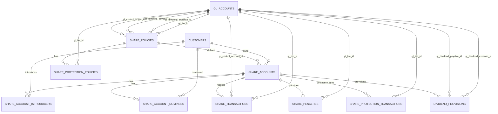
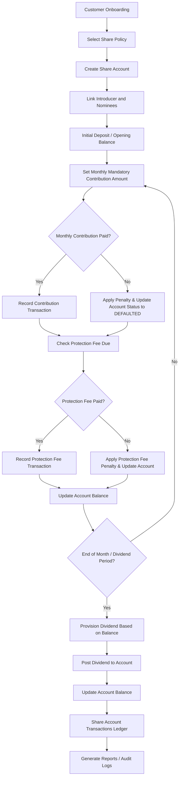

```sql
-- ===============================
-- Share Policies
-- ===============================
CREATE TABLE share_policies (
    id BIGINT UNSIGNED AUTO_INCREMENT PRIMARY KEY,
    code VARCHAR(50) UNIQUE NOT NULL,
    name VARCHAR(150) NOT NULL,
    description TEXT,

    -- Minimum balances & contributions
    min_opening_balance DECIMAL(18,2) DEFAULT 0.00,
    min_balance DECIMAL(18,2) DEFAULT 0.00,
    mandatory_monthly_contribution DECIMAL(18,2) DEFAULT 50.00,

    -- Dividend policy
    dividend_rate DECIMAL(5,2) DEFAULT 0.00,
    dividend_frequency ENUM('QUARTERLY','ANNUAL') DEFAULT 'ANNUAL',

    -- Withdrawal & protection
    withdrawal_limit INT DEFAULT NULL,
    protection_policy BOOLEAN DEFAULT TRUE,

    -- GL Accounts
    gl_control_ledger_id BIGINT UNSIGNED DEFAULT NULL,
    gl_dividend_payable_id BIGINT UNSIGNED DEFAULT NULL,
    gl_dividend_expense_id BIGINT UNSIGNED DEFAULT NULL,
    gl_fee_id BIGINT UNSIGNED DEFAULT NULL,

    status ENUM('ACTIVE','INACTIVE') DEFAULT 'ACTIVE',
    created_at TIMESTAMP DEFAULT CURRENT_TIMESTAMP,

    FOREIGN KEY (gl_control_ledger_id) REFERENCES gl_accounts(id),
    FOREIGN KEY (gl_dividend_payable_id) REFERENCES gl_accounts(id),
    FOREIGN KEY (gl_dividend_expense_id) REFERENCES gl_accounts(id),
    FOREIGN KEY (gl_fee_id) REFERENCES gl_accounts(id)
);

-- ===============================
-- Share Accounts
-- ===============================
CREATE TABLE share_accounts (
    id BIGINT UNSIGNED AUTO_INCREMENT PRIMARY KEY,
    account_no VARCHAR(50) UNIQUE NOT NULL,
    customer_id BIGINT UNSIGNED NOT NULL,
    share_policy_id BIGINT UNSIGNED NOT NULL,
    opened_date DATE NOT NULL,
    status ENUM('OPEN','FROZEN','CLOSED','DEFAULTED') DEFAULT 'OPEN',
    current_balance DECIMAL(18,2) DEFAULT 0.00,
    last_contribution_date DATE DEFAULT NULL,
    last_dividend_posted DATE,
    protection_fee_balance DECIMAL(18,2) DEFAULT 0.00,
    created_at TIMESTAMP DEFAULT CURRENT_TIMESTAMP,

    FOREIGN KEY (customer_id) REFERENCES customers(id),
    FOREIGN KEY (share_policy_id) REFERENCES share_policies(id)
);

-- ===============================
-- Share Protection Policy
-- ===============================
CREATE TABLE share_protection_policies (
    id BIGINT UNSIGNED AUTO_INCREMENT PRIMARY KEY,
    share_policy_id BIGINT UNSIGNED NOT NULL,
    monthly_fee DECIMAL(18,2) NOT NULL DEFAULT 10.00,
    active BOOLEAN DEFAULT TRUE,
    gl_fee_id BIGINT UNSIGNED DEFAULT NULL,
    created_at TIMESTAMP DEFAULT CURRENT_TIMESTAMP,

    FOREIGN KEY (share_policy_id) REFERENCES share_policies(id),
    FOREIGN KEY (gl_fee_id) REFERENCES gl_accounts(id)
);

-- ===============================
-- Share Account Introducers
-- ===============================
CREATE TABLE share_account_introducers (
    id BIGINT UNSIGNED AUTO_INCREMENT PRIMARY KEY,
    share_account_id BIGINT UNSIGNED NOT NULL,
    introducer_customer_id BIGINT UNSIGNED NOT NULL,
    created_at TIMESTAMP DEFAULT CURRENT_TIMESTAMP,
    FOREIGN KEY (share_account_id) REFERENCES share_accounts(id),
    FOREIGN KEY (introducer_customer_id) REFERENCES customers(id) ON DELETE CASCADE
);

-- ===============================
-- Share Account Nominees
-- ===============================
CREATE TABLE share_account_nominees (
    id BIGINT UNSIGNED AUTO_INCREMENT PRIMARY KEY,
    share_account_id BIGINT UNSIGNED NOT NULL,
    nominee_customer_id BIGINT UNSIGNED DEFAULT NULL,
    name VARCHAR(100) NOT NULL,
    relation VARCHAR(100) NOT NULL,
    share_percentage DECIMAL(5,2) DEFAULT 0,
    FOREIGN KEY (share_account_id) REFERENCES share_accounts(id),
    FOREIGN KEY (nominee_customer_id) REFERENCES customers(id)
);

-- ===============================
-- Share Transactions (Contribution, Dividend, Penalty, Protection Fee)
-- ===============================
CREATE TABLE share_transactions (
    id BIGINT UNSIGNED AUTO_INCREMENT PRIMARY KEY,
    share_account_id BIGINT UNSIGNED NOT NULL,
    txn_date DATE NOT NULL,
    description VARCHAR(255),
    debit DECIMAL(18,2) DEFAULT 0.00,
    credit DECIMAL(18,2) DEFAULT 0.00,
    balance DECIMAL(18,2) DEFAULT 0.00,
    reference_no VARCHAR(50),
    transaction_type ENUM('CONTRIBUTION','DIVIDEND','PENALTY','PROTECTION_FEE') DEFAULT 'CONTRIBUTION',
    penalty_applied BOOLEAN DEFAULT FALSE,
    protection_fee_applied BOOLEAN DEFAULT FALSE,
    gl_control_account_id BIGINT UNSIGNED DEFAULT NULL,
    gl_fee_id BIGINT UNSIGNED DEFAULT NULL,
    created_at TIMESTAMP DEFAULT CURRENT_TIMESTAMP,

    FOREIGN KEY (share_account_id) REFERENCES share_accounts(id),
    FOREIGN KEY (gl_control_account_id) REFERENCES gl_accounts(id),
    FOREIGN KEY (gl_fee_id) REFERENCES gl_accounts(id)
);

-- ===============================
-- Share Penalties (Late contribution)
-- ===============================
CREATE TABLE share_penalties (
    id BIGINT UNSIGNED AUTO_INCREMENT PRIMARY KEY,
    share_account_id BIGINT UNSIGNED NOT NULL,
    txn_date DATE NOT NULL,
    description VARCHAR(255),
    penalty_amount DECIMAL(18,2) NOT NULL,
    settled BOOLEAN DEFAULT FALSE,
    gl_fee_id BIGINT UNSIGNED DEFAULT NULL,
    created_at TIMESTAMP DEFAULT CURRENT_TIMESTAMP,

    FOREIGN KEY (share_account_id) REFERENCES share_accounts(id),
    FOREIGN KEY (gl_fee_id) REFERENCES gl_accounts(id)
);

-- ===============================
-- Share Protection Fee Transactions
-- ===============================
CREATE TABLE share_protection_transactions (
    id BIGINT UNSIGNED AUTO_INCREMENT PRIMARY KEY,
    share_account_id BIGINT UNSIGNED NOT NULL,
    protection_policy_id BIGINT UNSIGNED NOT NULL,
    txn_date DATE NOT NULL,
    fee_amount DECIMAL(18,2) NOT NULL,
    settled BOOLEAN DEFAULT FALSE,
    gl_fee_id BIGINT UNSIGNED DEFAULT NULL,
    description VARCHAR(255) DEFAULT 'Monthly protection fee',
    created_at TIMESTAMP DEFAULT CURRENT_TIMESTAMP,

    FOREIGN KEY (share_account_id) REFERENCES share_accounts(id),
    FOREIGN KEY (protection_policy_id) REFERENCES share_protection_policies(id),
    FOREIGN KEY (gl_fee_id) REFERENCES gl_accounts(id)
);

-- ===============================
-- Dividend Provisions
-- ===============================
CREATE TABLE dividend_provisions (
    id BIGINT UNSIGNED AUTO_INCREMENT PRIMARY KEY,
    share_account_id BIGINT UNSIGNED NOT NULL,
    provision_date DATE NOT NULL,
    provision_amount DECIMAL(18,2) NOT NULL,
    recognized BOOLEAN DEFAULT FALSE,
    gl_dividend_payable_id BIGINT UNSIGNED DEFAULT NULL,
    gl_dividend_expense_id BIGINT UNSIGNED DEFAULT NULL,
    notes VARCHAR(255),
    created_at TIMESTAMP DEFAULT CURRENT_TIMESTAMP,

    FOREIGN KEY (share_account_id) REFERENCES share_accounts(id),
    FOREIGN KEY (gl_dividend_payable_id) REFERENCES gl_accounts(id),
    FOREIGN KEY (gl_dividend_expense_id) REFERENCES gl_accounts(id)
);
```

## ER Diagram



## Deposit Account Flow


