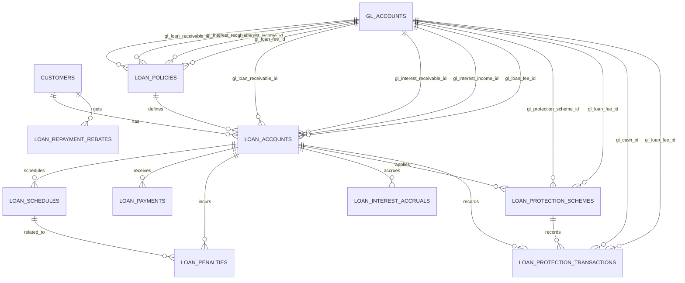
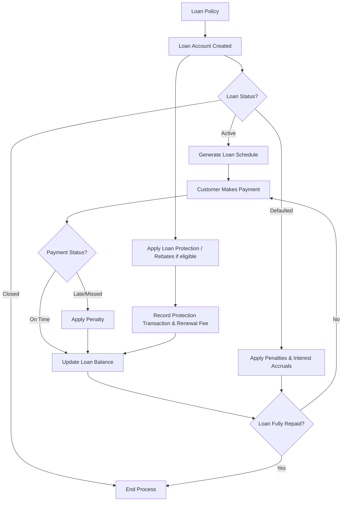

```sql
CREATE TABLE loan_policies (
    id BIGINT UNSIGNED AUTO_INCREMENT PRIMARY KEY,
    code VARCHAR(50) UNIQUE NOT NULL,
    name VARCHAR(150) NOT NULL,
    description TEXT,
    type ENUM('TERM_LOAN','OVERDRAFT','MORTGAGE','PERSONAL') NOT NULL,

    -- Open
    min_amount DECIMAL(18,2) DEFAULT 0.00,
    max_amount DECIMAL(18,2) DEFAULT 0.00,
    eligibility_check BOOLEAN DEFAULT TRUE,

    -- Interest
    interest_rate DECIMAL(5,2) NOT NULL,
    interest_method ENUM('FLAT','REDUCING','COMPOUND') DEFAULT 'REDUCING',
    interest_accrual BOOLEAN DEFAULT TRUE,
    interest_eligibility_check BOOLEAN DEFAULT TRUE,
    gl_interest_receivable_id BIGINT UNSIGNED DEFAULT NULL,
    gl_interest_income_id BIGINT UNSIGNED DEFAULT NULL,

    -- Installment / Repayment
    tenure_months INT NOT NULL,
    repayment_frequency ENUM('MONTHLY','QUARTERLY','WEEKLY') DEFAULT 'MONTHLY',
    installment_type ENUM('PRINCIPAL_INTEREST','PRINCIPAL_ONLY','INTEREST_ONLY') DEFAULT 'PRINCIPAL_INTEREST',
    installment_calculation_method ENUM('FLAT','REDUCING','COMPOUND') DEFAULT 'REDUCING',
    gl_loan_receivable_id BIGINT UNSIGNED DEFAULT NULL,

    -- Penalty / Fine
    late_payment_fee DECIMAL(18,2) DEFAULT 0.00,
    fine_rate DECIMAL(5,2) DEFAULT 0.00,
    fine_calculation_method ENUM('FIXED','PERCENTAGE','TIERED') DEFAULT 'FIXED',
    fine_max_cap DECIMAL(18,2) DEFAULT NULL,
    first_reminder_days INT DEFAULT 0,
    second_reminder_days INT DEFAULT 0,
    final_reminder_days INT DEFAULT 0,
    gl_loan_fee_id BIGINT UNSIGNED DEFAULT NULL,

    status ENUM('ACTIVE','INACTIVE') DEFAULT 'ACTIVE',
    created_at TIMESTAMP DEFAULT CURRENT_TIMESTAMP,

    FOREIGN KEY (gl_interest_receivable_id) REFERENCES gl_accounts(id),
    FOREIGN KEY (gl_interest_income_id) REFERENCES gl_accounts(id),
    FOREIGN KEY (gl_loan_receivable_id) REFERENCES gl_accounts(id),
    FOREIGN KEY (gl_loan_fee_id) REFERENCES gl_accounts(id)
);

-- Loan Accounts
CREATE TABLE loan_accounts (
    id BIGINT UNSIGNED AUTO_INCREMENT PRIMARY KEY,
    account_no VARCHAR(50) UNIQUE NOT NULL,
    customer_id BIGINT UNSIGNED NOT NULL,
    policy_id BIGINT UNSIGNED NOT NULL,
    disbursed_amount DECIMAL(18,2) NOT NULL,
    disbursed_date DATE NOT NULL,
    tenure_months INT NOT NULL,
    interest_rate DECIMAL(5,2) NOT NULL,
    repayment_frequency ENUM('MONTHLY','QUARTERLY','WEEKLY') DEFAULT 'MONTHLY',
    status ENUM('ACTIVE','CLOSED','DEFAULTED') DEFAULT 'ACTIVE',
    current_balance DECIMAL(18,2) DEFAULT 0.00,
    protection_scheme_id BIGINT UNSIGNED DEFAULT NULL,
    gl_loan_receivable_id BIGINT UNSIGNED DEFAULT NULL,
    gl_interest_receivable_id BIGINT UNSIGNED DEFAULT NULL,
    gl_interest_income_id BIGINT UNSIGNED DEFAULT NULL,
    gl_loan_fee_id BIGINT UNSIGNED DEFAULT NULL,
    created_at TIMESTAMP DEFAULT CURRENT_TIMESTAMP,
    FOREIGN KEY (customer_id) REFERENCES customers(id),
    FOREIGN KEY (policy_id) REFERENCES loan_policies(id),
    FOREIGN KEY (protection_scheme_id) REFERENCES loan_protection_schemes(id),
    FOREIGN KEY (gl_loan_receivable_id) REFERENCES gl_accounts(id),
    FOREIGN KEY (gl_interest_receivable_id) REFERENCES gl_accounts(id),
    FOREIGN KEY (gl_interest_income_id) REFERENCES gl_accounts(id),
    FOREIGN KEY (gl_loan_fee_id) REFERENCES gl_accounts(id)
);

-- Loan Protection Schemes
CREATE TABLE loan_protection_schemes (
    id BIGINT UNSIGNED AUTO_INCREMENT PRIMARY KEY,
    loan_account_id BIGINT UNSIGNED NOT NULL,
    scheme_name VARCHAR(150) NOT NULL,
    coverage_amount DECIMAL(18,2) NOT NULL,
    start_date DATE NOT NULL,
    end_date DATE NOT NULL,
    premium_amount DECIMAL(18,2) NOT NULL,
    renewal_fee DECIMAL(18,2) DEFAULT 0.00,
    status ENUM('ACTIVE','EXPIRED','LAPSED') DEFAULT 'ACTIVE',
    gl_protection_scheme_id BIGINT UNSIGNED DEFAULT NULL,
    gl_loan_fee_id BIGINT UNSIGNED DEFAULT NULL,
    created_at TIMESTAMP DEFAULT CURRENT_TIMESTAMP,
    FOREIGN KEY (loan_account_id) REFERENCES loan_accounts(id),
    FOREIGN KEY (gl_protection_scheme_id) REFERENCES gl_accounts(id),
    FOREIGN KEY (gl_loan_fee_id) REFERENCES gl_accounts(id)
);

-- Loan Protection Transactions
CREATE TABLE loan_protection_transactions (
    id BIGINT UNSIGNED AUTO_INCREMENT PRIMARY KEY,
    loan_account_id BIGINT UNSIGNED NOT NULL,
    protection_scheme_id BIGINT UNSIGNED NOT NULL,
    txn_date DATE NOT NULL,
    description VARCHAR(255),
    debit DECIMAL(18,2) DEFAULT 0.00,
    credit DECIMAL(18,2) DEFAULT 0.00,
    balance DECIMAL(18,2) DEFAULT 0.00,
    reference_no VARCHAR(50),
    gl_cash_id BIGINT UNSIGNED DEFAULT NULL,
    gl_loan_fee_id BIGINT UNSIGNED DEFAULT NULL,
    created_at TIMESTAMP DEFAULT CURRENT_TIMESTAMP,
    FOREIGN KEY (loan_account_id) REFERENCES loan_accounts(id),
    FOREIGN KEY (protection_scheme_id) REFERENCES loan_protection_schemes(id),
    FOREIGN KEY (gl_cash_id) REFERENCES gl_accounts(id),
    FOREIGN KEY (gl_loan_fee_id) REFERENCES gl_accounts(id)
);

-- Loan Schedules
CREATE TABLE loan_schedules (
    id BIGINT UNSIGNED AUTO_INCREMENT PRIMARY KEY,
    loan_account_id BIGINT UNSIGNED NOT NULL,
    sequence_no INT NOT NULL,
    due_date DATE NOT NULL,
    principal_due DECIMAL(18,2) NOT NULL,
    interest_due DECIMAL(18,2) NOT NULL,
    total_due DECIMAL(18,2) GENERATED ALWAYS AS (principal_due + interest_due) STORED,
    status ENUM('PENDING','PAID','LATE') DEFAULT 'PENDING',
    paid_date DATE DEFAULT NULL,
    created_at TIMESTAMP DEFAULT CURRENT_TIMESTAMP,
    FOREIGN KEY (loan_account_id) REFERENCES loan_accounts(id)
);

-- Loan Payments
CREATE TABLE loan_payments (
    id BIGINT UNSIGNED AUTO_INCREMENT PRIMARY KEY,
    loan_account_id BIGINT UNSIGNED NOT NULL,
    txn_date DATE NOT NULL,
    description VARCHAR(255),
    debit DECIMAL(18,2) DEFAULT 0.00,
    credit DECIMAL(18,2) DEFAULT 0.00,
    balance DECIMAL(18,2) DEFAULT 0.00,
    reference_no VARCHAR(50),
    gl_control_account_id BIGINT UNSIGNED DEFAULT NULL,
    gl_interest_receivable_id BIGINT UNSIGNED DEFAULT NULL,
    gl_interest_income_id BIGINT UNSIGNED DEFAULT NULL,
    gl_loan_fee_id BIGINT UNSIGNED DEFAULT NULL,
    created_at TIMESTAMP DEFAULT CURRENT_TIMESTAMP,
    FOREIGN KEY (loan_account_id) REFERENCES loan_accounts(id),
    FOREIGN KEY (gl_control_account_id) REFERENCES gl_accounts(id),
    FOREIGN KEY (gl_interest_receivable_id) REFERENCES gl_accounts(id),
    FOREIGN KEY (gl_interest_income_id) REFERENCES gl_accounts(id),
    FOREIGN KEY (gl_loan_fee_id) REFERENCES gl_accounts(id)
);

-- Loan Penalties
CREATE TABLE loan_penalties (
    id BIGINT UNSIGNED AUTO_INCREMENT PRIMARY KEY,
    loan_account_id BIGINT UNSIGNED NOT NULL,
    related_schedule_id BIGINT UNSIGNED DEFAULT NULL,
    txn_date DATE NOT NULL,
    description VARCHAR(255),
    penalty_amount DECIMAL(18,2) NOT NULL,
    received_as_cash BOOLEAN DEFAULT TRUE,
    settled BOOLEAN DEFAULT TRUE,
    gl_loan_fee_id BIGINT UNSIGNED DEFAULT NULL,
    created_at TIMESTAMP DEFAULT CURRENT_TIMESTAMP,
    FOREIGN KEY (loan_account_id) REFERENCES loan_accounts(id),
    FOREIGN KEY (related_schedule_id) REFERENCES loan_schedules(id),
    FOREIGN KEY (gl_loan_fee_id) REFERENCES gl_accounts(id)
);

-- Loan Interest Accruals
CREATE TABLE loan_interest_accruals (
    id BIGINT UNSIGNED AUTO_INCREMENT PRIMARY KEY,
    loan_account_id BIGINT UNSIGNED NOT NULL,
    provision_date DATE NOT NULL,
    provision_amount DECIMAL(18,2) NOT NULL,
    recognized BOOLEAN DEFAULT FALSE,
    gl_interest_receivable_id BIGINT UNSIGNED DEFAULT NULL,
    gl_interest_income_id BIGINT UNSIGNED DEFAULT NULL,
    created_at TIMESTAMP DEFAULT CURRENT_TIMESTAMP,
    FOREIGN KEY (loan_account_id) REFERENCES loan_accounts(id),
    FOREIGN KEY (gl_interest_receivable_id) REFERENCES gl_accounts(id),
    FOREIGN KEY (gl_interest_income_id) REFERENCES gl_accounts(id)
);

-- rebate provision

```

## ER Diagram



## Loan Lifecycle Flow


