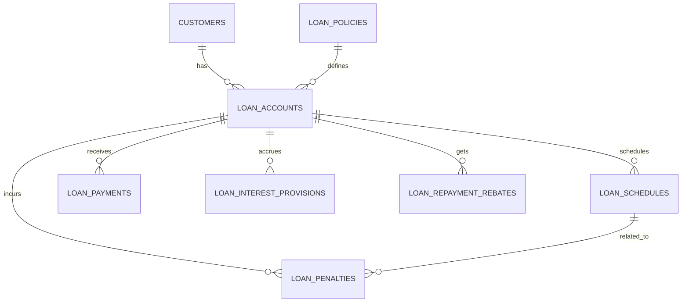
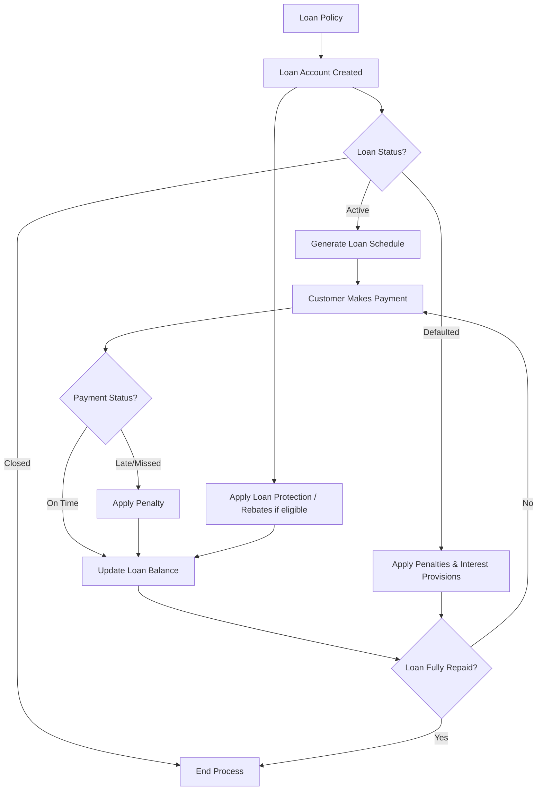

```sql
CREATE TABLE loan_policies (
    id BIGINT UNSIGNED AUTO_INCREMENT PRIMARY KEY,
    code VARCHAR(50) UNIQUE NOT NULL,             -- e.g., "LOAN_STD", "AGRI_LOAN"
    name VARCHAR(150) NOT NULL,
    description TEXT,
    type ENUM('TERM_LOAN','OVERDRAFT','MORTGAGE','PERSONAL') NOT NULL,
    interest_rate DECIMAL(5,2) NOT NULL,
    interest_method ENUM('FLAT','REDUCING','COMPOUND') DEFAULT 'REDUCING',
    min_amount DECIMAL(18,2) DEFAULT 0.00,
    max_amount DECIMAL(18,2) DEFAULT 0.00,
    tenure_months INT NOT NULL,
    repayment_frequency ENUM('MONTHLY','QUARTERLY','WEEKLY') DEFAULT 'MONTHLY',
    status ENUM('ACTIVE','INACTIVE') DEFAULT 'ACTIVE',
    created_at TIMESTAMP DEFAULT CURRENT_TIMESTAMP
);

CREATE TABLE loan_accounts (
    id BIGINT UNSIGNED AUTO_INCREMENT PRIMARY KEY,
    account_no VARCHAR(50) UNIQUE NOT NULL,
    customer_id BIGINT UNSIGNED NOT NULL,
    policy_id BIGINT UNSIGNED NOT NULL,
    disbursed_amount DECIMAL(18,2) NOT NULL,
    disbursed_date DATE NOT NULL,
    tenure_months INT NOT NULL,
    interest_rate DECIMAL(5,2) NOT NULL,
    repayment_frequency ENUM('MONTHLY','QUARTERLY','WEEKLY') DEFAULT 'MONTHLY',
    status ENUM('ACTIVE','CLOSED','DEFAULTED') DEFAULT 'ACTIVE',
    current_balance DECIMAL(18,2) DEFAULT 0.00,      -- Outstanding principal
    protection_scheme_id BIGINT UNSIGNED DEFAULT NULL, -- Optional loan protection
    created_at TIMESTAMP DEFAULT CURRENT_TIMESTAMP,
    FOREIGN KEY (customer_id) REFERENCES customers(id),
    FOREIGN KEY (policy_id) REFERENCES loan_policies(id)
);

CREATE TABLE loan_schedules (
    id BIGINT UNSIGNED AUTO_INCREMENT PRIMARY KEY,
    loan_account_id BIGINT UNSIGNED NOT NULL,
    sequence_no INT NOT NULL,                     -- Installment number
    due_date DATE NOT NULL,
    principal_due DECIMAL(18,2) NOT NULL,
    interest_due DECIMAL(18,2) NOT NULL,
    total_due DECIMAL(18,2) GENERATED ALWAYS AS (principal_due + interest_due) STORED,
    status ENUM('PENDING','PAID','LATE') DEFAULT 'PENDING',
    paid_date DATE DEFAULT NULL,
    created_at TIMESTAMP DEFAULT CURRENT_TIMESTAMP,
    FOREIGN KEY (loan_account_id) REFERENCES loan_accounts(id)
);

CREATE TABLE loan_payments (
    id BIGINT UNSIGNED AUTO_INCREMENT PRIMARY KEY,
    loan_account_id BIGINT UNSIGNED NOT NULL,
    txn_date DATE NOT NULL,
    description VARCHAR(255),
    debit DECIMAL(18,2) DEFAULT 0.00,           -- Payment received reduces balance
    credit DECIMAL(18,2) DEFAULT 0.00,          -- Disbursement or charges
    balance DECIMAL(18,2) DEFAULT 0.00,         -- Outstanding principal
    reference_no VARCHAR(50),
    created_at TIMESTAMP DEFAULT CURRENT_TIMESTAMP,
    FOREIGN KEY (loan_account_id) REFERENCES loan_accounts(id)
);

CREATE TABLE loan_penalties (
    id BIGINT UNSIGNED AUTO_INCREMENT PRIMARY KEY,
    loan_account_id BIGINT UNSIGNED NOT NULL,
    related_schedule_id BIGINT UNSIGNED DEFAULT NULL, -- FK to loan_schedules
    txn_date DATE NOT NULL,
    description VARCHAR(255),
    penalty_amount DECIMAL(18,2) NOT NULL,
    received_as_cash BOOLEAN DEFAULT TRUE,       -- Collected as cash
    settled BOOLEAN DEFAULT TRUE,                -- True if collected
    created_at TIMESTAMP DEFAULT CURRENT_TIMESTAMP,
    FOREIGN KEY (loan_account_id) REFERENCES loan_accounts(id),
    FOREIGN KEY (related_schedule_id) REFERENCES loan_schedules(id)
);

CREATE TABLE loan_interest_provisions (
    id BIGINT UNSIGNED AUTO_INCREMENT PRIMARY KEY,
    loan_account_id BIGINT UNSIGNED NOT NULL,
    provision_date DATE NOT NULL,
    provision_amount DECIMAL(18,2) NOT NULL,
    recognized BOOLEAN DEFAULT FALSE,             -- TRUE when posted to ledger
    created_at TIMESTAMP DEFAULT CURRENT_TIMESTAMP,
    FOREIGN KEY (loan_account_id) REFERENCES loan_accounts(id)
);

CREATE TABLE loan_repayment_rebates (
    id BIGINT UNSIGNED AUTO_INCREMENT PRIMARY KEY,
    loan_id BIGINT UNSIGNED NOT NULL,
    customer_id BIGINT UNSIGNED NOT NULL,
    rebate_type ENUM('EARLY_REPAYMENT','PROMOTIONAL') NOT NULL,
    amount DECIMAL(18,2) NOT NULL,
    applied_date DATE NOT NULL,
    remarks TEXT,
    created_at TIMESTAMP DEFAULT CURRENT_TIMESTAMP,
    updated_at TIMESTAMP DEFAULT CURRENT_TIMESTAMP ON UPDATE CURRENT_TIMESTAMP,
    FOREIGN KEY (loan_id) REFERENCES loans(id),
    FOREIGN KEY (customer_id) REFERENCES customers(id),
);
```

## ER Diagram



## Loan Lifecycle Flow


