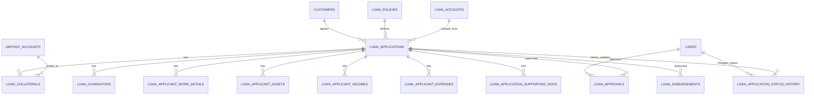
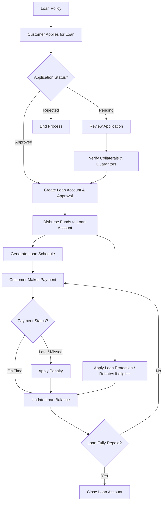

```sql
CREATE TABLE loan_applications (
    id BIGINT UNSIGNED AUTO_INCREMENT PRIMARY KEY,
    customer_id BIGINT UNSIGNED NOT NULL,
    loan_policy_id BIGINT UNSIGNED NOT NULL,
    loan_account_id BIGINT UNSIGNED NULL, -- created later after approval
    loan_type ENUM('GENERAL','DEPOSIT','SECURED') DEFAULT 'GENERAL',
    amount_requested DECIMAL(18,2) NOT NULL,
    purpose TEXT,
    application_date DATE NOT NULL,
    status ENUM('PENDING','APPROVED','REJECTED','DISBURSED','CLOSED') DEFAULT 'PENDING',
    created_at TIMESTAMP DEFAULT CURRENT_TIMESTAMP,
    updated_at TIMESTAMP DEFAULT CURRENT_TIMESTAMP ON UPDATE CURRENT_TIMESTAMP,
    FOREIGN KEY (customer_id) REFERENCES customers(id),
    FOREIGN KEY (loan_policy_id) REFERENCES loan_policies(id),
    FOREIGN KEY (loan_account_id) REFERENCES loan_accounts(id)
);

CREATE TABLE loan_collaterals (
    id BIGINT UNSIGNED AUTO_INCREMENT PRIMARY KEY,
    loan_application_id BIGINT UNSIGNED NOT NULL,
    loan_account_id BIGINT UNSIGNED NULL, -- created later after approval
    deposit_account_id BIGINT UNSIGNED,
    collateral_type ENUM('SURETY','LEAN','ASSET','PROPERTY','BLANK_CHEQUE') NOT NULL,
    reference VARCHAR(255),
    value DECIMAL(18,2) NOT NULL,
    description VARCHAR(255),
    status ENUM('PLEDGED','RELEASED','SEIZED') DEFAULT 'PLEDGED',
    FOREIGN KEY (loan_application_id) REFERENCES loan_applications(id) ON DELETE CASCADE,
    FOREIGN KEY (deposit_account_id) REFERENCES deposit_accounts(id)
    FOREIGN KEY (loan_account_id) REFERENCES loan_accounts(id)
);

CREATE TABLE loan_guarantors (
    id BIGINT UNSIGNED AUTO_INCREMENT PRIMARY KEY,
    loan_application_id BIGINT UNSIGNED NOT NULL,
    loan_account_id BIGINT UNSIGNED NULL, -- created later after approval
    customer_id BIGINT UNSIGNED NOT NULL,
    FOREIGN KEY (loan_application_id) REFERENCES loan_applications(id) ON DELETE CASCADE,
    FOREIGN KEY (customer_id) REFERENCES customers(id)
    FOREIGN KEY (loan_account_id) REFERENCES loan_accounts(id)
);

CREATE TABLE loan_applicant_work_details (
    id BIGINT UNSIGNED AUTO_INCREMENT PRIMARY KEY,
    loan_application_id BIGINT UNSIGNED NOT NULL,
    employer_name VARCHAR(100),
    designation VARCHAR(50),
    employment_type ENUM('PERMANENT','CONTRACT','SELF_EMPLOYED','OTHER') DEFAULT 'OTHER',
    monthly_income DECIMAL(18,2),
    years_of_service INT,
    FOREIGN KEY (loan_application_id) REFERENCES loan_applications(id) ON DELETE CASCADE
);

CREATE TABLE loan_applicant_assets (
    id BIGINT UNSIGNED AUTO_INCREMENT PRIMARY KEY,
    loan_application_id BIGINT UNSIGNED NOT NULL,
    asset_type VARCHAR(50) NOT NULL,
    description VARCHAR(255),
    value DECIMAL(18,2) NOT NULL,
    FOREIGN KEY (loan_application_id) REFERENCES loan_applications(id) ON DELETE CASCADE
);

CREATE TABLE loan_applicant_incomes (
    id BIGINT UNSIGNED AUTO_INCREMENT PRIMARY KEY,
    loan_application_id BIGINT UNSIGNED NOT NULL,
    source VARCHAR(100),
    monthly_amount DECIMAL(18,2),
    frequency ENUM('MONTHLY','ANNUAL','OTHER') DEFAULT 'MONTHLY',
    FOREIGN KEY (loan_application_id) REFERENCES loan_applications(id) ON DELETE CASCADE
);

CREATE TABLE loan_applicant_expenses (
    id BIGINT UNSIGNED AUTO_INCREMENT PRIMARY KEY,
    loan_application_id BIGINT UNSIGNED NOT NULL,
    category VARCHAR(50),
    monthly_amount DECIMAL(18,2),
    FOREIGN KEY (loan_application_id) REFERENCES loan_applications(id) ON DELETE CASCADE
);

CREATE TABLE loan_application_supporting_docs (
    id BIGINT UNSIGNED AUTO_INCREMENT PRIMARY KEY,
    loan_application_id BIGINT UNSIGNED NOT NULL,
    file_name VARCHAR(255),
    file_path VARCHAR(255),
    mime VARCHAR(50),
    document_type VARCHAR(50), -- e.g., Gas Bill, Electricity, Passport
    uploaded_at TIMESTAMP DEFAULT CURRENT_TIMESTAMP,
    FOREIGN KEY (loan_application_id) REFERENCES loan_applications(id) ON DELETE CASCADE
);

CREATE TABLE loan_approvals (
    id BIGINT UNSIGNED AUTO_INCREMENT PRIMARY KEY,
    loan_application_id BIGINT UNSIGNED NOT NULL,
    approved_by BIGINT UNSIGNED NOT NULL,
    approved_amount DECIMAL(18,2) NOT NULL,
    interest_rate DECIMAL(5,2) NOT NULL,
    repayment_schedule JSON NOT NULL, -- installments, dates, amounts
    approved_date DATE NOT NULL,
    loan_account_id BIGINT UNSIGNED NOT NULL, -- created account_id
    FOREIGN KEY (loan_application_id) REFERENCES loan_applications(id) ON DELETE CASCADE,
    FOREIGN KEY (loan_account_id) REFERENCES loan_accounts(id)
    FOREIGN KEY (approved_by) REFERENCES users(id)
);

CREATE TABLE loan_disbursements (
    id BIGINT UNSIGNED AUTO_INCREMENT PRIMARY KEY,
    loan_application_id BIGINT UNSIGNED NOT NULL,
    disbursement_date DATE NOT NULL,
    amount DECIMAL(18,2) NOT NULL,
    loan_account_id BIGINT UNSIGNED NOT NULL, -- account credited
    FOREIGN KEY (loan_application_id) REFERENCES loan_applications(id) ON DELETE CASCADE,
    FOREIGN KEY (loan_account_id) REFERENCES loan_accounts(id)
);

CREATE TABLE loan_application_status_history (
    id BIGINT UNSIGNED AUTO_INCREMENT PRIMARY KEY,
    loan_application_id BIGINT UNSIGNED NOT NULL,
    status ENUM('PENDING','APPROVED','REJECTED','DISBURSED','CLOSED') NOT NULL,
    changed_by BIGINT UNSIGNED NOT NULL,
    changed_at TIMESTAMP DEFAULT CURRENT_TIMESTAMP,
    FOREIGN KEY (loan_application_id) REFERENCES loan_applications(id) ON DELETE CASCADE,
    FOREIGN KEY (changed_by) REFERENCES users(id)
);
```

## ER Diagram

```mermaid
erDiagram
    %% Core entities
    CUSTOMERS ||--o{ LOAN_APPLICATIONS : applies
    LOAN_POLICIES ||--o{ LOAN_APPLICATIONS : defines
    LOAN_ACCOUNTS ||--o{ LOAN_APPLICATIONS : created_from
    USERS ||--o{ LOAN_APPROVALS : approves
    USERS ||--o{ LOAN_APPLICATION_STATUS_HISTORY : changes_status
    DEPOSIT_ACCOUNTS ||--o{ LOAN_COLLATERALS : linked_to

    %% Application details
    LOAN_APPLICATIONS ||--o{ LOAN_COLLATERALS : has
    LOAN_APPLICATIONS ||--o{ LOAN_GUARANTORS : has
    LOAN_APPLICATIONS ||--o{ LOAN_APPLICANT_WORK_DETAILS : has
    LOAN_APPLICATIONS ||--o{ LOAN_APPLICANT_ASSETS : has
    LOAN_APPLICATIONS ||--o{ LOAN_APPLICANT_INCOMES : has
    LOAN_APPLICATIONS ||--o{ LOAN_APPLICANT_EXPENSES : has
    LOAN_APPLICATIONS ||--o{ LOAN_APPLICATION_SUPPORTING_DOCS : has
    LOAN_APPLICATIONS ||--o{ LOAN_APPROVALS : approvals
    LOAN_APPLICATIONS ||--o{ LOAN_DISBURSEMENTS : disbursed
    LOAN_APPLICATIONS ||--o{ LOAN_APPLICATION_STATUS_HISTORY : status_updates

    %% Loan accounts & repayment
    LOAN_POLICIES ||--o{ LOAN_ACCOUNTS : defines
    LOAN_ACCOUNTS ||--o{ LOAN_SCHEDULES : schedules
    LOAN_ACCOUNTS ||--o{ LOAN_PAYMENTS : receives
    LOAN_ACCOUNTS ||--o{ LOAN_PENALTIES : incurs
    LOAN_ACCOUNTS ||--o{ LOAN_INTEREST_PROVISIONS : accrues
    LOAN_ACCOUNTS ||--o{ LOAN_REPAYMENT_REBATES : gets
    LOAN_SCHEDULES ||--o{ LOAN_PENALTIES : related_to
```





## Lifecycle Flow


