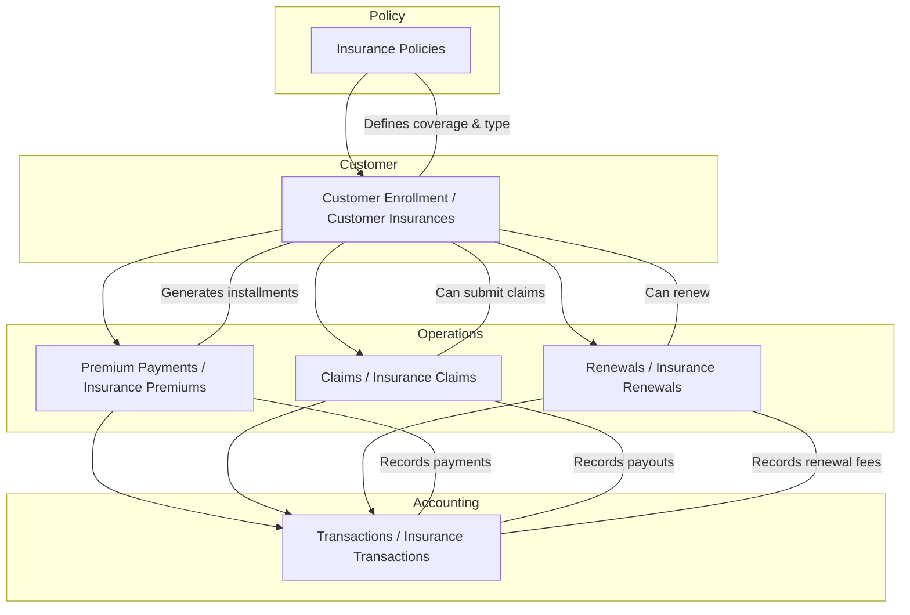

```sql
CREATE TABLE insurance_policies (
    id BIGINT UNSIGNED AUTO_INCREMENT PRIMARY KEY,
    code VARCHAR(50) UNIQUE NOT NULL,             -- e.g., "HEALTH_BASIC", "SHARE_PROTECTION", "LOAN_PROTECTION"
    name VARCHAR(150) NOT NULL,
    description TEXT,
    type ENUM('LIFE','HEALTH','ACCIDENTAL') NOT NULL,
    coverage_amount DECIMAL(18,2) NOT NULL,
    premium_amount DECIMAL(18,2) NOT NULL,       -- Per installment
    premium_frequency ENUM('MONTHLY','QUARTERLY','ANNUAL') DEFAULT 'ANNUAL',
    min_age INT DEFAULT NULL,
    max_age INT DEFAULT NULL,
    status ENUM('ACTIVE','INACTIVE') DEFAULT 'ACTIVE',
    created_at TIMESTAMP DEFAULT CURRENT_TIMESTAMP
);

CREATE TABLE customer_insurances (
    id BIGINT UNSIGNED AUTO_INCREMENT PRIMARY KEY,
    policy_id BIGINT UNSIGNED NOT NULL,
    customer_id BIGINT UNSIGNED NOT NULL,

    enrollment_date DATE NOT NULL,
    start_date DATE NOT NULL,
    end_date DATE NOT NULL,
    status ENUM('ACTIVE','LAPSED','CLOSED') DEFAULT 'ACTIVE',
    current_balance DECIMAL(18,2) DEFAULT 0.00,    -- For advance premiums if any
    created_at TIMESTAMP DEFAULT CURRENT_TIMESTAMP,
    FOREIGN KEY (customer_id) REFERENCES customers(id),
    FOREIGN KEY (policy_id) REFERENCES insurance_policies(id)
);

-- Schedules
CREATE TABLE insurance_premiums (
    id BIGINT UNSIGNED AUTO_INCREMENT PRIMARY KEY,
    customer_insurance_id BIGINT UNSIGNED NOT NULL,
    txn_date DATE NOT NULL,
    description VARCHAR(255),
    amount DECIMAL(18,2) NOT NULL,
    received_as_cash BOOLEAN DEFAULT TRUE,       -- Collected in cash or auto-debit
    settled BOOLEAN DEFAULT TRUE,
    reference_no VARCHAR(50),
    created_at TIMESTAMP DEFAULT CURRENT_TIMESTAMP,
    FOREIGN KEY (customer_insurance_id) REFERENCES customer_insurances(id)
);

CREATE TABLE insurance_claims (
    id BIGINT UNSIGNED AUTO_INCREMENT PRIMARY KEY,
    customer_insurance_id BIGINT UNSIGNED NOT NULL,
    claim_date DATE NOT NULL,
    claim_amount DECIMAL(18,2) NOT NULL,
    approved_amount DECIMAL(18,2) DEFAULT 0.00,
    status ENUM('PENDING','APPROVED','REJECTED','PAID') DEFAULT 'PENDING',
    paid_date DATE DEFAULT NULL,
    description TEXT,
    created_at TIMESTAMP DEFAULT CURRENT_TIMESTAMP,
    FOREIGN KEY (customer_insurance_id) REFERENCES customer_insurances(id)
);

CREATE TABLE insurance_renewals (
    id BIGINT UNSIGNED AUTO_INCREMENT PRIMARY KEY,
    customer_insurance_id BIGINT UNSIGNED NOT NULL,
    renewal_date DATE NOT NULL,
    fee_amount DECIMAL(18,2) NOT NULL,
    received_as_cash BOOLEAN DEFAULT TRUE,
    settled BOOLEAN DEFAULT TRUE,
    created_at TIMESTAMP DEFAULT CURRENT_TIMESTAMP,
    FOREIGN KEY (customer_insurance_id) REFERENCES customer_insurances(id)
);

CREATE TABLE insurance_transactions (
    id BIGINT UNSIGNED AUTO_INCREMENT PRIMARY KEY,
    customer_insurance_id BIGINT UNSIGNED NOT NULL,
    txn_date DATE NOT NULL,
    description VARCHAR(255),
    debit DECIMAL(18,2) DEFAULT 0.00,           -- Payments out (claims)
    credit DECIMAL(18,2) DEFAULT 0.00,          -- Premiums collected, renewal fees
    balance DECIMAL(18,2) DEFAULT 0.00,
    reference_no VARCHAR(50),
    created_at TIMESTAMP DEFAULT CURRENT_TIMESTAMP,
    FOREIGN KEY (customer_insurance_id) REFERENCES customer_insurances(id)
);
```


