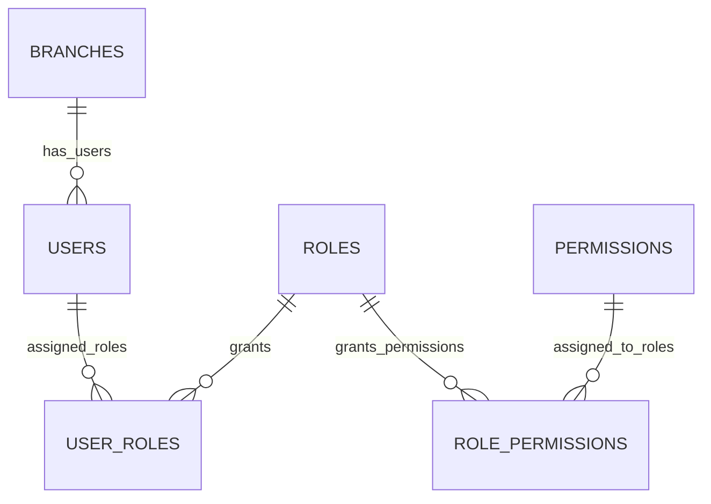
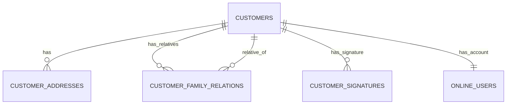
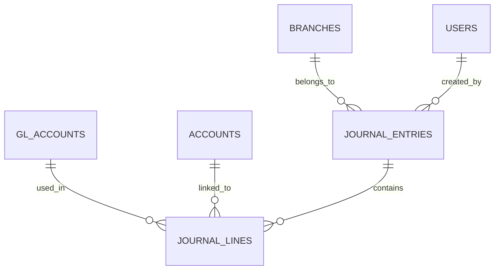
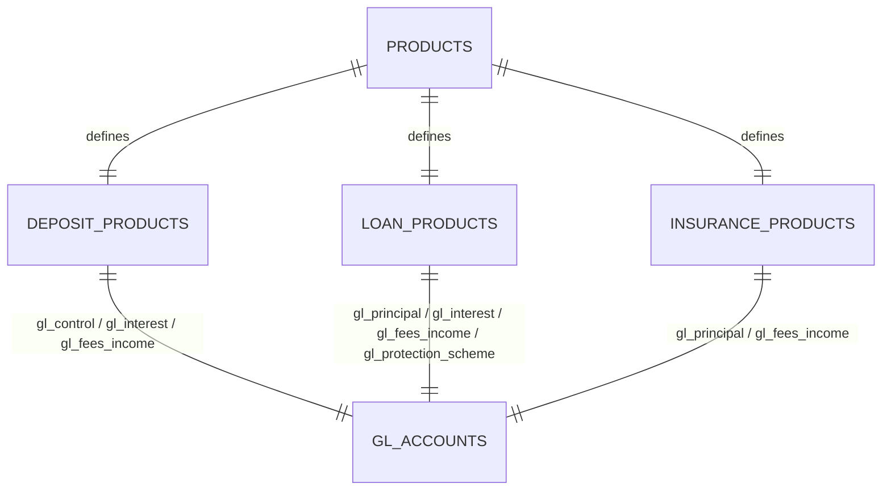
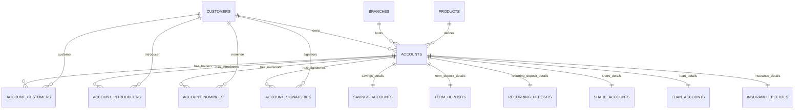
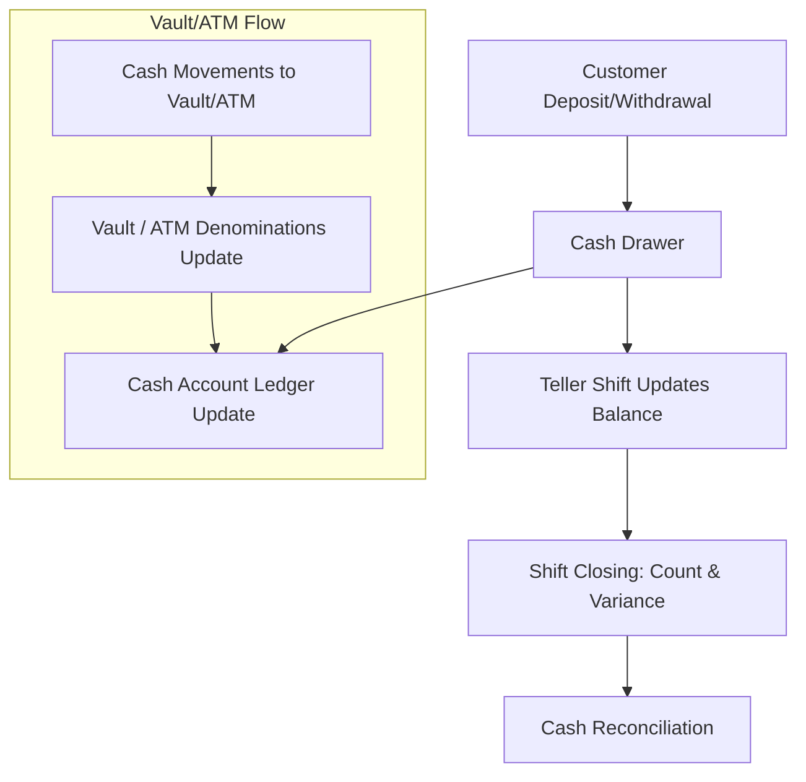
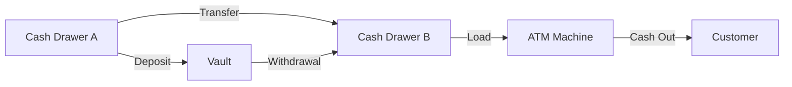
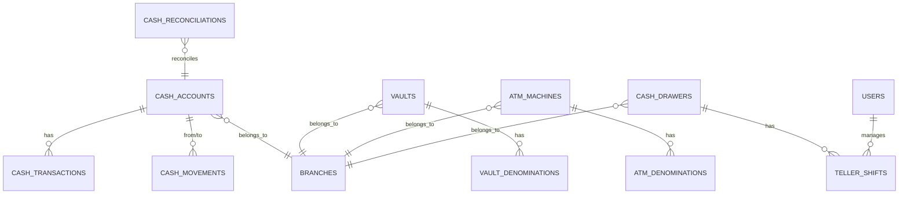

```mermaid
erDiagram
    CUSTOMERS ||--o{ LOAN_APPLICATIONS : "applies_for"
    PRODUCTS ||--o{ LOAN_APPLICATIONS : "defines"
    ACCOUNTS ||--o{ LOAN_APPLICATIONS : "linked_to"

    LOAN_APPLICATIONS ||--o{ LOAN_SURETIES : "has"
    ACCOUNTS ||--o{ LOAN_SURETIES : "as_surety"

    LOAN_APPLICATIONS ||--o{ LOAN_COLLATERALS : "has"
    LOAN_APPLICATIONS ||--o{ LOAN_GUARANTORS : "has"
    CUSTOMERS ||--o{ LOAN_GUARANTORS : "as_guarantor"

    LOAN_APPLICATIONS ||--o{ LOAN_APPLICANT_WORK_DETAILS : "has"
    LOAN_APPLICATIONS ||--o{ LOAN_APPLICANT_ASSETS : "has"
    LOAN_APPLICATIONS ||--o{ LOAN_APPLICANT_INCOMES : "has"
    LOAN_APPLICATIONS ||--o{ LOAN_APPLICANT_EXPENSES : "has"
    LOAN_APPLICATIONS ||--o{ LOAN_APPLICATION_SUPPORTING_DOCS : "has"

    LOAN_APPLICATIONS ||--o{ LOAN_APPROVALS : "may_be_approved_by"
    USERS ||--o{ LOAN_APPROVALS : "approves"

    LOAN_APPLICATIONS ||--o{ LOAN_DISBURSEMENTS : "may_be_disbursed_to"
    ACCOUNTS ||--o{ LOAN_DISBURSEMENTS : "receives"

    LOAN_APPLICATIONS ||--o{ LOAN_APPLICATION_STATUS_HISTORY : "has_status_history"
    USERS ||--o{ LOAN_APPLICATION_STATUS_HISTORY : "changes_status"
```

# Credit Union System Documentation

## Table of Contents

1. [Overview](#overview)
2. [Customers](#customers)
3. [Products](#products)
4. [Accounts](#accounts)
5. [Term & Recurring Deposits](#term--recurring-deposits)
6. [Loans](#loans)
7. [Bank / Cash / Vault / Teller](#bank--cash--vault--teller)
8. [Journals / GL](#journals--gl)
9. [Payments / Schedules / Interest / Charges](#payments--schedules--interest--charges)
10. [Cheques](#cheques)
11. [Audit Log](#audit-log)

---

### Manage Branches, Users, Roles and Permissions

#### Database Schema

```sql
CREATE TABLE branches (
    id BIGINT UNSIGNED AUTO_INCREMENT PRIMARY KEY,
    code VARCHAR(20) UNIQUE NOT NULL,
    name VARCHAR(100) NOT NULL,
    address VARCHAR(255),
    created_at TIMESTAMP DEFAULT CURRENT_TIMESTAMP,
    updated_at TIMESTAMP DEFAULT CURRENT_TIMESTAMP ON UPDATE CURRENT_TIMESTAMP
);

CREATE TABLE roles (
    id BIGINT UNSIGNED AUTO_INCREMENT PRIMARY KEY,
    name VARCHAR(50) UNIQUE NOT NULL,
    description VARCHAR(255) DEFAULT NULL,
    created_at TIMESTAMP DEFAULT CURRENT_TIMESTAMP,
    updated_at TIMESTAMP DEFAULT CURRENT_TIMESTAMP ON UPDATE CURRENT_TIMESTAMP
);
-- INSERT INTO roles (name, description) VALUES
-- ('TELLER', 'Handles cash transactions and member-facing services'),
-- ('MEMBER_SERVICE_REP', 'Provides account support and non-cash services'),
-- ('OPS', 'Manages back-office operations and settlements'),
-- ('COMPLIANCE_OFFICER', 'Ensures regulatory compliance and monitors KYC/AML'),
-- ('LOAN_OFFICER', 'Reviews and approves member loan applications'),
-- ('BRANCH_MANAGER', 'Oversees branch staff and authorizes high-value operations'),
-- ('OPERATIONS_MANAGER', 'Leads operations and ensures efficiency'),
-- ('ADMIN', 'Has full system access and manages configurations'),
-- ('AUDITOR', 'Audits processes and reviews compliance'),
-- ('BOARD_MEMBER', 'Governs strategic decisions and reviews reports');

CREATE TABLE permissions (
    id BIGINT UNSIGNED AUTO_INCREMENT PRIMARY KEY,
    name VARCHAR(100) UNIQUE NOT NULL,       -- e.g., 'VIEW_ACCOUNTS', 'APPROVE_LOANS', 'MANAGE_USERS'
    description VARCHAR(255) DEFAULT NULL,   -- Human-readable explanation
    created_at TIMESTAMP DEFAULT CURRENT_TIMESTAMP,
    updated_at TIMESTAMP DEFAULT CURRENT_TIMESTAMP ON UPDATE CURRENT_TIMESTAMP
);
-- ✅ Example seed permissions
-- INSERT INTO permissions (name, description) VALUES
-- ('VIEW_ACCOUNTS', 'View member account details'),
-- ('APPROVE_LOANS', 'Approve or reject loan applications'),
-- ('PROCESS_TRANSACTIONS', 'Process deposits and withdrawals'),
-- ('MANAGE_USERS', 'Create, edit, or deactivate user accounts'),
-- ('VIEW_REPORTS', 'Access financial and operational reports');

CREATE TABLE role_permissions (
    role_id BIGINT UNSIGNED NOT NULL,
    permission_id BIGINT UNSIGNED NOT NULL,
    granted_at TIMESTAMP DEFAULT CURRENT_TIMESTAMP,
    PRIMARY KEY (role_id, permission_id),
    FOREIGN KEY (role_id) REFERENCES roles(id) ON DELETE CASCADE,
    FOREIGN KEY (permission_id) REFERENCES permissions(id) ON DELETE CASCADE
);

CREATE TABLE users (
    id BIGINT UNSIGNED AUTO_INCREMENT PRIMARY KEY,
    branch_id BIGINT UNSIGNED NOT NULL,
    full_name VARCHAR(100) NOT NULL,
    email VARCHAR(100) UNIQUE NOT NULL,
    password VARCHAR(255) NOT NULL,
    status ENUM('ACTIVE','INACTIVE','SUSPENDED') DEFAULT 'ACTIVE',
    created_at TIMESTAMP DEFAULT CURRENT_TIMESTAMP,
    updated_at TIMESTAMP DEFAULT CURRENT_TIMESTAMP ON UPDATE CURRENT_TIMESTAMP,
    FOREIGN KEY (branch_id) REFERENCES branches(id)
);

CREATE TABLE user_roles (
    user_id BIGINT UNSIGNED NOT NULL,
    role_id BIGINT UNSIGNED NOT NULL,
    assigned_at TIMESTAMP DEFAULT CURRENT_TIMESTAMP,
    PRIMARY KEY (user_id, role_id),
    FOREIGN KEY (user_id) REFERENCES users(id) ON DELETE CASCADE,
    FOREIGN KEY (role_id) REFERENCES roles(id) ON DELETE CASCADE
);

```

#### ER Structure



### Manage Customer, Address, Family, Signatures and Online-Users

#### Database Schema

```sql
CREATE TABLE customers (
    id BIGINT UNSIGNED AUTO_INCREMENT PRIMARY KEY,
    customer_no VARCHAR(50) UNIQUE NOT NULL,
    type ENUM('Individual','Organization') NOT NULL,
    name VARCHAR(150) NOT NULL,
    phone VARCHAR(50),
    email VARCHAR(100),
    kyc_level ENUM('MIN','STD','ENH') DEFAULT 'MIN',
    status ENUM('PENDING','ACTIVE','SUSPENDED','CLOSED') DEFAULT 'ACTIVE',

    -- Person Info
    dob DATE,
    gender ENUM('MALE','FEMALE','OTHER') DEFAULT NULL,
    religion ENUM('CHRISTIANITY','ISLAM','HINDUISM','BUDDHISM','OTHER') DEFAULT NULL,
    identification_type ENUM('NID','NBR','PASSPORT','DRIVING_LICENSE') NOT NULL,
    identification_number VARCHAR(50) NOT NULL,
    photo VARCHAR(255),

    -- Organization Info
    registration_no VARCHAR(150),// For organizations

    created_at TIMESTAMP DEFAULT CURRENT_TIMESTAMP,
    updated_at TIMESTAMP DEFAULT CURRENT_TIMESTAMP ON UPDATE CURRENT_TIMESTAMP
);

CREATE TABLE customer_addresses (
    id BIGINT UNSIGNED AUTO_INCREMENT PRIMARY KEY,
    customer_id BIGINT UNSIGNED NOT NULL,
    line1 VARCHAR(255) NOT NULL,
    line2 VARCHAR(255),
    city VARCHAR(100) NOT NULL,
    state VARCHAR(100),
    postal_code VARCHAR(20),
    country_code CHAR(2) NOT NULL DEFAULT 'BD',  -- ISO 3166-1 alpha-2
    type ENUM('CURRENT','PERMANENT','MAILING','WORK','REGISTERED','OTHER')
        NOT NULL DEFAULT 'CURRENT',
    FOREIGN KEY (customer_id) REFERENCES customers(id) ON DELETE CASCADE
);

CREATE TABLE customer_family_relations (
    id BIGINT UNSIGNED AUTO_INCREMENT PRIMARY KEY,
    customer_id BIGINT UNSIGNED NOT NULL,
    relative_id BIGINT UNSIGNED NOT NULL,
    relation_type ENUM(
        'FATHER','MOTHER','SON','DAUGHTER',
        'BROTHER','SISTER','HUSBAND','WIFE',
        'GRANDFATHER','GRANDMOTHER','GRANDSON','GRANDDAUGHTER',
        'UNCLE','AUNT','NEPHEW','NIECE',
        'FATHER-IN-LAW','MOTHER-IN-LAW','SON-IN-LAW','DAUGHTER-IN-LAW',
        'BROTHER-IN-LAW','SISTER-IN-LAW'
    ) NOT NULL,
    reverse_relation_type ENUM(
        'FATHER','MOTHER','SON','DAUGHTER',
        'BROTHER','SISTER','HUSBAND','WIFE',
        'GRANDFATHER','GRANDMOTHER','GRANDSON','GRANDDAUGHTER',
        'UNCLE','AUNT','NEPHEW','NIECE',
        'FATHER-IN-LAW','MOTHER-IN-LAW','SON-IN-LAW','DAUGHTER-IN-LAW',
        'BROTHER-IN-LAW','SISTER-IN-LAW'
    ) NOT NULL,
    created_at TIMESTAMP DEFAULT CURRENT_TIMESTAMP,
    updated_at TIMESTAMP DEFAULT CURRENT_TIMESTAMP ON UPDATE CURRENT_TIMESTAMP,
    FOREIGN KEY (customer_id) REFERENCES customers(id) ON DELETE CASCADE,
    FOREIGN KEY (relative_id) REFERENCES customers(id) ON DELETE CASCADE,
    UNIQUE KEY uq_customer_relative (customer_id, relative_id),
    INDEX idx_relative (relative_id),
    INDEX idx_relation_type (relation_type)
);

-- Stores uploaded signature images
CREATE TABLE customer_signatures (
    id BIGINT UNSIGNED AUTO_INCREMENT PRIMARY KEY,
    customer_id BIGINT UNSIGNED NOT NULL,
    signature_path VARCHAR(255) NOT NULL,
    created_at TIMESTAMP DEFAULT CURRENT_TIMESTAMP,
    updated_at TIMESTAMP DEFAULT CURRENT_TIMESTAMP ON UPDATE CURRENT_TIMESTAMP,
    FOREIGN KEY (customer_id) REFERENCES customers(id) ON DELETE CASCADE
);

CREATE TABLE online_users (
    id BIGINT UNSIGNED AUTO_INCREMENT PRIMARY KEY,
     customer_id BIGINT UNSIGNED NOT NULL UNIQUE,
    username VARCHAR(100) UNIQUE NOT NULL,
    email VARCHAR(150) UNIQUE,
    phone VARCHAR(20) UNIQUE,
    password VARCHAR(255) NOT NULL,
    last_login_at TIMESTAMP NULL,
    status ENUM('ACTIVE','SUSPENDED','CLOSED') DEFAULT 'ACTIVE',
    created_at TIMESTAMP DEFAULT CURRENT_TIMESTAMP,
    updated_at TIMESTAMP DEFAULT CURRENT_TIMESTAMP ON UPDATE CURRENT_TIMESTAMP,
    FOREIGN KEY (customer_id) REFERENCES customers(id)
);
```

### ER Structure



### Manage General Ledger (GL) and Journals

#### Database Schema

```sql
-- General Ledger Accounts
CREATE TABLE gl_accounts (
    id BIGINT UNSIGNED AUTO_INCREMENT PRIMARY KEY,
    code VARCHAR(50) UNIQUE NOT NULL,
    name VARCHAR(100) NOT NULL,
    type ENUM('ASSET','LIABILITY','EQUITY','INCOME','EXPENSE') NOT NULL,
    is_leaf BOOLEAN DEFAULT TRUE,
    parent_id BIGINT UNSIGNED,
    FOREIGN KEY (parent_id) REFERENCES gl_accounts(id)
);

-- Voucher / Journal Entry
CREATE TABLE journal_entries (
    id BIGINT UNSIGNED AUTO_INCREMENT PRIMARY KEY,
    tx_code VARCHAR(50),         -- e.g., 'PAY_VOUCHER', 'RCPT_VOUCHER', 'JOURNAL_VOUCHER'
    tx_ref VARCHAR(50),          -- optional reference number
    posted_at TIMESTAMP DEFAULT CURRENT_TIMESTAMP,
    branch_id BIGINT UNSIGNED,
    user_id BIGINT UNSIGNED,
    memo TEXT,
    FOREIGN KEY (branch_id) REFERENCES branches(id),
    FOREIGN KEY (user_id) REFERENCES users(id)
);

-- Voucher Lines
CREATE TABLE journal_lines (
    id BIGINT UNSIGNED AUTO_INCREMENT PRIMARY KEY,
    entry_id BIGINT UNSIGNED NOT NULL,
    gl_account_id BIGINT UNSIGNED NOT NULL,
    account_id BIGINT UNSIGNED,       -- optional, link to customer/account
    debit DECIMAL(18,2) DEFAULT 0,
    credit DECIMAL(18,2) DEFAULT 0,
    CHECK ((debit = 0 AND credit > 0) OR (credit = 0 AND debit > 0)),
    FOREIGN KEY (entry_id) REFERENCES journal_entries(id) ON DELETE CASCADE,
    FOREIGN KEY (gl_account_id) REFERENCES gl_accounts(id),
    FOREIGN KEY (account_id) REFERENCES accounts(id)
);
```

### ER Structure



### Manage Products (Deposit, Loan, Insurance)

#### Database Schema

```sql
CREATE TABLE products (
    id BIGINT UNSIGNED AUTO_INCREMENT PRIMARY KEY,
    type ENUM('SAVINGS','SHARE','RECURRING_DEPOSIT','FIXED_DEPOSIT','INSURANCE','LOAN') NOT NULL,
    code VARCHAR(50) UNIQUE NOT NULL,   -- unique product code
    name VARCHAR(100) NOT NULL,         -- product name
    is_active BOOLEAN DEFAULT TRUE,

    created_at TIMESTAMP DEFAULT CURRENT_TIMESTAMP,
    updated_at TIMESTAMP DEFAULT CURRENT_TIMESTAMP ON UPDATE CURRENT_TIMESTAMP
);

CREATE TABLE deposit_products (
    product_id BIGINT UNSIGNED PRIMARY KEY,
    gl_control_id BIGINT UNSIGNED NOT NULL,     -- liability control account for deposits
    gl_interest_id BIGINT UNSIGNED NOT NULL,     -- GL for interest income
    gl_fees_income_id BIGINT UNSIGNED NOT NULL,  -- GL for fees/penalty/processing/etc.
    interest_method ENUM('DAILY','MONTHLY','QUARTERLY','NONE') DEFAULT 'NONE',
    rate_bp INT NOT NULL,                       -- interest rate (basis points, e.g. 500 = 5%)
    min_opening_amount DECIMAL(18,2) DEFAULT 0,
    lock_in_days INT DEFAULT 0,
    penalty_break_bp INT DEFAULT 0,             -- penalty rate for premature withdrawal
    FOREIGN KEY (product_id) REFERENCES products(id) ON DELETE CASCADE
);

CREATE TABLE loan_products (
    product_id BIGINT UNSIGNED PRIMARY KEY,
    gl_principal_id BIGINT UNSIGNED NOT NULL,   -- loan principal ledger
    gl_interest_id BIGINT UNSIGNED NOT NULL,     -- GL for interest income
    gl_fees_income_id BIGINT UNSIGNED NOT NULL,  -- GL for fees/penalty/processing/etc.
    gl_protection_scheme_id BIGINT UNSIGNED NULL,
    penalty_bp INT DEFAULT 0,                   -- penalty interest rate
    schedule_method ENUM('FLAT_EQUAL','REDUCING','INTEREST_ONLY','CUSTOM') DEFAULT 'REDUCING',
    max_tenor_months INT NOT NULL,
    collateral_required BOOLEAN DEFAULT FALSE,
    ltv_percent INT NULL,                       -- Loan-to-Value ratio
    FOREIGN KEY (product_id) REFERENCES products(id) ON DELETE CASCADE
);

CREATE TABLE insurance_products (
    product_id BIGINT UNSIGNED PRIMARY KEY,
    gl_principal_id BIGINT UNSIGNED NOT NULL,   -- loan principal ledger
    gl_fees_income_id BIGINT UNSIGNED NULL,  -- GL for fees/penalty/processing/etc.
    coverage_type ENUM('LIFE','HEALTH','PROPERTY','OTHER') DEFAULT 'LIFE',
    min_premium DECIMAL(18,2) NOT NULL,
    max_premium DECIMAL(18,2) NOT NULL,
    premium_cycle ENUM('MONTHLY','QUARTERLY','ANNUAL') DEFAULT 'MONTHLY',
    FOREIGN KEY (product_id) REFERENCES products(id) ON DELETE CASCADE
);
```

### ER Structure



### Manage Accounts

#### Database Schema

```sql
CREATE TABLE accounts (
    id BIGINT UNSIGNED AUTO_INCREMENT PRIMARY KEY,
    account_no VARCHAR(50) UNIQUE NOT NULL,         -- core account number
    customer_id BIGINT UNSIGNED NOT NULL,             -- who owns the account
    product_id BIGINT UNSIGNED NOT NULL,            -- FK to product definition
    branch_id BIGINT UNSIGNED NOT NULL,             -- branch opened
    type ENUM('SAVINGS','RD','FD','SHARE','LOAN','INSURANCE') NOT NULL,
    status ENUM('ACTIVE','PENDING','CLOSED','SUSPENDED') DEFAULT 'ACTIVE',

    created_at TIMESTAMP DEFAULT CURRENT_TIMESTAMP,
    updated_at TIMESTAMP DEFAULT CURRENT_TIMESTAMP ON UPDATE CURRENT_TIMESTAMP,

    FOREIGN KEY (customer_id) REFERENCES customers(id),
    FOREIGN KEY (product_id) REFERENCES products(id),
    FOREIGN KEY (branch_id) REFERENCES branches(id)
);

-- Account holders (ownership)
CREATE TABLE account_customers (
    id BIGINT UNSIGNED AUTO_INCREMENT PRIMARY KEY,
    account_id BIGINT UNSIGNED NOT NULL,
    customer_id BIGINT UNSIGNED NOT NULL,
    role ENUM('PRIMARY_HOLDER','JOINT_HOLDER','AUTHORIZED_SIGNATORY') NOT NULL,
    created_at TIMESTAMP DEFAULT CURRENT_TIMESTAMP,
    updated_at TIMESTAMP DEFAULT CURRENT_TIMESTAMP ON UPDATE CURRENT_TIMESTAMP,
    FOREIGN KEY (account_id) REFERENCES accounts(id) ON DELETE CASCADE,
    FOREIGN KEY (customer_id) REFERENCES customers(id) ON DELETE CASCADE
);

-- Introducers (separate relationship)
CREATE TABLE account_introducers (
    id BIGINT UNSIGNED AUTO_INCREMENT PRIMARY KEY,
    account_id BIGINT UNSIGNED NOT NULL,
    introducer_customer_id BIGINT UNSIGNED NOT NULL,
    created_at TIMESTAMP DEFAULT CURRENT_TIMESTAMP,
    FOREIGN KEY (account_id) REFERENCES accounts(id) ON DELETE CASCADE,
    FOREIGN KEY (introducer_customer_id) REFERENCES customers(id) ON DELETE CASCADE
);

CREATE TABLE account_nominees (
    id BIGINT UNSIGNED AUTO_INCREMENT PRIMARY KEY,
    account_id BIGINT UNSIGNED NOT NULL,
    nominee_id BIGINT UNSIGNED NOT NULL,
    share_percentage DECIMAL(5,2) DEFAULT 0,
    FOREIGN KEY (account_id) REFERENCES accounts(id) ON DELETE CASCADE,
    FOREIGN KEY (nominee_id) REFERENCES customers(id)
);

CREATE TABLE account_signatories (
    id BIGINT UNSIGNED AUTO_INCREMENT PRIMARY KEY,
    account_id BIGINT UNSIGNED NOT NULL,
    customer_id BIGINT UNSIGNED NOT NULL,
    signing_rule ENUM('PRIMARY','JOINT','DIRECTOR','PARTNER','AUTHORIZED') NOT NULL DEFAULT 'PRIMARY',
    created_at TIMESTAMP DEFAULT CURRENT_TIMESTAMP,
    updated_at TIMESTAMP DEFAULT CURRENT_TIMESTAMP ON UPDATE CURRENT_TIMESTAMP,
    FOREIGN KEY (account_id) REFERENCES accounts(id) ON DELETE CASCADE,
    FOREIGN KEY (customer_id) REFERENCES customers(id) ON DELETE CASCADE,
    UNIQUE KEY uq_account_signatory (account_id, customer_id)
);

CREATE TABLE savings_accounts (
    account_id BIGINT UNSIGNED PRIMARY KEY,
    balance DECIMAL(18,2) DEFAULT 0,
    min_balance DECIMAL(18,2) DEFAULT 0,
    interest_rate_bp INT DEFAULT 0,
    interest_method ENUM('DAILY','MONTHLY','QUARTERLY') DEFAULT 'MONTHLY',
    FOREIGN KEY (account_id) REFERENCES accounts(id) ON DELETE CASCADE
);

CREATE TABLE term_deposits (
    account_id BIGINT UNSIGNED PRIMARY KEY,
    principal DECIMAL(18,2) NOT NULL,
    rate_bp INT NOT NULL, -- interest rate base point
    start_date DATE NOT NULL,
    maturity_date DATE NOT NULL,
    --how interest is calculated and added to the account.
    compounding ENUM('MONTHLY','QUARTERLY','SEMI_ANNUAL','ANNUAL','MATURITY') DEFAULT 'MATURITY',
    auto_renew BOOLEAN DEFAULT FALSE,
    FOREIGN KEY (account_id) REFERENCES accounts(id) ON DELETE CASCADE
);

CREATE TABLE recurring_deposits (
    account_id BIGINT UNSIGNED PRIMARY KEY,
    installment_amount DECIMAL(18,2) NOT NULL,
    rate_bp INT NOT NULL, -- interest rate base point
    cycle ENUM('MONTHLY') DEFAULT 'MONTHLY',
    start_date DATE NOT NULL,
    tenor_months INT NOT NULL,
    FOREIGN KEY (account_id) REFERENCES accounts(id) ON DELETE CASCADE
);

CREATE TABLE share_accounts (
    account_id BIGINT UNSIGNED PRIMARY KEY,
    total_shares INT NOT NULL,
    share_price DECIMAL(18,2) NOT NULL,
    FOREIGN KEY (account_id) REFERENCES accounts(id) ON DELETE CASCADE
);

CREATE TABLE loan_accounts (
    account_id BIGINT UNSIGNED PRIMARY KEY,
    principal_amount DECIMAL(18,2) NOT NULL,
    outstanding_amount DECIMAL(18,2) NOT NULL,
    rate_bp INT NOT NULL, -- interest rate in basis points
    start_date DATE NOT NULL,
    end_date DATE NOT NULL,
    schedule_method ENUM('FLAT_EQUAL','REDUCING','INTEREST_ONLY','CUSTOM') DEFAULT 'FLAT_EQUAL',
    collateral_required BOOLEAN DEFAULT FALSE,
    ltv_percent INT, -- Loan-to-Value ratio
    penalty_bp INT DEFAULT 0, -- penalty interest
    status ENUM('APPROVED','DISBURSED','REPAID','DEFAULTED') DEFAULT 'APPROVED',
    FOREIGN KEY (account_id) REFERENCES accounts(id) ON DELETE CASCADE
);

CREATE TABLE insurance_policies (
    account_id BIGINT UNSIGNED PRIMARY KEY,
    policy_no VARCHAR(50) UNIQUE NOT NULL,
    start_date DATE NOT NULL,
    end_date DATE NOT NULL,
    premium_amount DECIMAL(18,2) NOT NULL,
    premium_cycle ENUM('MONTHLY','QUARTERLY','ANNUAL') DEFAULT 'MONTHLY',
    status ENUM('ACTIVE','LAPSED','CANCELLED','CLAIMED') DEFAULT 'ACTIVE',
    beneficiary VARCHAR(150),
    FOREIGN KEY (account_id) REFERENCES accounts(id) ON DELETE CASCADE
);

-- account schedules
CREATE TABLE schedules (
    id BIGINT UNSIGNED AUTO_INCREMENT PRIMARY KEY,
    account_id BIGINT UNSIGNED NOT NULL,
    due_date DATE NOT NULL,
    principal_due DECIMAL(18,2) DEFAULT 0,
    interest_due DECIMAL(18,2) DEFAULT 0,
    fee_due DECIMAL(18,2) DEFAULT 0,
    component ENUM('LOAN','RD','FD') NOT NULL,
    sequence_no INT NOT NULL,
    status ENUM('PENDING','PARTIAL','PAID','WAIVED','CLOSED') DEFAULT 'PENDING',
    UNIQUE(account_id, sequence_no),
    FOREIGN KEY (account_id) REFERENCES accounts(id)
);

CREATE TABLE insurance_premiums (
    id BIGINT UNSIGNED AUTO_INCREMENT PRIMARY KEY,
    policy_id BIGINT UNSIGNED NOT NULL,
    due_date DATE NOT NULL,
    amount DECIMAL(18,2) NOT NULL,
    status ENUM('PENDING','PAID','OVERDUE','WAIVED') DEFAULT 'PENDING',
    paid_at TIMESTAMP NULL,
    journal_entry_id BIGINT UNSIGNED,
    FOREIGN KEY (policy_id) REFERENCES insurance_policies(id),
    FOREIGN KEY (journal_entry_id) REFERENCES journal_entries(id)
);

-- account transactions trace

CREATE TABLE payments (
    id BIGINT UNSIGNED AUTO_INCREMENT PRIMARY KEY,
    account_id BIGINT UNSIGNED NOT NULL,
    schedule_id BIGINT UNSIGNED,
    amount DECIMAL(18,2) NOT NULL,
    method ENUM('CASH','TRANSFER','ADJUSTMENT') NOT NULL,
    received_at TIMESTAMP DEFAULT CURRENT_TIMESTAMP,
    journal_entry_id BIGINT UNSIGNED,
    FOREIGN KEY (account_id) REFERENCES accounts(id),
    FOREIGN KEY (schedule_id) REFERENCES schedules(id),
    FOREIGN KEY (journal_entry_id) REFERENCES journal_entries(id)
);

CREATE TABLE interest_accruals (
    id BIGINT UNSIGNED AUTO_INCREMENT PRIMARY KEY,
    account_id BIGINT UNSIGNED NOT NULL,
    period_start DATE NOT NULL,
    period_end DATE NOT NULL,
    interest_amount DECIMAL(18,2) NOT NULL,
    journal_entry_id BIGINT UNSIGNED,
    created_at TIMESTAMP DEFAULT CURRENT_TIMESTAMP,
    FOREIGN KEY (account_id) REFERENCES accounts(id),
    FOREIGN KEY (journal_entry_id) REFERENCES journal_entries(id)
);

CREATE TABLE charges (
    id BIGINT UNSIGNED AUTO_INCREMENT PRIMARY KEY,
    account_id BIGINT UNSIGNED NOT NULL,
    code VARCHAR(50) NOT NULL,
    amount DECIMAL(18,2) NOT NULL,
    applied_at TIMESTAMP DEFAULT CURRENT_TIMESTAMP,
    journal_entry_id BIGINT UNSIGNED,
    FOREIGN KEY (account_id) REFERENCES accounts(id),
    FOREIGN KEY (journal_entry_id) REFERENCES journal_entries(id)
);

CREATE TABLE insurance_claims (
    id BIGINT UNSIGNED AUTO_INCREMENT PRIMARY KEY,
    policy_id BIGINT UNSIGNED NOT NULL,
    claim_date DATE NOT NULL,
    claim_amount DECIMAL(18,2) NOT NULL,
    status ENUM('PENDING','APPROVED','REJECTED','PAID') DEFAULT 'PENDING',
    processed_by BIGINT UNSIGNED,
    paid_at TIMESTAMP NULL,
    journal_entry_id BIGINT UNSIGNED,
    FOREIGN KEY (policy_id) REFERENCES insurance_policies(id),
    FOREIGN KEY (processed_by) REFERENCES users(id),
    FOREIGN KEY (journal_entry_id) REFERENCES journal_entries(id)
);

-- ========================================
-- Dividend Periods
-- ========================================
CREATE TABLE dividend_periods (
    id BIGINT UNSIGNED AUTO_INCREMENT PRIMARY KEY,
    name VARCHAR(100) NOT NULL,
    start_date DATE NOT NULL,
    end_date DATE NOT NULL,
    declared_date DATE NOT NULL,
    dividend_type ENUM('FINAL','INTERIM') NOT NULL,
    status ENUM('PENDING','PAID','CANCELLED') DEFAULT 'PENDING',
    created_at TIMESTAMP DEFAULT CURRENT_TIMESTAMP,
    updated_at TIMESTAMP DEFAULT CURRENT_TIMESTAMP ON UPDATE CURRENT_TIMESTAMP
);

-- ========================================
-- Member Dividends
-- ========================================
CREATE TABLE member_dividends (
    id BIGINT UNSIGNED AUTO_INCREMENT PRIMARY KEY,
    customer_id BIGINT UNSIGNED NOT NULL,
    dividend_period_id BIGINT UNSIGNED NOT NULL,
    amount DECIMAL(18,2) NOT NULL,
    status ENUM('PENDING','PAID') DEFAULT 'PENDING',
    paid_date DATE NULL,
    remarks TEXT,
    created_at TIMESTAMP DEFAULT CURRENT_TIMESTAMP,
    updated_at TIMESTAMP DEFAULT CURRENT_TIMESTAMP ON UPDATE CURRENT_TIMESTAMP,
    FOREIGN KEY (customer_id) REFERENCES customers(id),
    FOREIGN KEY (dividend_period_id) REFERENCES dividend_periods(id)
);

-- ========================================
-- Dividend Payments
-- ========================================
CREATE TABLE dividend_payments (
    id BIGINT UNSIGNED AUTO_INCREMENT PRIMARY KEY,
    member_dividend_id BIGINT UNSIGNED NOT NULL,
    payment_date DATE NOT NULL,
    payment_method ENUM('BANK_TRANSFER','CASH','CHEQUE') NOT NULL,
    reference_no VARCHAR(50),
    amount DECIMAL(18,2) NOT NULL,
    created_at TIMESTAMP DEFAULT CURRENT_TIMESTAMP,
    updated_at TIMESTAMP DEFAULT CURRENT_TIMESTAMP ON UPDATE CURRENT_TIMESTAMP,
    FOREIGN KEY (member_dividend_id) REFERENCES member_dividends(id)
);

-- ========================================
-- Loan Repayment Rebates
-- ========================================
CREATE TABLE loan_repayment_rebates (
    id BIGINT UNSIGNED AUTO_INCREMENT PRIMARY KEY,
    loan_id BIGINT UNSIGNED NOT NULL,
    customer_id BIGINT UNSIGNED NOT NULL,
    rebate_type ENUM('EARLY_REPAYMENT','PROMOTIONAL') NOT NULL,
    amount DECIMAL(18,2) NOT NULL,
    applied_date DATE NOT NULL,
    remarks TEXT,
    created_at TIMESTAMP DEFAULT CURRENT_TIMESTAMP,
    updated_at TIMESTAMP DEFAULT CURRENT_TIMESTAMP ON UPDATE CURRENT_TIMESTAMP,
    FOREIGN KEY (loan_id) REFERENCES loans(id),
    FOREIGN KEY (customer_id) REFERENCES customers(id),
);

```

### ER Structure



### Management Loan Application

#### Loan Flow

**1. Application Stage**

- Customer submits loan request.
- Data goes into loan_applications.
- Attach guarantors, sureties, collaterals, applicant income/expenses, work details, supporting docs.
- status = PENDING.

**👉 Tables involved:**

- loan_applications
- loan_guarantors, loan_sureties, loan_collaterals
- loan_applicant_work_details, loan_applicant_assets, - loan_applicant_incomes, loan_applicant_expenses
- loan_application_supporting_docs

**2. Approval Stage**

- Credit officer / committee reviews the loan.
- Approval decision recorded in loan_approvals.
- Includes: approved amount, interest rate, repayment schedule (can be JSON or linked to schedules).
- loan_application_status_history logs the status change to APPROVED.

**👉 Tables involved:**

- loan_approvals
- loan_application_status_history

**_3. Account Creation (important!)_**

- Once approved, a loan account is created in accounts with:
    - product_id → loan product type
    - balance = 0 initially
- loan_applications.account_id is updated with this newly created account.
- This allows all schedules and repayments to reference the same account like deposits.

**👉 Tables involved:**

- accounts
- loan_applications (update to store account_id)

**4. Disbursement Stage**

- Loan is disbursed in one or multiple tranches.
- Recorded in loan_disbursements.
- Credited to the borrower’s deposit account (or external bank).
- Loan account balance increases by disbursed amount.
- loan_application_status_history logs DISBURSED.

**👉 Tables involved:**

- loan_disbursements
- accounts (loan account balance update)
- loan_application_status_history

**5. Repayment Schedule Generation**

- System generates schedule rows in schedules linked to the loan account.
- Each row = installment with due_date, principal_due, interest_due, fee_due, sequence_no.
- Status = PENDING.

**👉 Tables involved:**

- schedules

**6. Repayment Stage**

- Borrower makes payments against the loan.
- You can track these in a transactions table (not shown yet but usually required).
- Each repayment updates:
- Loan account balance ↓
- Matching schedule rows (status → PARTIAL or PAID).
- Interest accruals (if applied daily/monthly) can also be posted to schedules or a separate accruals table.

**👉 Tables involved:**

- transactions (recommended addition)
- schedules
- accounts

**7. Closure / Write-off**

- When the loan balance = 0 and all schedules are paid → loan account status → CLOSED.
- If waived/write-off → schedules.status = WAIVED and balance adjusted.
- loan_application_status_history logs CLOSED.

**👉 Tables involved:**

- accounts (status update)
- loan_application_status_history

#### Database Schema

```sql
CREATE TABLE loan_applications (
    id BIGINT UNSIGNED AUTO_INCREMENT PRIMARY KEY,
    customer_id BIGINT UNSIGNED NOT NULL,
    product_id BIGINT UNSIGNED NOT NULL,
    account_id BIGINT UNSIGNED NULL, -- created later after approval
    loan_type ENUM('GENERAL','DEPOSIT','SECURED') DEFAULT 'GENERAL',
    amount_requested DECIMAL(18,2) NOT NULL,
    purpose TEXT,
    application_date DATE NOT NULL,
    status ENUM('PENDING','APPROVED','REJECTED','DISBURSED','CLOSED') DEFAULT 'PENDING',
    created_at TIMESTAMP DEFAULT CURRENT_TIMESTAMP,
    updated_at TIMESTAMP DEFAULT CURRENT_TIMESTAMP ON UPDATE CURRENT_TIMESTAMP,
    FOREIGN KEY (customer_id) REFERENCES customers(id),
    FOREIGN KEY (product_id) REFERENCES products(id),
    FOREIGN KEY (account_id) REFERENCES accounts(id)
);

CREATE TABLE loan_sureties (
    id BIGINT UNSIGNED AUTO_INCREMENT PRIMARY KEY,
    loan_application_id BIGINT UNSIGNED NOT NULL,
    account_id BIGINT UNSIGNED NOT NULL,
    surety_type ENUM('SURETY','LEAN') NOT NULL,
    amount DECIMAL(18,2) NOT NULL,
    FOREIGN KEY (loan_application_id) REFERENCES loan_applications(id) ON DELETE CASCADE,
    FOREIGN KEY (account_id) REFERENCES accounts(id)
);

CREATE TABLE loan_collaterals (
    id BIGINT UNSIGNED AUTO_INCREMENT PRIMARY KEY,
    loan_application_id BIGINT UNSIGNED NOT NULL,
    collateral_type ENUM('ASSET','PROPERTY') NOT NULL,
    reference VARCHAR(255),
    value DECIMAL(18,2) NOT NULL,
    description VARCHAR(255),
    FOREIGN KEY (loan_application_id) REFERENCES loan_applications(id) ON DELETE CASCADE
);

CREATE TABLE loan_guarantors (
    id BIGINT UNSIGNED AUTO_INCREMENT PRIMARY KEY,
    loan_application_id BIGINT UNSIGNED NOT NULL,
    customer_id BIGINT UNSIGNED NOT NULL,
    FOREIGN KEY (loan_application_id) REFERENCES loan_applications(id) ON DELETE CASCADE,
    FOREIGN KEY (customer_id) REFERENCES customers(id)
);

CREATE TABLE loan_applicant_work_details (
    id BIGINT UNSIGNED AUTO_INCREMENT PRIMARY KEY,
    loan_application_id BIGINT UNSIGNED NOT NULL,
    employer_name VARCHAR(100),
    designation VARCHAR(50),
    employment_type ENUM('PERMANENT','CONTRACT','SELF_EMPLOYED','OTHER') DEFAULT 'OTHER',
    monthly_income DECIMAL(18,2),
    years_of_service INT,
    FOREIGN KEY (loan_application_id) REFERENCES loan_applications(id) ON DELETE CASCADE
);

CREATE TABLE loan_applicant_assets (
    id BIGINT UNSIGNED AUTO_INCREMENT PRIMARY KEY,
    loan_application_id BIGINT UNSIGNED NOT NULL,
    asset_type VARCHAR(50) NOT NULL,
    description VARCHAR(255),
    value DECIMAL(18,2) NOT NULL,
    FOREIGN KEY (loan_application_id) REFERENCES loan_applications(id) ON DELETE CASCADE
);

CREATE TABLE loan_applicant_incomes (
    id BIGINT UNSIGNED AUTO_INCREMENT PRIMARY KEY,
    loan_application_id BIGINT UNSIGNED NOT NULL,
    source VARCHAR(100),
    monthly_amount DECIMAL(18,2),
    frequency ENUM('MONTHLY','ANNUAL','OTHER') DEFAULT 'MONTHLY',
    FOREIGN KEY (loan_application_id) REFERENCES loan_applications(id) ON DELETE CASCADE
);

CREATE TABLE loan_applicant_expenses (
    id BIGINT UNSIGNED AUTO_INCREMENT PRIMARY KEY,
    loan_application_id BIGINT UNSIGNED NOT NULL,
    category VARCHAR(50),
    monthly_amount DECIMAL(18,2),
    FOREIGN KEY (loan_application_id) REFERENCES loan_applications(id) ON DELETE CASCADE
);

CREATE TABLE loan_application_supporting_docs (
    id BIGINT UNSIGNED AUTO_INCREMENT PRIMARY KEY,
    loan_application_id BIGINT UNSIGNED NOT NULL,
    file_name VARCHAR(255),
    file_path VARCHAR(255),
    mime VARCHAR(50),
    document_type VARCHAR(50), -- e.g., Gas Bill, Electricity, Passport
    uploaded_at TIMESTAMP DEFAULT CURRENT_TIMESTAMP,
    FOREIGN KEY (loan_application_id) REFERENCES loan_applications(id) ON DELETE CASCADE
);

CREATE TABLE loan_approvals (
    id BIGINT UNSIGNED AUTO_INCREMENT PRIMARY KEY,
    loan_application_id BIGINT UNSIGNED NOT NULL,
    approved_by BIGINT UNSIGNED NOT NULL,
    approved_amount DECIMAL(18,2) NOT NULL,
    interest_rate DECIMAL(5,2) NOT NULL,
    repayment_schedule JSON NOT NULL, -- installments, dates, amounts
    approved_date DATE NOT NULL,
    FOREIGN KEY (loan_application_id) REFERENCES loan_applications(id) ON DELETE CASCADE,
    FOREIGN KEY (approved_by) REFERENCES users(id)
);

CREATE TABLE loan_disbursements (
    id BIGINT UNSIGNED AUTO_INCREMENT PRIMARY KEY,
    loan_application_id BIGINT UNSIGNED NOT NULL,
    disbursement_date DATE NOT NULL,
    amount DECIMAL(18,2) NOT NULL,
    account_id BIGINT UNSIGNED NOT NULL, -- account credited
    FOREIGN KEY (loan_application_id) REFERENCES loan_applications(id) ON DELETE CASCADE,
    FOREIGN KEY (account_id) REFERENCES accounts(id)
);

CREATE TABLE loan_application_status_history (
    id BIGINT UNSIGNED AUTO_INCREMENT PRIMARY KEY,
    loan_application_id BIGINT UNSIGNED NOT NULL,
    status ENUM('PENDING','APPROVED','REJECTED','DISBURSED','CLOSED') NOT NULL,
    changed_by BIGINT UNSIGNED NOT NULL,
    changed_at TIMESTAMP DEFAULT CURRENT_TIMESTAMP,
    FOREIGN KEY (loan_application_id) REFERENCES loan_applications(id) ON DELETE CASCADE,
    FOREIGN KEY (changed_by) REFERENCES users(id)
);
```

## ER Structure



## Manage Cash Flow

---

### Core Concepts

- **Cash Accounts**: Logical representation of cash holdings.
    - Types: `CASH_ON_HAND`, `BANK`, `PETTY_CASH`, `CASH_EQUIVALENT`.
    - Linked to a branch optionally.
    - Tracks cash balances in the ledger.

- **Vaults / ATMs**: Physical cash storage locations.
    - Vaults: branch-level storage.
    - ATMs: machines, also linked to branches.
    - Both track denominations for bills and coins.

- **Cash Drawers**: Physical cash drawers assigned to tellers.
    - Tracks cash handled by teller per shift.
    - Updates balance in real-time.

- **Teller Shifts**: Tracks teller operations per drawer.
    - Opening balance: `opening_expected`.
    - Closing balance: `closing_counted`.
    - Variance calculated: `variance = closing_counted - closing_expected`.

- **Cash Movements**: Transfers between accounts, drawers, vaults, and ATMs.
- **Reconciliation**: Compare physical vs system balances.

---

### Cash Flow



### Teller Shift Lifecycle

**1. Shift Start**

- Teller assigned a cash drawer.
- Opening balance (opening_expected) loaded from system.

**2. During Shift**

- Process cash transactions.
- Update drawer balance.
- Move cash to vaults or ATMs if needed.

**3. Shift End**

- Count cash (closing_counted).
- Compare with expected (closing_expected).
- Variance logged.

### Vault / ATM Management

- Vaults
    - Track denominations of physical cash.
    - Supports deposits from drawers and withdrawals to drawers/ATMs.
- ATMs
    - Track denominations of cash loaded.
    - Cash movements to/from ATMs recorded in cash_movements.

### Reconciliation

- Compare actual cash in drawers, vaults, ATMs with system balances.
- Record discrepancies in cash_reconciliations.
- Adjust ledger entries or investigate variances.

**Discrepancy Formula:**

```
discrepancy = counted_amount - system_amount
```

### Cash Movement Flow



### ER Structure



### Notes

- All physical cash flows must be recorded in cash_transactions.
- Teller shifts track daily operations and reconcile variances.
- Vaults and ATMs track denominations to simplify loading/unloading.
- Reconciliation ensures cash integrity and prevents loss or fraud.
- All movements between accounts, drawers, vaults, and ATMs are logged in cash_movements.
- Cash accounts, drawers, vaults, and ATMs are linked to branches and users for - accountability.
- Variances from reconciliations should be investigated promptly and adjusted in GL.

#### Database Schema

```sql
-- ============================
-- 1️⃣ Cash Accounts
-- ============================
CREATE TABLE cash_accounts (
    id BIGINT UNSIGNED AUTO_INCREMENT PRIMARY KEY,
    name VARCHAR(100) NOT NULL,                 -- "Cash on Hand", "Petty Cash", "Bank - ABC"
    type ENUM('CASH_ON_HAND','BANK','PETTY_CASH','CASH_EQUIVALENT') NOT NULL,
    branch_id BIGINT UNSIGNED NULL,
    location VARCHAR(255),
    currency CHAR(3) DEFAULT 'BDT',
    is_active BOOLEAN DEFAULT TRUE,
    created_at TIMESTAMP DEFAULT CURRENT_TIMESTAMP,
    updated_at TIMESTAMP DEFAULT CURRENT_TIMESTAMP ON UPDATE CURRENT_TIMESTAMP,
    FOREIGN KEY (branch_id) REFERENCES branches(id)
);

-- ============================
-- 2️⃣ Vaults
-- ============================
CREATE TABLE vaults (
    id BIGINT UNSIGNED AUTO_INCREMENT PRIMARY KEY,
    branch_id BIGINT UNSIGNED NOT NULL,
    name VARCHAR(100) NOT NULL,
    created_at TIMESTAMP DEFAULT CURRENT_TIMESTAMP,
    updated_at TIMESTAMP DEFAULT CURRENT_TIMESTAMP ON UPDATE CURRENT_TIMESTAMP,
    FOREIGN KEY (branch_id) REFERENCES branches(id)
);

CREATE TABLE vault_denominations (
    id BIGINT UNSIGNED AUTO_INCREMENT PRIMARY KEY,
    vault_id BIGINT UNSIGNED NOT NULL,
    denomination INT NOT NULL,
    quantity INT NOT NULL DEFAULT 0,
    FOREIGN KEY (vault_id) REFERENCES vaults(id) ON DELETE CASCADE
);

-- ============================
-- 3️⃣ ATMs
-- ============================
CREATE TABLE atm_machines (
    id BIGINT UNSIGNED AUTO_INCREMENT PRIMARY KEY,
    branch_id BIGINT UNSIGNED NOT NULL,
    location VARCHAR(255),
    code VARCHAR(50) UNIQUE,
    created_at TIMESTAMP DEFAULT CURRENT_TIMESTAMP,
    updated_at TIMESTAMP DEFAULT CURRENT_TIMESTAMP ON UPDATE CURRENT_TIMESTAMP,
    FOREIGN KEY (branch_id) REFERENCES branches(id)
);

CREATE TABLE atm_denominations (
    id BIGINT UNSIGNED AUTO_INCREMENT PRIMARY KEY,
    atm_id BIGINT UNSIGNED NOT NULL,
    denomination INT NOT NULL,
    quantity INT NOT NULL DEFAULT 0,
    FOREIGN KEY (atm_id) REFERENCES atm_machines(id) ON DELETE CASCADE
);

-- ============================
-- 4️⃣ Cash Drawers (Branch-level Teller Drawers)
-- ============================
CREATE TABLE cash_drawers (
    id BIGINT UNSIGNED AUTO_INCREMENT PRIMARY KEY,
    branch_id BIGINT UNSIGNED NOT NULL,
    assigned_user_id BIGINT UNSIGNED,
    balance DECIMAL(18,2) DEFAULT 0,
    created_at TIMESTAMP DEFAULT CURRENT_TIMESTAMP,
    updated_at TIMESTAMP DEFAULT CURRENT_TIMESTAMP ON UPDATE CURRENT_TIMESTAMP,
    FOREIGN KEY (branch_id) REFERENCES branches(id),
    FOREIGN KEY (assigned_user_id) REFERENCES users(id)
);

-- ============================
-- 5️⃣ Teller Shifts
-- ============================
CREATE TABLE teller_shifts (
    id BIGINT UNSIGNED AUTO_INCREMENT PRIMARY KEY,
    drawer_id BIGINT UNSIGNED NOT NULL,
    user_id BIGINT UNSIGNED NOT NULL,
    opened_at TIMESTAMP DEFAULT CURRENT_TIMESTAMP,
    closed_at TIMESTAMP,
    opening_expected DECIMAL(18,2) DEFAULT 0,
    closing_expected DECIMAL(18,2),
    closing_counted DECIMAL(18,2),
    variance DECIMAL(18,2),
    created_at TIMESTAMP DEFAULT CURRENT_TIMESTAMP,
    updated_at TIMESTAMP DEFAULT CURRENT_TIMESTAMP ON UPDATE CURRENT_TIMESTAMP,
    FOREIGN KEY (drawer_id) REFERENCES cash_drawers(id),
    FOREIGN KEY (user_id) REFERENCES users(id)
);

-- ============================
-- 6️⃣ Cash Movements (Between Cash Accounts / Vaults / ATMs)
-- ============================
CREATE TABLE cash_movements (
    id BIGINT UNSIGNED AUTO_INCREMENT PRIMARY KEY,
    from_account_id BIGINT UNSIGNED NOT NULL,
    to_account_id BIGINT UNSIGNED NOT NULL,
    amount DECIMAL(18,2) NOT NULL,
    movement_date DATE NOT NULL,
    reference VARCHAR(100),
    description TEXT,
    created_by BIGINT UNSIGNED,
    created_at TIMESTAMP DEFAULT CURRENT_TIMESTAMP,
    FOREIGN KEY (from_account_id) REFERENCES cash_accounts(id),
    FOREIGN KEY (to_account_id) REFERENCES cash_accounts(id),
    FOREIGN KEY (created_by) REFERENCES users(id)
);

-- ============================
-- 7️⃣ Cash Transactions (Inflow / Outflow)
-- ============================
CREATE TABLE cash_transactions (
    id BIGINT UNSIGNED AUTO_INCREMENT PRIMARY KEY,
    cash_account_id BIGINT UNSIGNED NOT NULL,
    vault_id BIGINT UNSIGNED,
    atm_id BIGINT UNSIGNED,
    transaction_type ENUM('IN','OUT') NOT NULL,
    amount DECIMAL(18,2) NOT NULL,
    transaction_date DATE NOT NULL,
    reference VARCHAR(100),
    description TEXT,
    created_by BIGINT UNSIGNED,
    created_at TIMESTAMP DEFAULT CURRENT_TIMESTAMP,
    FOREIGN KEY (cash_account_id) REFERENCES cash_accounts(id),
    FOREIGN KEY (vault_id) REFERENCES vaults(id),
    FOREIGN KEY (atm_id) REFERENCES atm_machines(id),
    FOREIGN KEY (created_by) REFERENCES users(id)
);

-- ============================
-- 8️⃣ Cash Reconciliations
-- ============================
CREATE TABLE cash_reconciliations (
    id BIGINT UNSIGNED AUTO_INCREMENT PRIMARY KEY,
    cash_account_id BIGINT UNSIGNED NOT NULL,
    counted_amount DECIMAL(18,2) NOT NULL,
    system_amount DECIMAL(18,2) NOT NULL,
    discrepancy DECIMAL(18,2) AS (counted_amount - system_amount) STORED,
    reconciled_by BIGINT UNSIGNED,
    reconciled_at TIMESTAMP DEFAULT CURRENT_TIMESTAMP,
    FOREIGN KEY (cash_account_id) REFERENCES cash_accounts(id),
    FOREIGN KEY (reconciled_by) REFERENCES users(id)
);
```

## Cheques

#### Database Schema

```sql
CREATE TABLE cheque_books (
    id BIGINT UNSIGNED AUTO_INCREMENT PRIMARY KEY,
    account_id BIGINT UNSIGNED NOT NULL,
    book_no VARCHAR(50) NOT NULL,
    start_no INT NOT NULL,
    end_no INT NOT NULL,
    issued_date DATE NOT NULL,
    active BOOLEAN DEFAULT TRUE,
    FOREIGN KEY (account_id) REFERENCES accounts(id)
);

CREATE TABLE cheques (
    id BIGINT UNSIGNED AUTO_INCREMENT PRIMARY KEY,
    cheque_book_id BIGINT UNSIGNED NOT NULL,
    cheque_no INT NOT NULL,
    payee VARCHAR(100),
    amount DECIMAL(18,2),
    status ENUM('ISSUED','PENDING','CLEARED','BOUNCED','CANCELLED') DEFAULT 'ISSUED',
    issue_date DATE NOT NULL,
    clearance_date DATE,
    FOREIGN KEY (cheque_book_id) REFERENCES cheque_books(id)
);


CREATE TABLE pending_cheque_debits (
    id BIGINT UNSIGNED AUTO_INCREMENT PRIMARY KEY,
    cheque_id BIGINT UNSIGNED NOT NULL,
    account_id BIGINT UNSIGNED NOT NULL,
    amount DECIMAL(18,2) NOT NULL,
    created_at TIMESTAMP DEFAULT CURRENT_TIMESTAMP,
    FOREIGN KEY (cheque_id) REFERENCES cheques(id),
    FOREIGN KEY (account_id) REFERENCES accounts(id)
);

```

### status meanings:

- ISSUED → customer has written the cheque, not yet presented.
- PENDING → cheque presented but not cleared.
- CLEARED → funds debited and cheque cleared.
- BOUNCED → cheque returned unpaid (insufficient funds or stop payment).
- CANCELLED → customer voided the cheque.

Ensures account balance minus pending holds is available for withdrawals.
Automatically cleared when cheque clears or bounces.

### System Entry

- Once presented, the bank system does:
- Check the account number on the cheque.
- Create a cheques record in the system (if not already linked to a cheque book).
- Set status = PENDING.
- Optionally create pending_cheque_debits to hold funds.
- This is the first time the system “knows” the cheque exists.

# Petty Cash Management

## Actors / Entities:

- Petty Cash Fund: Linked to a branch or department.
- Custodian: A user responsible for the petty cash.
- Transactions: Cash disbursed for small expenses, cash replenishments.
- Expense Categories: For reporting and audit.

**Principle:** All petty cash movements → journal_lines for double-entry auditing.

## Database Schema

```sql

```

## Workflow

**1. Fund Setup**

- Branch manager creates a petty cash fund and assigns a custodian.
- Initial balance is funded (REPLENISH transaction).

**2. Disbursement**

- Custodian records small payments (DISBURSE) for operational needs.
- Each transaction optionally posts a journal entry to track GL impact.

**3. Replenishment**

- Fund gets topped up from main vault or bank when low.
- REPLENISH transaction posted, balance updated.

**4. Reporting / Audit**

- Daily/weekly/monthly petty cash report per fund.
- All transactions are auditable via journal_lines and audits table.

## ✅ Integration with Existing Schema:

- vaults / cash_drawers → source of replenishment.
- journal_entries / journal_lines → all transactions are double-entry compliant.
- audits → track all petty cash adjustments.

## Audit Log

#### Database Schema

```sql
CREATE TABLE audits (
    id BIGINT UNSIGNED AUTO_INCREMENT PRIMARY KEY,
    auditable_type VARCHAR(150) NOT NULL,
    auditable_id BIGINT UNSIGNED NOT NULL,
    user_id BIGINT UNSIGNED,
    event ENUM('CREATED','UPDATED','DELETED','RESTORED') NOT NULL,
    old_values JSON,
    new_values JSON,
    url VARCHAR(255),
    ip_address VARCHAR(45),
    user_agent VARCHAR(255),
    branch_id BIGINT UNSIGNED,
    created_at TIMESTAMP DEFAULT CURRENT_TIMESTAMP,
    updated_at TIMESTAMP DEFAULT CURRENT_TIMESTAMP ON UPDATE CURRENT_TIMESTAMP,
    INDEX idx_auditable (auditable_type, auditable_id),
    INDEX idx_user (user_id),
    INDEX idx_event (event),
    FOREIGN KEY (user_id) REFERENCES users(id),
    FOREIGN KEY (branch_id) REFERENCES branches(id)
);
```

## ✅ Notes

- All money movement is recorded via journal_entries + journal_lines.
- cash_transactions are optional for teller/cash reconciliation but derived from GL.
- accounts serve as the central entity connecting deposits, loans, RD/FDs, and insurance.
- schedules + payments + interest_accruals allow full auditability of repayments and charges.
- cheques and pending_cheque_debits handle real-world payment holds and clearance.
- audits provide full history of user actions for compliance.
