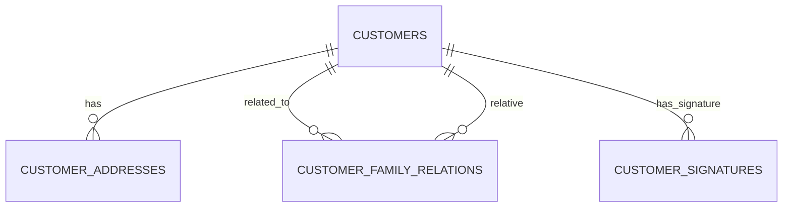
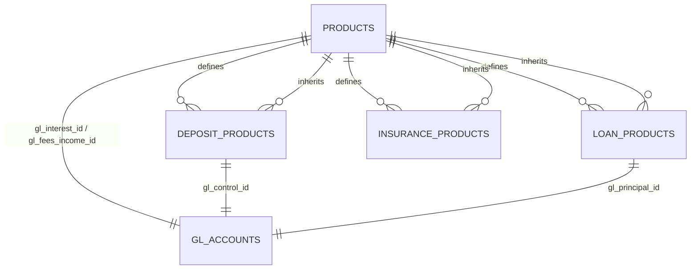
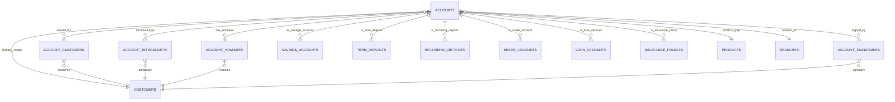
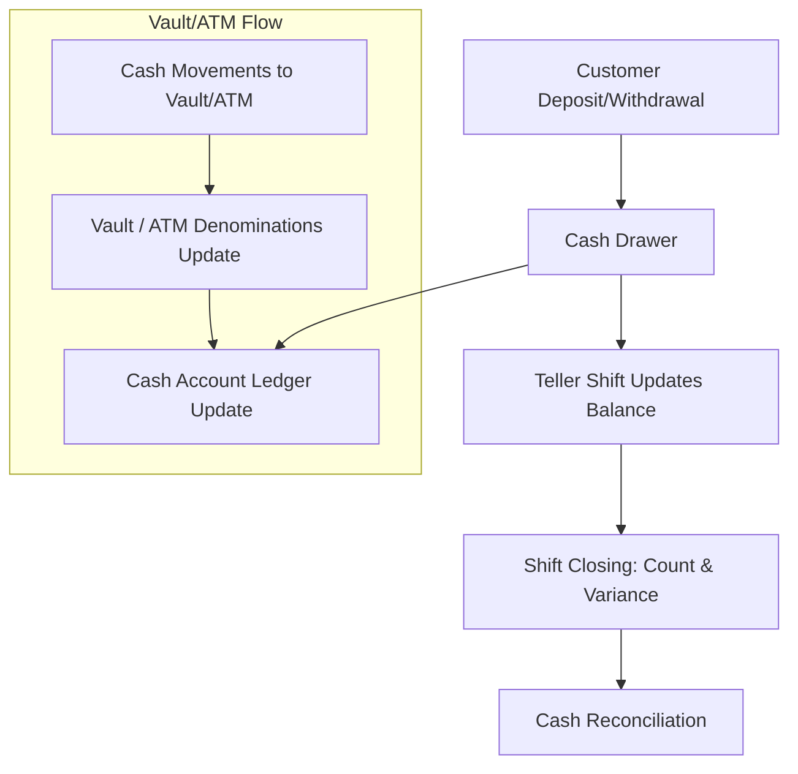
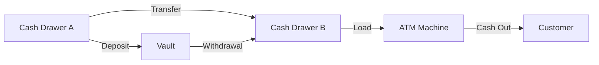
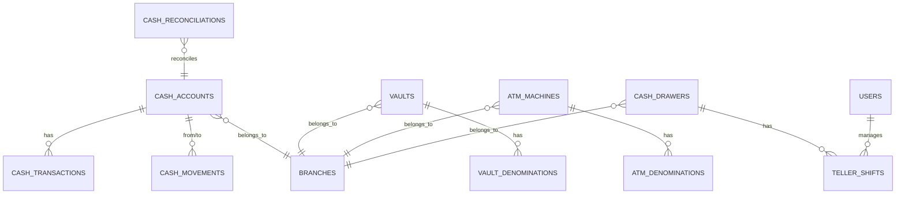

# Credit Union System Documentation

## 1. Overview

The Credit Union System is a modular banking solution designed to handle:

- Customer accounts
- Loans
- Deposits
- Insurance
- Cash management
- Journals & GL
- Cheques
- Audit logs

**Core Principles:**

1. All money movement is represented via **journal entries** (double-entry bookkeeping).
2. Product transactions are **derived from journals**, ensuring a clean audit trail.
3. Multi-branch, multi-user, teller-level operations supported.
4. Fully **KYC-compliant** customer management.

---

## 2. Actors & Organization

**Entities:**

- **Customers** – Individuals or organizations, KYC-verified.
- **Branches** – Operational units of the credit union.
- **Users** – Staff: tellers, ops, managers, admin.
- **Roles** – TELLER, OPS, MANAGER, ADMIN.

**Relationships:**

```bash
branches ──< users
customers ──< accounts (via account_customers)
```

---

## 3. Products

**Supported Product Types:**

| Type      | Description                             |
| --------- | --------------------------------------- |
| SAVINGS   | Standard savings accounts               |
| SHARE     | Share accounts with member equity       |
| RD        | Recurring deposits                      |
| FD        | Term deposits                           |
| LOAN      | Standard loans / loans against deposits |
| INSURANCE | Insurance policies linked to customers  |

**Tables:**

- `products`
- `insurance_policies`

**Fields Highlights:**

- **Deposit-specific:** `rate_bp`, `interest_method`, `gl_control_id`, `lock_in_days`
- **Loan-specific:** `schedule_method`, `penalty_bp`, `collateral_required`, `ltv_percent`

---

## 4. Accounts

**Tables:**

- `accounts` – Core account record per product
- `account_customers` – Customer ownership (primary/joint)
- `account_introducers` – Introducer linkage
- `account_nominees` – Nominee & share info
- `account_signatories` – Authorized signatories & mandate

**Account Types:**

- SAVINGS, SHARE, RD, FD, LOAN, INSURANCE

**Notes:**

- `balance` tracks current balance / loan outstanding
- `accrued_interest` tracks interest earned or payable
- `maturity_date` applies to FD, RD, or loans

---

## 5. Term & Recurring Deposits

**Tables:**

- `term_deposits` – Principal, rate, start/maturity, compounding, auto-renew
- `recurring_deposits` – Installment amount, rate, cycle, tenor

**Business Rules:**

- Interest can be compounded: monthly, quarterly, semi-annual, annual, or at maturity

---

## 6. Loans

**Tables:**

- `loan_applications`
- `loan_sureties`
- `loan_collaterals`
- `loan_guarantors`
- `loan_applicant_work_details`
- `loan_applicant_assets`
- `loan_applicant_incomes`
- `loan_applicant_expenses`
- `loan_application_supporting_docs`
- `loan_approvals`
- `loan_disbursements`
- `loan_application_status_history`

**Loan Flow:**

1. **Application Stage** – Customer submits loan; all supporting data is recorded.
2. **Approval Stage** – Credit officer approves and sets schedule.
3. **Account Creation** – Approved loan gets a new `accounts` entry.
4. **Disbursement Stage** – Loan credited to borrower account.
5. **Repayment Schedule** – Generated and linked to loan account.
6. **Repayment Stage** – Payments update balances & schedules.
7. **Closure / Write-off** – Loan is closed when fully repaid or waived.

---

## 7. Bank / Cash / Vault / Teller

**Tables:**

- `bank_accounts` – Bank accounts per branch
- `vaults` – Cash vault per branch
- `vault_denominations` – Denomination count in vaults
- `cash_drawers` – Teller drawers
- `teller_shifts` – Shift management, variance calculation
- `cash_transactions` – Cash inflow/outflow
- `transactions` – Customer-level ledger transactions

**Notes:**

- All teller and vault cash movements must **link to journal entries**.
- `transactions` table represents **customer perspective**.

---

## 8. Journals / GL

**Tables:**

- `gl_accounts` – Chart of accounts
- `journal_entries` – Master journal record
- `journal_lines` – Debits and credits per GL

**Business Rules:**

- Double-entry system: total debits = total credits
- Each `transaction` links to a `journal_entry`

---

## 9. Payments / Schedules / Interest / Charges

**Tables:**

- `schedules` – Loan/RD/FD schedule rows
- `insurance_premiums` – Premium payments
- `payments` – Payment receipts for accounts/schedules
- `interest_accruals` – Interest posting
- `charges` – Fees and penalties
- `insurance_claims` – Insurance claim records

---

## 10. Cheques

**Tables:**

- `cheque_books` – Customer cheque books
- `cheques` – Individual cheques
- `pending_cheque_debits` – Hold amounts for pending cheques

**Notes:**

- Cheque statuses: ISSUED, PENDING, CLEARED, BOUNCED, CANCELLED
- System handles posting, clearing, and pending holds automatically

---

## 11. Audit Log

**Tables:**

- `audits` – Tracks CRUD changes across the system

**Fields:**

- `auditable_type`, `auditable_id` – Entity changed
- `user_id` – Who made the change
- `event` – CREATED, UPDATED, DELETED, RESTORED
- `old_values`, `new_values` – JSON snapshots
- `branch_id`, `ip_address`, `user_agent` – Context

---

## 12. Principles & Notes

- All money movements are **backed by journal lines**.
- Customer account balance is **derived from transactions**.
- Teller shifts and cash drawer balances are **auditable**.
- KYC & family relations are fully tracked.
- Loan schedules, repayments, and interest accruals maintain **full auditability**.

# Credit Union Modules

## Table of Contents

1. [Branches & Users](#branches--users)
2. [Customers](#customers)
3. [Products](#products)
4. [Accounts](#accounts)
5. [Term & Recurring Deposits](#term--recurring-deposits)
6. [Loans](#loans)
7. [Bank / Cash / Vault / Teller](#bank--cash--vault--teller)
8. [Journals / GL](#journals--gl)
9. [Payments / Schedules / Interest / Charges](#payments--schedules--interest--charges)
10. [Cheques](#cheques)
11. [Audit Log](#audit-log)

---

## Branches & Users

```sql
CREATE TABLE branches (
    id BIGINT UNSIGNED AUTO_INCREMENT PRIMARY KEY,
    code VARCHAR(20) UNIQUE NOT NULL,
    name VARCHAR(100) NOT NULL,
    address VARCHAR(255),
    created_at TIMESTAMP DEFAULT CURRENT_TIMESTAMP,
    updated_at TIMESTAMP DEFAULT CURRENT_TIMESTAMP ON UPDATE CURRENT_TIMESTAMP
);

CREATE TABLE users (
    id BIGINT UNSIGNED AUTO_INCREMENT PRIMARY KEY,
    branch_id BIGINT UNSIGNED NOT NULL,
    full_name VARCHAR(100) NOT NULL,
    email VARCHAR(100) UNIQUE NOT NULL,
    password VARCHAR(255) NOT NULL,
    role ENUM('TELLER','OPS','MANAGER','ADMIN') NOT NULL,
    is_active BOOLEAN DEFAULT TRUE,
    created_at TIMESTAMP DEFAULT CURRENT_TIMESTAMP,
    updated_at TIMESTAMP DEFAULT CURRENT_TIMESTAMP ON UPDATE CURRENT_TIMESTAMP,
    FOREIGN KEY (branch_id) REFERENCES branches(id)
);

CREATE TABLE online_users (
    id BIGINT UNSIGNED AUTO_INCREMENT PRIMARY KEY,
    customer_id CHAR(36) NOT NULL,
    username VARCHAR(100) UNIQUE NOT NULL,
    email VARCHAR(150) UNIQUE,
    phone VARCHAR(20) UNIQUE,
    password VARCHAR(255) NOT NULL,
    last_login_at TIMESTAMP NULL,
    status ENUM('ACTIVE','SUSPENDED','CLOSED') DEFAULT 'ACTIVE',
    created_at TIMESTAMP DEFAULT CURRENT_TIMESTAMP,
    updated_at TIMESTAMP DEFAULT CURRENT_TIMESTAMP ON UPDATE CURRENT_TIMESTAMP,
    FOREIGN KEY (customer_id) REFERENCES customers(id)
);
```

## Customers

### ER Diagram



```sql
CREATE TABLE customers (
    id BIGINT UNSIGNED AUTO_INCREMENT PRIMARY KEY,
    customer_no VARCHAR(50) UNIQUE NOT NULL,
    type ENUM('Individual','Organization') NOT NULL,
    full_name VARCHAR(150) NOT NULL,
    registration_no VARCHAR(150),// For organizations
    dob DATE,
    gender ENUM('Male','Female','Other'),
    religion ENUM('Christianity','Islam','Hinduism', 'Buddhism', 'Other'),
    identification_type ENUM('NID','NBR','Passport', 'Driving License'),
    identification_number VARCHAR(50) NOT NULL,
    photo VARCHAR(255),
    phone VARCHAR(50),
    email VARCHAR(100),
    kyc_level ENUM('MIN','STD','ENH') DEFAULT 'MIN',
    status ENUM('PENDING','ACTIVE','SUSPENDED','CLOSED') DEFAULT 'ACTIVE',
    created_at TIMESTAMP DEFAULT CURRENT_TIMESTAMP,
    updated_at TIMESTAMP DEFAULT CURRENT_TIMESTAMP ON UPDATE CURRENT_TIMESTAMP
);

CREATE TABLE customer_addresses (
    id BIGINT UNSIGNED AUTO_INCREMENT PRIMARY KEY,
    customer_id BIGINT UNSIGNED NOT NULL,
    line1 VARCHAR(255) NOT NULL,
    line2 VARCHAR(255),
    city VARCHAR(100) NOT NULL,
    state VARCHAR(100),
    postal_code VARCHAR(20),
    country_code CHAR(2) NOT NULL DEFAULT 'BD',  -- ISO 3166-1 alpha-2
    type ENUM('CURRENT','PERMANENT','MAILING','WORK','REGISTERED','OTHER')
        NOT NULL DEFAULT 'CURRENT',
    FOREIGN KEY (customer_id) REFERENCES customers(id) ON DELETE CASCADE
);

-- protected $relationMap = [
--     // Parents & Children
--     'Father'        => ['reverse' => ['Son','Daughter']],
--     'Mother'        => ['reverse' => ['Son','Daughter']],
--     'Son'           => ['reverse' => ['Father','Mother']],
--     'Daughter'      => ['reverse' => ['Father','Mother']],

--     // Siblings
--     'Brother'       => ['reverse' => ['Brother','Sister']],
--     'Sister'        => ['reverse' => ['Brother','Sister']],

--     // Spouse
--     'Husband'       => ['reverse' => ['Wife']],
--     'Wife'          => ['reverse' => ['Husband']],

--     // Extended family
--     'Grandfather'   => ['reverse' => ['Grandson','Granddaughter']],
--     'Grandmother'   => ['reverse' => ['Grandson','Granddaughter']],
--     'Grandson'      => ['reverse' => ['Grandfather','Grandmother']],
--     'Granddaughter' => ['reverse' => ['Grandfather','Grandmother']],

--     'Uncle'         => ['reverse' => ['Nephew','Niece']],
--     'Aunt'          => ['reverse' => ['Nephew','Niece']],
--     'Nephew'        => ['reverse' => ['Uncle','Aunt']],
--     'Niece'         => ['reverse' => ['Uncle','Aunt']],

--     // In-laws
--     'Father-in-law'    => ['reverse' => ['Son-in-law','Daughter-in-law']],
--     'Mother-in-law'    => ['reverse' => ['Son-in-law','Daughter-in-law']],
--     'Son-in-law'       => ['reverse' => ['Father-in-law','Mother-in-law']],
--     'Daughter-in-law'  => ['reverse' => ['Father-in-law','Mother-in-law']],
--     'Brother-in-law'   => ['reverse' => ['Brother-in-law','Sister-in-law']],
--     'Sister-in-law'    => ['reverse' => ['Brother-in-law','Sister-in-law']],
-- ];

CREATE TABLE customer_family_relations (
    id BIGINT UNSIGNED AUTO_INCREMENT PRIMARY KEY,
    customer_id BIGINT UNSIGNED NOT NULL,
    relative_id BIGINT UNSIGNED NOT NULL,
    relation_type VARCHAR(50) NOT NULL,
    reverse_relation_type VARCHAR(50) NOT NULL,
    created_at TIMESTAMP DEFAULT CURRENT_TIMESTAMP,
    updated_at TIMESTAMP DEFAULT CURRENT_TIMESTAMP ON UPDATE CURRENT_TIMESTAMP,
    FOREIGN KEY (customer_id) REFERENCES customers(id) ON DELETE CASCADE,
    FOREIGN KEY (relative_id) REFERENCES customers(id) ON DELETE CASCADE,
    UNIQUE (customer_id, relative_id)  -- prevent duplicates
);

CREATE TABLE customer_signatures (
    id BIGINT UNSIGNED AUTO_INCREMENT PRIMARY KEY,
    customer_id BIGINT UNSIGNED NOT NULL,
    signature_path VARCHAR(255) NOT NULL,
    role ENUM('DIRECTOR','PARTNER','AUTHORIZED_SIGNATORY') NOT NULL,
    created_at TIMESTAMP DEFAULT CURRENT_TIMESTAMP,
    updated_at TIMESTAMP DEFAULT CURRENT_TIMESTAMP ON UPDATE CURRENT_TIMESTAMP,
    FOREIGN KEY (customer_id) REFERENCES customers(id) ON DELETE CASCADE
);
```

## Products

### ER Diagram



```sql
CREATE TABLE products (
    id BIGINT UNSIGNED AUTO_INCREMENT PRIMARY KEY,
    type ENUM('SAVINGS','SHARE','RECURRING_DEPOSIT','FIXED_DEPOSIT','INSURANCE','LOAN') NOT NULL,
    code VARCHAR(50) UNIQUE NOT NULL,   -- unique product code
    name VARCHAR(100) NOT NULL,         -- product name
    is_active BOOLEAN DEFAULT TRUE,

    -- GL mappings (common)
    gl_interest_id BIGINT UNSIGNED NULL,     -- GL for interest income
    gl_fees_income_id BIGINT UNSIGNED NULL,  -- GL for fees/penalty/processing/etc.

    created_at TIMESTAMP DEFAULT CURRENT_TIMESTAMP,
    updated_at TIMESTAMP DEFAULT CURRENT_TIMESTAMP ON UPDATE CURRENT_TIMESTAMP
);

CREATE TABLE deposit_products (
    product_id BIGINT UNSIGNED PRIMARY KEY,
    gl_control_id BIGINT UNSIGNED NOT NULL,     -- liability control account for deposits
    interest_method ENUM('DAILY','MONTHLY','QUARTERLY','NONE') DEFAULT 'NONE',
    rate_bp INT NOT NULL,                       -- interest rate (basis points, e.g. 500 = 5%)
    min_opening_amount DECIMAL(18,2) DEFAULT 0,
    lock_in_days INT DEFAULT 0,
    penalty_break_bp INT DEFAULT 0,             -- penalty rate for premature withdrawal
    FOREIGN KEY (product_id) REFERENCES products(id) ON DELETE CASCADE
);

CREATE TABLE loan_products (
    product_id BIGINT UNSIGNED PRIMARY KEY,
    gl_principal_id BIGINT UNSIGNED NOT NULL,   -- loan principal ledger
    penalty_bp INT DEFAULT 0,                   -- penalty interest rate
    schedule_method ENUM('FLAT_EQUAL','REDUCING','INTEREST_ONLY','CUSTOM') DEFAULT 'REDUCING',
    max_tenor_months INT NOT NULL,
    collateral_required BOOLEAN DEFAULT FALSE,
    ltv_percent INT NULL,                       -- Loan-to-Value ratio
    FOREIGN KEY (product_id) REFERENCES products(id) ON DELETE CASCADE
);

CREATE TABLE insurance_products (
    product_id BIGINT UNSIGNED PRIMARY KEY,
    coverage_type ENUM('LIFE','HEALTH','PROPERTY','OTHER') DEFAULT 'LIFE',
    min_premium DECIMAL(18,2) NOT NULL,
    max_premium DECIMAL(18,2) NOT NULL,
    premium_cycle ENUM('MONTHLY','QUARTERLY','ANNUAL') DEFAULT 'MONTHLY',
    FOREIGN KEY (product_id) REFERENCES products(id) ON DELETE CASCADE
);
```

## Accounts

### ER Diagram



```sql
CREATE TABLE accounts (
    id BIGINT UNSIGNED AUTO_INCREMENT PRIMARY KEY,
    account_no VARCHAR(50) UNIQUE NOT NULL,         -- core account number
    customer_id BIGINT UNSIGNED NOT NULL,             -- who owns the account
    product_id BIGINT UNSIGNED NOT NULL,            -- FK to product definition
    branch_id BIGINT UNSIGNED NOT NULL,             -- branch opened
    type ENUM('SAVINGS','RD','FD','SHARE','LOAN','INSURANCE') NOT NULL,
    status ENUM('ACTIVE','PENDING','CLOSED','SUSPENDED') DEFAULT 'ACTIVE',

    created_at TIMESTAMP DEFAULT CURRENT_TIMESTAMP,
    updated_at TIMESTAMP DEFAULT CURRENT_TIMESTAMP ON UPDATE CURRENT_TIMESTAMP,

    FOREIGN KEY (customer_id) REFERENCES customers(id),
    FOREIGN KEY (product_id) REFERENCES products(id),
    FOREIGN KEY (branch_id) REFERENCES branches(id)
);

-- Account holders (ownership)
CREATE TABLE account_customers (
    id BIGINT UNSIGNED AUTO_INCREMENT PRIMARY KEY,
    account_id BIGINT UNSIGNED NOT NULL,
    customer_id BIGINT UNSIGNED NOT NULL,
    role ENUM('PRIMARY_HOLDER','JOINT_HOLDER','AUTHORIZED_SIGNATORY') NOT NULL,
    created_at TIMESTAMP DEFAULT CURRENT_TIMESTAMP,
    updated_at TIMESTAMP DEFAULT CURRENT_TIMESTAMP ON UPDATE CURRENT_TIMESTAMP,
    FOREIGN KEY (account_id) REFERENCES accounts(id) ON DELETE CASCADE,
    FOREIGN KEY (customer_id) REFERENCES customers(id) ON DELETE CASCADE
);

-- Introducers (separate relationship)
CREATE TABLE account_introducers (
    id BIGINT UNSIGNED AUTO_INCREMENT PRIMARY KEY,
    account_id BIGINT UNSIGNED NOT NULL,
    introducer_customer_id BIGINT UNSIGNED NOT NULL,
    created_at TIMESTAMP DEFAULT CURRENT_TIMESTAMP,
    FOREIGN KEY (account_id) REFERENCES accounts(id) ON DELETE CASCADE,
    FOREIGN KEY (introducer_customer_id) REFERENCES customers(id) ON DELETE CASCADE
);

CREATE TABLE account_nominees (
    id BIGINT UNSIGNED AUTO_INCREMENT PRIMARY KEY,
    account_id BIGINT UNSIGNED NOT NULL,
    nominee_id BIGINT UNSIGNED NOT NULL,
    share_percentage DECIMAL(5,2) DEFAULT 0,
    FOREIGN KEY (account_id) REFERENCES accounts(id) ON DELETE CASCADE,
    FOREIGN KEY (nominee_id) REFERENCES customers(id)
);

CREATE TABLE account_signatories (
    id BIGINT UNSIGNED AUTO_INCREMENT PRIMARY KEY,
    account_id BIGINT UNSIGNED NOT NULL,
    customer_id BIGINT UNSIGNED NOT NULL,
    signature_path VARCHAR(255) NOT NULL,  -- file path or blob ref
    mandate ENUM('SOLE','JOINT','EITHER','VIEW_ONLY') DEFAULT 'SOLE',
    is_active BOOLEAN DEFAULT TRUE,
    created_at TIMESTAMP DEFAULT CURRENT_TIMESTAMP,
    FOREIGN KEY (account_id) REFERENCES accounts(id),
    FOREIGN KEY (customer_id) REFERENCES customers(id)
);

CREATE TABLE savings_accounts (
    account_id BIGINT UNSIGNED PRIMARY KEY,
    balance DECIMAL(18,2) DEFAULT 0,
    min_balance DECIMAL(18,2) DEFAULT 0,
    interest_rate_bp INT DEFAULT 0,
    interest_method ENUM('DAILY','MONTHLY','QUARTERLY') DEFAULT 'MONTHLY',
    FOREIGN KEY (account_id) REFERENCES accounts(id) ON DELETE CASCADE
);

CREATE TABLE term_deposits (
    account_id BIGINT UNSIGNED PRIMARY KEY,
    principal DECIMAL(18,2) NOT NULL,
    rate_bp INT NOT NULL, -- interest rate base point
    start_date DATE NOT NULL,
    maturity_date DATE NOT NULL,
    --how interest is calculated and added to the account.
    compounding ENUM('MONTHLY','QUARTERLY','SEMI_ANNUAL','ANNUAL','MATURITY') DEFAULT 'MATURITY',
    auto_renew BOOLEAN DEFAULT FALSE,
    FOREIGN KEY (account_id) REFERENCES accounts(id) ON DELETE CASCADE
);

CREATE TABLE recurring_deposits (
    account_id BIGINT UNSIGNED PRIMARY KEY,
    installment_amount DECIMAL(18,2) NOT NULL,
    rate_bp INT NOT NULL, -- interest rate base point
    cycle ENUM('MONTHLY') DEFAULT 'MONTHLY',
    start_date DATE NOT NULL,
    tenor_months INT NOT NULL,
    FOREIGN KEY (account_id) REFERENCES accounts(id) ON DELETE CASCADE
);

CREATE TABLE share_accounts (
    account_id BIGINT UNSIGNED PRIMARY KEY,
    total_shares INT NOT NULL,
    share_price DECIMAL(18,2) NOT NULL,
    FOREIGN KEY (account_id) REFERENCES accounts(id) ON DELETE CASCADE
);

CREATE TABLE loan_accounts (
    account_id BIGINT UNSIGNED PRIMARY KEY,
    principal_amount DECIMAL(18,2) NOT NULL,
    outstanding_amount DECIMAL(18,2) NOT NULL,
    rate_bp INT NOT NULL, -- interest rate in basis points
    start_date DATE NOT NULL,
    end_date DATE NOT NULL,
    schedule_method ENUM('FLAT_EQUAL','REDUCING','INTEREST_ONLY','CUSTOM') DEFAULT 'FLAT_EQUAL',
    collateral_required BOOLEAN DEFAULT FALSE,
    ltv_percent INT, -- Loan-to-Value ratio
    penalty_bp INT DEFAULT 0, -- penalty interest
    status ENUM('APPROVED','DISBURSED','REPAID','DEFAULTED') DEFAULT 'APPROVED',
    FOREIGN KEY (account_id) REFERENCES accounts(id) ON DELETE CASCADE
);

CREATE TABLE insurance_policies (
    account_id BIGINT UNSIGNED PRIMARY KEY,
    policy_no VARCHAR(50) UNIQUE NOT NULL,
    start_date DATE NOT NULL,
    end_date DATE NOT NULL,
    premium_amount DECIMAL(18,2) NOT NULL,
    premium_cycle ENUM('MONTHLY','QUARTERLY','ANNUAL') DEFAULT 'MONTHLY',
    status ENUM('ACTIVE','LAPSED','CANCELLED','CLAIMED') DEFAULT 'ACTIVE',
    beneficiary VARCHAR(150),
    FOREIGN KEY (account_id) REFERENCES accounts(id) ON DELETE CASCADE
);
```

## Loan Application Management Documentation

### Loan Flow

**1. Application Stage**

- Customer submits loan request.
- Data goes into loan_applications.
- Attach guarantors, sureties, collaterals, applicant income/expenses, work details, supporting docs.
- status = PENDING.

**👉 Tables involved:**

- loan_applications
- loan_guarantors, loan_sureties, loan_collaterals
- loan_applicant_work_details, loan_applicant_assets, - loan_applicant_incomes, loan_applicant_expenses
- loan_application_supporting_docs

**2. Approval Stage**

- Credit officer / committee reviews the loan.
- Approval decision recorded in loan_approvals.
- Includes: approved amount, interest rate, repayment schedule (can be JSON or linked to schedules).
- loan_application_status_history logs the status change to APPROVED.

**👉 Tables involved:**

- loan_approvals
- loan_application_status_history

**_3. Account Creation (important!)_**

- Once approved, a loan account is created in accounts with:
    - product_id → loan product type
    - balance = 0 initially
- loan_applications.account_id is updated with this newly created account.
- This allows all schedules and repayments to reference the same account like deposits.

**👉 Tables involved:**

- accounts
- loan_applications (update to store account_id)

**4. Disbursement Stage**

- Loan is disbursed in one or multiple tranches.
- Recorded in loan_disbursements.
- Credited to the borrower’s deposit account (or external bank).
- Loan account balance increases by disbursed amount.
- loan_application_status_history logs DISBURSED.

**👉 Tables involved:**

- loan_disbursements
- accounts (loan account balance update)
- loan_application_status_history

**5. Repayment Schedule Generation**

- System generates schedule rows in schedules linked to the loan account.
- Each row = installment with due_date, principal_due, interest_due, fee_due, sequence_no.
- Status = PENDING.

**👉 Tables involved:**

- schedules

**6. Repayment Stage**

- Borrower makes payments against the loan.
- You can track these in a transactions table (not shown yet but usually required).
- Each repayment updates:
- Loan account balance ↓
- Matching schedule rows (status → PARTIAL or PAID).
- Interest accruals (if applied daily/monthly) can also be posted to schedules or a separate accruals table.

**👉 Tables involved:**

- transactions (recommended addition)
- schedules
- accounts

**7. Closure / Write-off**

- When the loan balance = 0 and all schedules are paid → loan account status → CLOSED.
- If waived/write-off → schedules.status = WAIVED and balance adjusted.
- loan_application_status_history logs CLOSED.

**👉 Tables involved:**

- accounts (status update)
- loan_application_status_history

## ER Diagram

```mermaid
erDiagram
    CUSTOMERS ||--o{ LOAN_APPLICATIONS : "applies_for"
    PRODUCTS ||--o{ LOAN_APPLICATIONS : "defines"
    ACCOUNTS ||--o{ LOAN_APPLICATIONS : "linked_to"

    LOAN_APPLICATIONS ||--o{ LOAN_SURETIES : "has"
    ACCOUNTS ||--o{ LOAN_SURETIES : "as_surety"

    LOAN_APPLICATIONS ||--o{ LOAN_COLLATERALS : "has"
    LOAN_APPLICATIONS ||--o{ LOAN_GUARANTORS : "has"
    CUSTOMERS ||--o{ LOAN_GUARANTORS : "as_guarantor"

    LOAN_APPLICATIONS ||--o{ LOAN_APPLICANT_WORK_DETAILS : "has"
    LOAN_APPLICATIONS ||--o{ LOAN_APPLICANT_ASSETS : "has"
    LOAN_APPLICATIONS ||--o{ LOAN_APPLICANT_INCOMES : "has"
    LOAN_APPLICATIONS ||--o{ LOAN_APPLICANT_EXPENSES : "has"
    LOAN_APPLICATIONS ||--o{ LOAN_APPLICATION_SUPPORTING_DOCS : "has"

    LOAN_APPLICATIONS ||--o{ LOAN_APPROVALS : "may_be_approved_by"
    USERS ||--o{ LOAN_APPROVALS : "approves"

    LOAN_APPLICATIONS ||--o{ LOAN_DISBURSEMENTS : "may_be_disbursed_to"
    ACCOUNTS ||--o{ LOAN_DISBURSEMENTS : "receives"

    LOAN_APPLICATIONS ||--o{ LOAN_APPLICATION_STATUS_HISTORY : "has_status_history"
    USERS ||--o{ LOAN_APPLICATION_STATUS_HISTORY : "changes_status"
```



```sql
CREATE TABLE loan_applications (
    id BIGINT UNSIGNED AUTO_INCREMENT PRIMARY KEY,
    customer_id BIGINT UNSIGNED NOT NULL,
    product_id BIGINT UNSIGNED NOT NULL,
    account_id BIGINT UNSIGNED NULL, -- created later after approval
    loan_type ENUM('GENERAL','DEPOSIT','SECURED') DEFAULT 'GENERAL',
    amount_requested DECIMAL(18,2) NOT NULL,
    purpose TEXT,
    application_date DATE NOT NULL,
    status ENUM('PENDING','APPROVED','REJECTED','DISBURSED','CLOSED') DEFAULT 'PENDING',
    created_at TIMESTAMP DEFAULT CURRENT_TIMESTAMP,
    updated_at TIMESTAMP DEFAULT CURRENT_TIMESTAMP ON UPDATE CURRENT_TIMESTAMP,
    FOREIGN KEY (customer_id) REFERENCES customers(id),
    FOREIGN KEY (product_id) REFERENCES products(id),
    FOREIGN KEY (account_id) REFERENCES accounts(id)
);

CREATE TABLE loan_sureties (
    id BIGINT UNSIGNED AUTO_INCREMENT PRIMARY KEY,
    loan_application_id BIGINT UNSIGNED NOT NULL,
    account_id BIGINT UNSIGNED NOT NULL,
    surety_type ENUM('SURETY','LEAN') NOT NULL,
    amount DECIMAL(18,2) NOT NULL,
    FOREIGN KEY (loan_application_id) REFERENCES loan_applications(id) ON DELETE CASCADE,
    FOREIGN KEY (account_id) REFERENCES accounts(id)
);

CREATE TABLE loan_collaterals (
    id BIGINT UNSIGNED AUTO_INCREMENT PRIMARY KEY,
    loan_application_id BIGINT UNSIGNED NOT NULL,
    collateral_type ENUM('ASSET','PROPERTY') NOT NULL,
    reference VARCHAR(255),
    value DECIMAL(18,2) NOT NULL,
    description VARCHAR(255),
    FOREIGN KEY (loan_application_id) REFERENCES loan_applications(id) ON DELETE CASCADE
);

CREATE TABLE loan_guarantors (
    id BIGINT UNSIGNED AUTO_INCREMENT PRIMARY KEY,
    loan_application_id BIGINT UNSIGNED NOT NULL,
    customer_id BIGINT UNSIGNED NOT NULL,
    FOREIGN KEY (loan_application_id) REFERENCES loan_applications(id) ON DELETE CASCADE,
    FOREIGN KEY (customer_id) REFERENCES customers(id)
);

CREATE TABLE loan_applicant_work_details (
    id BIGINT UNSIGNED AUTO_INCREMENT PRIMARY KEY,
    loan_application_id BIGINT UNSIGNED NOT NULL,
    employer_name VARCHAR(100),
    designation VARCHAR(50),
    employment_type ENUM('PERMANENT','CONTRACT','SELF_EMPLOYED','OTHER') DEFAULT 'OTHER',
    monthly_income DECIMAL(18,2),
    years_of_service INT,
    FOREIGN KEY (loan_application_id) REFERENCES loan_applications(id) ON DELETE CASCADE
);

CREATE TABLE loan_applicant_assets (
    id BIGINT UNSIGNED AUTO_INCREMENT PRIMARY KEY,
    loan_application_id BIGINT UNSIGNED NOT NULL,
    asset_type VARCHAR(50) NOT NULL,
    description VARCHAR(255),
    value DECIMAL(18,2) NOT NULL,
    FOREIGN KEY (loan_application_id) REFERENCES loan_applications(id) ON DELETE CASCADE
);

CREATE TABLE loan_applicant_incomes (
    id BIGINT UNSIGNED AUTO_INCREMENT PRIMARY KEY,
    loan_application_id BIGINT UNSIGNED NOT NULL,
    source VARCHAR(100),
    monthly_amount DECIMAL(18,2),
    frequency ENUM('MONTHLY','ANNUAL','OTHER') DEFAULT 'MONTHLY',
    FOREIGN KEY (loan_application_id) REFERENCES loan_applications(id) ON DELETE CASCADE
);

CREATE TABLE loan_applicant_expenses (
    id BIGINT UNSIGNED AUTO_INCREMENT PRIMARY KEY,
    loan_application_id BIGINT UNSIGNED NOT NULL,
    category VARCHAR(50),
    monthly_amount DECIMAL(18,2),
    FOREIGN KEY (loan_application_id) REFERENCES loan_applications(id) ON DELETE CASCADE
);

CREATE TABLE loan_application_supporting_docs (
    id BIGINT UNSIGNED AUTO_INCREMENT PRIMARY KEY,
    loan_application_id BIGINT UNSIGNED NOT NULL,
    file_name VARCHAR(255),
    file_path VARCHAR(255),
    mime VARCHAR(50),
    document_type VARCHAR(50), -- e.g., Gas Bill, Electricity, Passport
    uploaded_at TIMESTAMP DEFAULT CURRENT_TIMESTAMP,
    FOREIGN KEY (loan_application_id) REFERENCES loan_applications(id) ON DELETE CASCADE
);

CREATE TABLE loan_approvals (
    id BIGINT UNSIGNED AUTO_INCREMENT PRIMARY KEY,
    loan_application_id BIGINT UNSIGNED NOT NULL,
    approved_by BIGINT UNSIGNED NOT NULL,
    approved_amount DECIMAL(18,2) NOT NULL,
    interest_rate DECIMAL(5,2) NOT NULL,
    repayment_schedule JSON NOT NULL, -- installments, dates, amounts
    approved_date DATE NOT NULL,
    FOREIGN KEY (loan_application_id) REFERENCES loan_applications(id) ON DELETE CASCADE,
    FOREIGN KEY (approved_by) REFERENCES users(id)
);

CREATE TABLE loan_disbursements (
    id BIGINT UNSIGNED AUTO_INCREMENT PRIMARY KEY,
    loan_application_id BIGINT UNSIGNED NOT NULL,
    disbursement_date DATE NOT NULL,
    amount DECIMAL(18,2) NOT NULL,
    account_id BIGINT UNSIGNED NOT NULL, -- account credited
    FOREIGN KEY (loan_application_id) REFERENCES loan_applications(id) ON DELETE CASCADE,
    FOREIGN KEY (account_id) REFERENCES accounts(id)
);

CREATE TABLE loan_application_status_history (
    id BIGINT UNSIGNED AUTO_INCREMENT PRIMARY KEY,
    loan_application_id BIGINT UNSIGNED NOT NULL,
    status ENUM('PENDING','APPROVED','REJECTED','DISBURSED','CLOSED') NOT NULL,
    changed_by BIGINT UNSIGNED NOT NULL,
    changed_at TIMESTAMP DEFAULT CURRENT_TIMESTAMP,
    FOREIGN KEY (loan_application_id) REFERENCES loan_applications(id) ON DELETE CASCADE,
    FOREIGN KEY (changed_by) REFERENCES users(id)
);
```

# Cash Management System Documentation

---

## 1️⃣ Core Concepts

- **Cash Accounts**: Logical representation of cash holdings.
    - Types: `CASH_ON_HAND`, `BANK`, `PETTY_CASH`, `CASH_EQUIVALENT`.
    - Linked to a branch optionally.
    - Tracks cash balances in the ledger.

- **Vaults / ATMs**: Physical cash storage locations.
    - Vaults: branch-level storage.
    - ATMs: machines, also linked to branches.
    - Both track denominations for bills and coins.

- **Cash Drawers**: Physical cash drawers assigned to tellers.
    - Tracks cash handled by teller per shift.
    - Updates balance in real-time.

- **Teller Shifts**: Tracks teller operations per drawer.
    - Opening balance: `opening_expected`.
    - Closing balance: `closing_counted`.
    - Variance calculated: `variance = closing_counted - closing_expected`.

- **Cash Movements**: Transfers between accounts, drawers, vaults, and ATMs.
- **Reconciliation**: Compare physical vs system balances.

---

## 2️⃣ Key Tables

| Table                  | Purpose                                                                        |
| ---------------------- | ------------------------------------------------------------------------------ |
| `cash_accounts`        | Logical representation of cash holdings (CASH_ON_HAND, BANK, PETTY_CASH, etc.) |
| `cash_drawers`         | Physical drawer assigned to teller                                             |
| `teller_shifts`        | Track teller operations per drawer                                             |
| `vaults`               | Branch-level physical cash storage                                             |
| `vault_denominations`  | Track bill/coin quantities in vaults                                           |
| `atm_machines`         | ATM machines per branch                                                        |
| `atm_denominations`    | Track bill quantities in ATMs                                                  |
| `cash_transactions`    | Cash inflows and outflows                                                      |
| `cash_movements`       | Cash transfers between accounts, drawers, vaults, ATMs                         |
| `cash_reconciliations` | Cash counts vs system balances                                                 |

---

## 3️⃣ Cash Flow



## 5️⃣ Teller Shift Lifecycle

**1. Shift Start**

- Teller assigned a cash drawer.
- Opening balance (opening_expected) loaded from system.

**2. During Shift**

- Process cash transactions.
- Update drawer balance.
- Move cash to vaults or ATMs if needed.

**3. Shift End**

- Count cash (closing_counted).
- Compare with expected (closing_expected).
- Variance logged.

## 6️⃣ Vault / ATM Management

- Vaults
    - Track denominations of physical cash.
    - Supports deposits from drawers and withdrawals to drawers/ATMs.
- ATMs
    - Track denominations of cash loaded.
    - Cash movements to/from ATMs recorded in cash_movements.

## 7️⃣ Reconciliation

- Compare actual cash in drawers, vaults, ATMs with system balances.
- Record discrepancies in cash_reconciliations.
- Adjust ledger entries or investigate variances.

**Discrepancy Formula:**

```
discrepancy = counted_amount - system_amount
```

## 8️⃣ Cash Movement Flow



## 9️⃣ ER Structure



## 🔟 Notes

- All physical cash flows must be recorded in cash_transactions.
- Teller shifts track daily operations and reconcile variances.
- Vaults and ATMs track denominations to simplify loading/unloading.
- Reconciliation ensures cash integrity and prevents loss or fraud.
- All movements between accounts, drawers, vaults, and ATMs are logged in cash_movements.
- Cash accounts, drawers, vaults, and ATMs are linked to branches and users for - accountability.
- Variances from reconciliations should be investigated promptly and adjusted in GL.

```sql
-- -- Branch Bank Accounts
-- CREATE TABLE bank_accounts (
--     id BIGINT UNSIGNED AUTO_INCREMENT PRIMARY KEY,
--     branch_id BIGINT UNSIGNED NOT NULL,
--     bank_name VARCHAR(100) NOT NULL,
--     account_no VARCHAR(50) NOT NULL,
--     currency CHAR(3) DEFAULT 'USD',
--     is_active BOOLEAN DEFAULT TRUE,
--     created_at TIMESTAMP DEFAULT CURRENT_TIMESTAMP,
--     updated_at TIMESTAMP DEFAULT CURRENT_TIMESTAMP ON UPDATE CURRENT_TIMESTAMP,
--     FOREIGN KEY (branch_id) REFERENCES branches(id),
--     UNIQUE(branch_id, account_no)
-- );

-- -- Vaults (Physical Cash Storage)
-- CREATE TABLE vaults (
--     id BIGINT UNSIGNED AUTO_INCREMENT PRIMARY KEY,
--     branch_id BIGINT UNSIGNED NOT NULL,
--     balance DECIMAL(18,2) DEFAULT 0,
--     created_at TIMESTAMP DEFAULT CURRENT_TIMESTAMP,
--     updated_at TIMESTAMP DEFAULT CURRENT_TIMESTAMP ON UPDATE CURRENT_TIMESTAMP,
--     FOREIGN KEY (branch_id) REFERENCES branches(id)
-- );

-- -- Vault Denominations (for reconciliation)
-- CREATE TABLE vault_denominations (
--     id BIGINT UNSIGNED AUTO_INCREMENT PRIMARY KEY,
--     vault_id BIGINT UNSIGNED NOT NULL,
--     denomination INT NOT NULL,
--     quantity INT NOT NULL DEFAULT 0,
--     FOREIGN KEY (vault_id) REFERENCES vaults(id),
--     UNIQUE(vault_id, denomination)
-- );

-- -- Teller Cash Drawers
-- CREATE TABLE cash_drawers (
--     id BIGINT UNSIGNED AUTO_INCREMENT PRIMARY KEY,
--     branch_id BIGINT UNSIGNED NOT NULL,
--     assigned_user_id BIGINT UNSIGNED,
--     balance DECIMAL(18,2) DEFAULT 0,
--     created_at TIMESTAMP DEFAULT CURRENT_TIMESTAMP,
--     updated_at TIMESTAMP DEFAULT CURRENT_TIMESTAMP ON UPDATE CURRENT_TIMESTAMP,
--     FOREIGN KEY (branch_id) REFERENCES branches(id),
--     FOREIGN KEY (assigned_user_id) REFERENCES users(id)
-- );

-- -- Teller Shifts (Accountability)
-- CREATE TABLE teller_shifts (
--     id BIGINT UNSIGNED AUTO_INCREMENT PRIMARY KEY,
--     drawer_id BIGINT UNSIGNED NOT NULL,
--     user_id BIGINT UNSIGNED NOT NULL,
--     opened_at TIMESTAMP DEFAULT CURRENT_TIMESTAMP,
--     closed_at TIMESTAMP,
--     opening_expected DECIMAL(18,2) DEFAULT 0,
--     closing_expected DECIMAL(18,2),
--     closing_counted DECIMAL(18,2),
--     variance DECIMAL(18,2),
--     created_at TIMESTAMP DEFAULT CURRENT_TIMESTAMP,
--     updated_at TIMESTAMP DEFAULT CURRENT_TIMESTAMP ON UPDATE CURRENT_TIMESTAMP,
--     FOREIGN KEY (drawer_id) REFERENCES cash_drawers(id),
--     FOREIGN KEY (user_id) REFERENCES users(id)
-- );

-- -- Cash Transactions (Physical Cash Movements)
-- CREATE TABLE cash_transactions (
--     id BIGINT UNSIGNED AUTO_INCREMENT PRIMARY KEY,
--     account_id BIGINT UNSIGNED,             -- Optional if deposit/withdrawal
--     teller_id BIGINT UNSIGNED,             -- Nullable for system/bank transactions
--     vault_id BIGINT UNSIGNED,              -- Nullable unless teller/system
--     bank_account_id BIGINT UNSIGNED,       -- Nullable unless bank interaction
--     type ENUM(
--         'DEPOSIT','WITHDRAWAL','TRANSFER',
--         'LOAN_DISBURSEMENT','LOAN_REPAYMENT',
--         'CHEQUE_CLEARANCE','CASH_IN','CASH_OUT'
--     ) NOT NULL,
--     mode ENUM('CASH','CHEQUE','TRANSFER') NOT NULL DEFAULT 'CASH',
--     source ENUM('TELLER','BANK','SYSTEM') NOT NULL DEFAULT 'TELLER',
--     amount DECIMAL(18,2) NOT NULL,
--     transaction_date TIMESTAMP DEFAULT CURRENT_TIMESTAMP,
--     reference_no VARCHAR(50),
--     created_by BIGINT UNSIGNED,
--     FOREIGN KEY (account_id) REFERENCES accounts(id),
--     FOREIGN KEY (teller_id) REFERENCES users(id),
--     FOREIGN KEY (vault_id) REFERENCES vaults(id),
--     FOREIGN KEY (bank_account_id) REFERENCES bank_accounts(id),
--     FOREIGN KEY (created_by) REFERENCES users(id),
--     INDEX(transaction_date),
--     INDEX(account_id)
-- );

-- -- General Ledger / Customer Ledger
-- CREATE TABLE transactions (
--     id BIGINT UNSIGNED AUTO_INCREMENT PRIMARY KEY,
--     account_id BIGINT UNSIGNED NOT NULL,
--     journal_entry_id BIGINT UNSIGNED NOT NULL,
--     type ENUM(
--         'DEPOSIT','WITHDRAWAL','TRANSFER',
--         'LOAN_DISBURSEMENT','LOAN_REPAYMENT',
--         'INTEREST_ACCRUAL','CHARGE','FEE',
--         'INSURANCE_PREMIUM','INSURANCE_CLAIM',
--         'ADJUSTMENT','REVERSAL'
--     ) NOT NULL,
--     dr_cr ENUM('DEBIT','CREDIT') NOT NULL,
--     amount DECIMAL(18,2) NOT NULL,
--     balance_after DECIMAL(18,2) NOT NULL,
--     channel ENUM('TELLER','ATM','ONLINE','MOBILE','BANK','SYSTEM') DEFAULT 'SYSTEM',
--     mode ENUM('CASH','CHEQUE','TRANSFER','INTERNAL') DEFAULT 'CASH',
--     reference_no VARCHAR(100),
--     narration VARCHAR(255),
--     branch_id BIGINT UNSIGNED,
--     created_at TIMESTAMP DEFAULT CURRENT_TIMESTAMP,
--     FOREIGN KEY (account_id) REFERENCES accounts(id),
--     FOREIGN KEY (journal_entry_id) REFERENCES journal_entries(id),
--     FOREIGN KEY (branch_id) REFERENCES branches(id),
--     INDEX(account_id),
--     INDEX(created_at)
-- );

-- -- Petty Cash Fund
-- CREATE TABLE petty_cash_funds (
--     id BIGINT UNSIGNED AUTO_INCREMENT PRIMARY KEY,
--     branch_id BIGINT UNSIGNED NOT NULL,
--     fund_name VARCHAR(100) NOT NULL,
--     balance DECIMAL(18,2) DEFAULT 0,
--     custodian_id BIGINT UNSIGNED NOT NULL,
--     created_at TIMESTAMP DEFAULT CURRENT_TIMESTAMP,
--     updated_at TIMESTAMP DEFAULT CURRENT_TIMESTAMP ON UPDATE CURRENT_TIMESTAMP,
--     FOREIGN KEY (branch_id) REFERENCES branches(id),
--     FOREIGN KEY (custodian_id) REFERENCES users(id),
--     UNIQUE(branch_id, fund_name)
-- );

-- -- Petty Cash Transactions
-- CREATE TABLE petty_cash_transactions (
--     id BIGINT UNSIGNED AUTO_INCREMENT PRIMARY KEY,
--     fund_id BIGINT UNSIGNED NOT NULL,
--     type ENUM('DISBURSE','REPLENISH') NOT NULL,
--     amount DECIMAL(18,2) NOT NULL,
--     category VARCHAR(100),
--     description VARCHAR(255),
--     transaction_date TIMESTAMP DEFAULT CURRENT_TIMESTAMP,
--     journal_entry_id BIGINT UNSIGNED,
--     created_by BIGINT UNSIGNED,
--     FOREIGN KEY (fund_id) REFERENCES petty_cash_funds(id),
--     FOREIGN KEY (journal_entry_id) REFERENCES journal_entries(id),
--     FOREIGN KEY (created_by) REFERENCES users(id),
--     INDEX(transaction_date),
--     INDEX(fund_id)
-- );

-- -- Petty Cash Expense Categories (Optional)
-- CREATE TABLE petty_cash_categories (
--     id BIGINT UNSIGNED AUTO_INCREMENT PRIMARY KEY,
--     name VARCHAR(100) NOT NULL UNIQUE,
--     description VARCHAR(255)
-- );

-- ============================
-- 1️⃣ Cash Accounts
-- ============================
CREATE TABLE cash_accounts (
    id BIGINT UNSIGNED AUTO_INCREMENT PRIMARY KEY,
    name VARCHAR(100) NOT NULL,                 -- "Cash on Hand", "Petty Cash", "Bank - ABC"
    type ENUM('CASH_ON_HAND','BANK','PETTY_CASH','CASH_EQUIVALENT') NOT NULL,
    branch_id BIGINT UNSIGNED NULL,
    location VARCHAR(255),
    currency CHAR(3) DEFAULT 'BDT',
    is_active BOOLEAN DEFAULT TRUE,
    created_at TIMESTAMP DEFAULT CURRENT_TIMESTAMP,
    updated_at TIMESTAMP DEFAULT CURRENT_TIMESTAMP ON UPDATE CURRENT_TIMESTAMP,
    FOREIGN KEY (branch_id) REFERENCES branches(id)
);

-- ============================
-- 2️⃣ Vaults
-- ============================
CREATE TABLE vaults (
    id BIGINT UNSIGNED AUTO_INCREMENT PRIMARY KEY,
    branch_id BIGINT UNSIGNED NOT NULL,
    name VARCHAR(100) NOT NULL,
    created_at TIMESTAMP DEFAULT CURRENT_TIMESTAMP,
    updated_at TIMESTAMP DEFAULT CURRENT_TIMESTAMP ON UPDATE CURRENT_TIMESTAMP,
    FOREIGN KEY (branch_id) REFERENCES branches(id)
);

CREATE TABLE vault_denominations (
    id BIGINT UNSIGNED AUTO_INCREMENT PRIMARY KEY,
    vault_id BIGINT UNSIGNED NOT NULL,
    denomination INT NOT NULL,
    quantity INT NOT NULL DEFAULT 0,
    FOREIGN KEY (vault_id) REFERENCES vaults(id) ON DELETE CASCADE
);

-- ============================
-- 3️⃣ ATMs
-- ============================
CREATE TABLE atm_machines (
    id BIGINT UNSIGNED AUTO_INCREMENT PRIMARY KEY,
    branch_id BIGINT UNSIGNED NOT NULL,
    location VARCHAR(255),
    code VARCHAR(50) UNIQUE,
    created_at TIMESTAMP DEFAULT CURRENT_TIMESTAMP,
    updated_at TIMESTAMP DEFAULT CURRENT_TIMESTAMP ON UPDATE CURRENT_TIMESTAMP,
    FOREIGN KEY (branch_id) REFERENCES branches(id)
);

CREATE TABLE atm_denominations (
    id BIGINT UNSIGNED AUTO_INCREMENT PRIMARY KEY,
    atm_id BIGINT UNSIGNED NOT NULL,
    denomination INT NOT NULL,
    quantity INT NOT NULL DEFAULT 0,
    FOREIGN KEY (atm_id) REFERENCES atm_machines(id) ON DELETE CASCADE
);

-- ============================
-- 4️⃣ Cash Drawers (Branch-level Teller Drawers)
-- ============================
CREATE TABLE cash_drawers (
    id BIGINT UNSIGNED AUTO_INCREMENT PRIMARY KEY,
    branch_id BIGINT UNSIGNED NOT NULL,
    assigned_user_id BIGINT UNSIGNED,
    balance DECIMAL(18,2) DEFAULT 0,
    created_at TIMESTAMP DEFAULT CURRENT_TIMESTAMP,
    updated_at TIMESTAMP DEFAULT CURRENT_TIMESTAMP ON UPDATE CURRENT_TIMESTAMP,
    FOREIGN KEY (branch_id) REFERENCES branches(id),
    FOREIGN KEY (assigned_user_id) REFERENCES users(id)
);

-- ============================
-- 5️⃣ Teller Shifts
-- ============================
CREATE TABLE teller_shifts (
    id BIGINT UNSIGNED AUTO_INCREMENT PRIMARY KEY,
    drawer_id BIGINT UNSIGNED NOT NULL,
    user_id BIGINT UNSIGNED NOT NULL,
    opened_at TIMESTAMP DEFAULT CURRENT_TIMESTAMP,
    closed_at TIMESTAMP,
    opening_expected DECIMAL(18,2) DEFAULT 0,
    closing_expected DECIMAL(18,2),
    closing_counted DECIMAL(18,2),
    variance DECIMAL(18,2),
    created_at TIMESTAMP DEFAULT CURRENT_TIMESTAMP,
    updated_at TIMESTAMP DEFAULT CURRENT_TIMESTAMP ON UPDATE CURRENT_TIMESTAMP,
    FOREIGN KEY (drawer_id) REFERENCES cash_drawers(id),
    FOREIGN KEY (user_id) REFERENCES users(id)
);

-- ============================
-- 6️⃣ Cash Movements (Between Cash Accounts / Vaults / ATMs)
-- ============================
CREATE TABLE cash_movements (
    id BIGINT UNSIGNED AUTO_INCREMENT PRIMARY KEY,
    from_account_id BIGINT UNSIGNED NOT NULL,
    to_account_id BIGINT UNSIGNED NOT NULL,
    amount DECIMAL(18,2) NOT NULL,
    movement_date DATE NOT NULL,
    reference VARCHAR(100),
    description TEXT,
    created_by BIGINT UNSIGNED,
    created_at TIMESTAMP DEFAULT CURRENT_TIMESTAMP,
    FOREIGN KEY (from_account_id) REFERENCES cash_accounts(id),
    FOREIGN KEY (to_account_id) REFERENCES cash_accounts(id),
    FOREIGN KEY (created_by) REFERENCES users(id)
);

-- ============================
-- 7️⃣ Cash Transactions (Inflow / Outflow)
-- ============================
CREATE TABLE cash_transactions (
    id BIGINT UNSIGNED AUTO_INCREMENT PRIMARY KEY,
    cash_account_id BIGINT UNSIGNED NOT NULL,
    vault_id BIGINT UNSIGNED,
    atm_id BIGINT UNSIGNED,
    transaction_type ENUM('IN','OUT') NOT NULL,
    amount DECIMAL(18,2) NOT NULL,
    transaction_date DATE NOT NULL,
    reference VARCHAR(100),
    description TEXT,
    created_by BIGINT UNSIGNED,
    created_at TIMESTAMP DEFAULT CURRENT_TIMESTAMP,
    FOREIGN KEY (cash_account_id) REFERENCES cash_accounts(id),
    FOREIGN KEY (vault_id) REFERENCES vaults(id),
    FOREIGN KEY (atm_id) REFERENCES atm_machines(id),
    FOREIGN KEY (created_by) REFERENCES users(id)
);

-- ============================
-- 8️⃣ Cash Reconciliations
-- ============================
CREATE TABLE cash_reconciliations (
    id BIGINT UNSIGNED AUTO_INCREMENT PRIMARY KEY,
    cash_account_id BIGINT UNSIGNED NOT NULL,
    counted_amount DECIMAL(18,2) NOT NULL,
    system_amount DECIMAL(18,2) NOT NULL,
    discrepancy DECIMAL(18,2) AS (counted_amount - system_amount) STORED,
    reconciled_by BIGINT UNSIGNED,
    reconciled_at TIMESTAMP DEFAULT CURRENT_TIMESTAMP,
    FOREIGN KEY (cash_account_id) REFERENCES cash_accounts(id),
    FOREIGN KEY (reconciled_by) REFERENCES users(id)
);
```

## Journals / General Ledger (GL)

```sql
CREATE TABLE gl_accounts (
    id BIGINT UNSIGNED AUTO_INCREMENT PRIMARY KEY,
    code VARCHAR(50) UNIQUE NOT NULL,
    name VARCHAR(100) NOT NULL,
    type ENUM('ASSET','LIABILITY','EQUITY','INCOME','EXPENSE') NOT NULL,
    is_leaf BOOLEAN DEFAULT TRUE,
    parent_id BIGINT UNSIGNED,
    FOREIGN KEY (parent_id) REFERENCES gl_accounts(id)
);

CREATE TABLE journal_entries (
    id BIGINT UNSIGNED AUTO_INCREMENT PRIMARY KEY,
    tx_code VARCHAR(50),
    tx_ref VARCHAR(50),
    posted_at TIMESTAMP DEFAULT CURRENT_TIMESTAMP,
    branch_id BIGINT UNSIGNED,
    user_id BIGINT UNSIGNED,
    memo TEXT,
    FOREIGN KEY (branch_id) REFERENCES branches(id),
    FOREIGN KEY (user_id) REFERENCES users(id)
);

CREATE TABLE journal_lines (
    id BIGINT UNSIGNED AUTO_INCREMENT PRIMARY KEY,
    entry_id BIGINT UNSIGNED NOT NULL,
    gl_account_id BIGINT UNSIGNED NOT NULL,
    account_id BIGINT UNSIGNED,
    debit DECIMAL(18,2) DEFAULT 0,
    credit DECIMAL(18,2) DEFAULT 0,
    CHECK ((debit = 0 AND credit > 0) OR (credit = 0 AND debit > 0)),
    FOREIGN KEY (entry_id) REFERENCES journal_entries(id) ON DELETE CASCADE,
    FOREIGN KEY (gl_account_id) REFERENCES gl_accounts(id),
    FOREIGN KEY (account_id) REFERENCES accounts(id)
);


```

## Payments / Schedules / Interest / Charges

```sql
CREATE TABLE schedules (
    id BIGINT UNSIGNED AUTO_INCREMENT PRIMARY KEY,
    account_id BIGINT UNSIGNED NOT NULL,
    due_date DATE NOT NULL,
    principal_due DECIMAL(18,2) DEFAULT 0,
    interest_due DECIMAL(18,2) DEFAULT 0,
    fee_due DECIMAL(18,2) DEFAULT 0,
    component ENUM('LOAN','RD','FD') NOT NULL,
    sequence_no INT NOT NULL,
    status ENUM('PENDING','PARTIAL','PAID','WAIVED','CLOSED') DEFAULT 'PENDING',
    UNIQUE(account_id, sequence_no),
    FOREIGN KEY (account_id) REFERENCES accounts(id)
);

CREATE TABLE insurance_premiums (
    id BIGINT UNSIGNED AUTO_INCREMENT PRIMARY KEY,
    policy_id BIGINT UNSIGNED NOT NULL,
    due_date DATE NOT NULL,
    amount DECIMAL(18,2) NOT NULL,
    status ENUM('PENDING','PAID','OVERDUE','WAIVED') DEFAULT 'PENDING',
    paid_at TIMESTAMP NULL,
    journal_entry_id BIGINT UNSIGNED,
    FOREIGN KEY (policy_id) REFERENCES insurance_policies(id),
    FOREIGN KEY (journal_entry_id) REFERENCES journal_entries(id)
);

CREATE TABLE payments (
    id BIGINT UNSIGNED AUTO_INCREMENT PRIMARY KEY,
    account_id BIGINT UNSIGNED NOT NULL,
    schedule_id BIGINT UNSIGNED,
    amount DECIMAL(18,2) NOT NULL,
    method ENUM('CASH','TRANSFER','ADJUSTMENT') NOT NULL,
    received_at TIMESTAMP DEFAULT CURRENT_TIMESTAMP,
    journal_entry_id BIGINT UNSIGNED,
    FOREIGN KEY (account_id) REFERENCES accounts(id),
    FOREIGN KEY (schedule_id) REFERENCES schedules(id),
    FOREIGN KEY (journal_entry_id) REFERENCES journal_entries(id)
);

CREATE TABLE interest_accruals (
    id BIGINT UNSIGNED AUTO_INCREMENT PRIMARY KEY,
    account_id BIGINT UNSIGNED NOT NULL,
    period_start DATE NOT NULL,
    period_end DATE NOT NULL,
    interest_amount DECIMAL(18,2) NOT NULL,
    journal_entry_id BIGINT UNSIGNED,
    created_at TIMESTAMP DEFAULT CURRENT_TIMESTAMP,
    FOREIGN KEY (account_id) REFERENCES accounts(id),
    FOREIGN KEY (journal_entry_id) REFERENCES journal_entries(id)
);

CREATE TABLE charges (
    id BIGINT UNSIGNED AUTO_INCREMENT PRIMARY KEY,
    account_id BIGINT UNSIGNED NOT NULL,
    code VARCHAR(50) NOT NULL,
    amount DECIMAL(18,2) NOT NULL,
    applied_at TIMESTAMP DEFAULT CURRENT_TIMESTAMP,
    journal_entry_id BIGINT UNSIGNED,
    FOREIGN KEY (account_id) REFERENCES accounts(id),
    FOREIGN KEY (journal_entry_id) REFERENCES journal_entries(id)
);

CREATE TABLE insurance_claims (
    id BIGINT UNSIGNED AUTO_INCREMENT PRIMARY KEY,
    policy_id BIGINT UNSIGNED NOT NULL,
    claim_date DATE NOT NULL,
    claim_amount DECIMAL(18,2) NOT NULL,
    status ENUM('PENDING','APPROVED','REJECTED','PAID') DEFAULT 'PENDING',
    processed_by BIGINT UNSIGNED,
    paid_at TIMESTAMP NULL,
    journal_entry_id BIGINT UNSIGNED,
    FOREIGN KEY (policy_id) REFERENCES insurance_policies(id),
    FOREIGN KEY (processed_by) REFERENCES users(id),
    FOREIGN KEY (journal_entry_id) REFERENCES journal_entries(id)
);
```

## Cheques

```sql
CREATE TABLE cheque_books (
    id BIGINT UNSIGNED AUTO_INCREMENT PRIMARY KEY,
    account_id BIGINT UNSIGNED NOT NULL,
    book_no VARCHAR(50) NOT NULL,
    start_no INT NOT NULL,
    end_no INT NOT NULL,
    issued_date DATE NOT NULL,
    active BOOLEAN DEFAULT TRUE,
    FOREIGN KEY (account_id) REFERENCES accounts(id)
);

CREATE TABLE cheques (
    id BIGINT UNSIGNED AUTO_INCREMENT PRIMARY KEY,
    cheque_book_id BIGINT UNSIGNED NOT NULL,
    cheque_no INT NOT NULL,
    payee VARCHAR(100),
    amount DECIMAL(18,2),
    status ENUM('ISSUED','PENDING','CLEARED','BOUNCED','CANCELLED') DEFAULT 'ISSUED',
    issue_date DATE NOT NULL,
    clearance_date DATE,
    FOREIGN KEY (cheque_book_id) REFERENCES cheque_books(id)
);


CREATE TABLE pending_cheque_debits (
    id BIGINT UNSIGNED AUTO_INCREMENT PRIMARY KEY,
    cheque_id BIGINT UNSIGNED NOT NULL,
    account_id BIGINT UNSIGNED NOT NULL,
    amount DECIMAL(18,2) NOT NULL,
    created_at TIMESTAMP DEFAULT CURRENT_TIMESTAMP,
    FOREIGN KEY (cheque_id) REFERENCES cheques(id),
    FOREIGN KEY (account_id) REFERENCES accounts(id)
);

```

### status meanings:

- ISSUED → customer has written the cheque, not yet presented.
- PENDING → cheque presented but not cleared.
- CLEARED → funds debited and cheque cleared.
- BOUNCED → cheque returned unpaid (insufficient funds or stop payment).
- CANCELLED → customer voided the cheque.

Ensures account balance minus pending holds is available for withdrawals.
Automatically cleared when cheque clears or bounces.

### System Entry

- Once presented, the bank system does:
- Check the account number on the cheque.
- Create a cheques record in the system (if not already linked to a cheque book).
- Set status = PENDING.
- Optionally create pending_cheque_debits to hold funds.
- This is the first time the system “knows” the cheque exists.

# Petty Cash Management

## Actors / Entities:

- Petty Cash Fund: Linked to a branch or department.
- Custodian: A user responsible for the petty cash.
- Transactions: Cash disbursed for small expenses, cash replenishments.
- Expense Categories: For reporting and audit.

**Principle:** All petty cash movements → journal_lines for double-entry auditing.

## Database Schema

```sql

```

## Workflow

**1. Fund Setup**

- Branch manager creates a petty cash fund and assigns a custodian.
- Initial balance is funded (REPLENISH transaction).

**2. Disbursement**

- Custodian records small payments (DISBURSE) for operational needs.
- Each transaction optionally posts a journal entry to track GL impact.

**3. Replenishment**

- Fund gets topped up from main vault or bank when low.
- REPLENISH transaction posted, balance updated.

**4. Reporting / Audit**

- Daily/weekly/monthly petty cash report per fund.
- All transactions are auditable via journal_lines and audits table.

## ✅ Integration with Existing Schema:

- vaults / cash_drawers → source of replenishment.
- journal_entries / journal_lines → all transactions are double-entry compliant.
- audits → track all petty cash adjustments.

## Audit Log

```sql
CREATE TABLE audits (
    id BIGINT UNSIGNED AUTO_INCREMENT PRIMARY KEY,
    auditable_type VARCHAR(150) NOT NULL,
    auditable_id BIGINT UNSIGNED NOT NULL,
    user_id BIGINT UNSIGNED,
    event ENUM('CREATED','UPDATED','DELETED','RESTORED') NOT NULL,
    old_values JSON,
    new_values JSON,
    url VARCHAR(255),
    ip_address VARCHAR(45),
    user_agent VARCHAR(255),
    branch_id BIGINT UNSIGNED,
    created_at TIMESTAMP DEFAULT CURRENT_TIMESTAMP,
    updated_at TIMESTAMP DEFAULT CURRENT_TIMESTAMP ON UPDATE CURRENT_TIMESTAMP,
    INDEX idx_auditable (auditable_type, auditable_id),
    INDEX idx_user (user_id),
    INDEX idx_event (event),
    FOREIGN KEY (user_id) REFERENCES users(id),
    FOREIGN KEY (branch_id) REFERENCES branches(id)
);
```

## ✅ Notes

- All money movement is recorded via journal_entries + journal_lines.
- cash_transactions are optional for teller/cash reconciliation but derived from GL.
- accounts serve as the central entity connecting deposits, loans, RD/FDs, and insurance.
- schedules + payments + interest_accruals allow full auditability of repayments and charges.
- cheques and pending_cheque_debits handle real-world payment holds and clearance.
- audits provide full history of user actions for compliance.
